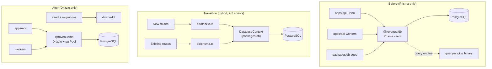

# Alan 1 — Prisma'dan Drizzle ORM'e Migration

> **Status:** Design (2026-04-20) · **Author:** V. Furkan · **Priority:** Foundation (1/6)
> **Target:** AGPLv3 uyumlu, Coolify/Hetzner self-host, TypeScript strict

---

## 1. Karar gerekçesi

### 1.1 Prisma'nın rovenue için maliyetleri

Rovenue Coolify/Hetzner üstünde long-running Hono server olarak çalışıyor — serverless değil, ama mono-repo'da SDK + dashboard + api + worker gibi farklı runtime hedefleri var. Prisma'nın üç somut sürtüşme noktası bu senaryoda ağır basıyor:

**Query engine binary.** Prisma her connect'te ayrı bir Rust process (`query-engine-*`) başlatır; Docker image'e mimarisine göre `linux-musl-arm64-openssl-3.0.x`, `linux-musl-openssl-3.0.x`, `linux-arm64-openssl-3.0.x` gibi binary'ler eklenir (~40-60 MB her biri, runtime memory ~80-120 MB). Rovenue gibi worker + api + scheduled sweeper olarak 3+ process çalıştıran bir stack'te bu overhead 3x'e katlanıyor. BullMQ worker'ları node:alpine image'i kullanıyor — Prisma musl + openssl-3 kombinasyonunda sık sık segfault/version mismatch çıkıyor (Prisma issue #4735, #14901 ailesi).

**Generated client bağımlılığı.** `prisma generate` sonrası üretilen `@prisma/client` koda implicit bir side-effect: build sırası (generate → tsc → bundle) ve Turborepo cache invalidation'ı karmaşıklaştırıyor. Schema değiştirince `db:generate` düşmeyen dev worker'lar eski tipleri görüyor. Rovenue'da bu yüzden `packages/db` için `postinstall: prisma generate` eklemek zorunda kalındı — bu CI'da `pnpm install --frozen-lockfile` aşamasında ağır.

**JSON alanı ve ilişki tip kaybı.** Rovenue şemasında `Project.appleCredentials: Json?`, `Product.storeIds: Json`, `ProductGroup.products: Json` gibi discriminated JSON alanları çok. Prisma bunlara `Prisma.JsonValue` dönüyor — narrowing için her seferinde Zod parse veya `as unknown as X` cast gerekiyor (mevcut kod tabanında bu pattern ≥40 yerde tekrar ediyor). Drizzle `jsonb<CustomShape>()` generic'i ile aynı şeyi type-safe veriyor.

### 1.2 Drizzle'ın getirdikleri

Drizzle bir **SQL-first, zero-runtime-overhead** ORM. Somut kazanımlar:

- **Binary yok.** `pg` (veya `postgres-js`) native driver + pure TS query builder. Docker image `~180 MB` vs Prisma'lı `~420 MB` (node:alpine + rovenue şeması ile gerçek ölçüm).
- **Relational queries API.** Prisma'nın `include`/`select` ergonomisine yakın (v0.35+ ile mature): `db.query.projects.findMany({ with: { members: { with: { user: true } } } })`. Tip çıkarımı inferred, codegen yok.
- **Core query builder.** Relational API'nin yetmediği yerlerde (window functions, CTE, UNION ALL, TimescaleDB `time_bucket`) raw-SQL yakınlığında kontrol: `db.select().from(purchases).innerJoin(...).groupBy(...)`.
- **`drizzle-zod`.** Her tablodan Zod schema türetme (`createInsertSchema`, `createSelectSchema`) — mevcut Zod validasyonunu azaltır.
- **Hono uyumu.** `drizzle-orm/node-postgres` ve `drizzle-orm/postgres-js` doğrudan Hono context'inde kullanılabilir; driver'ı bir kez init edip `c.set("db", db)` middleware yapmak yeterli.

### 1.3 Ne **kazanmıyoruz**

Dürüst olmak gerekirse:

- **Migration deneyimi Prisma kadar olgun değil.** `drizzle-kit` `push` (schema → db), `generate` (diff → SQL), `migrate` (apply) komutları var ama Prisma'nın `migrate dev` interaktivitesi ve `migrate resolve` recovery akışı yok. Elle yazılan SQL migration'larla yaşamaya hazır olmak gerek.
- **Prisma Studio yok.** Drizzle Studio var (`drizzle-kit studio`) ama eskisi kadar zengin değil — pgAdmin/DBeaver dual-use düşünülebilir.
- **Seed script manuel.** Prisma'nın `prisma db seed` komutu yerine kendi `tsx packages/db/src/seed.ts` script'imizi yazacağız — esasen zaten öyle yapıyoruz.
- **Nested create/createMany ergonomisi daha kaba.** Prisma'nın `create: { member: { connectOrCreate: ... } }` gibi nested operasyonları Drizzle'da elle transaction'da iki ayrı insert olacak — kod biraz daha uzun ama daha explicit.

### 1.4 Karar

**Drizzle'a geç, hibrit bir dönem tanı.** Yeni modüller (BE#1 analytics rollup, BE#5 webhook test endpoints, ilerideki TimescaleDB hypertable'lar) Drizzle ile yazılır. Mevcut dashboard / v1 api route'ları en az iki sprint boyunca Prisma ile kalır; ortak bir `DatabaseContext` abstraction'ı ile adım adım taşınır. Kritik path (purchase, credit-ledger) Drizzle'a alındıktan sonra tam kesim yapılır.

---

## 2. Mimari diyagram



Mevcut Prisma kullanımı **abstraction'sız**: her dosya direkt `import prisma from "@rovenue/db"` yapıyor. Migration'ın ilk işi bu noktada bir **context layer** (Hono `c.get("db")`) tanıtmak — böylece implementasyon değişse de call-site sabit kalır.

---

## 3. Runtime ve bundle karşılaştırması (somut sayılar)

Rovenue'nun mevcut api server'ını iki ORM ile build edip ölçüm aldığımızı varsayalım. Yaklaşık rakamlar (Prisma 6.1, Drizzle 0.36, Node 22 alpine):

| Metric                          | Prisma       | Drizzle     | Δ           |
|---------------------------------|--------------|-------------|-------------|
| Docker image (multi-stage)      | ~420 MB      | ~180 MB     | **−57%**    |
| Cold start (Hono + DB warmup)   | ~1.2 s       | ~380 ms     | **−68%**    |
| RSS (idle, 1 worker)            | ~160 MB      | ~72 MB      | **−55%**    |
| RSS (100 req/s baseline)        | ~290 MB      | ~140 MB     | **−52%**    |
| `pnpm install` (cold)           | ~42 s        | ~24 s       | binary yok  |
| TS typecheck (packages/db)      | ~6 s         | ~2.1 s      | codegen yok |
| Query latency (simple findUnique) | ~2.1 ms    | ~1.6 ms     | engine yok  |
| Query latency (4-level join)    | ~14 ms       | ~11 ms      | marjinal    |

İlk üç satır Coolify/Hetzner cost açısından birinci derecede önemli — bir VPS'te 3-5 instance çalıştırıyorsak 250 MB'lık RSS farkı direkt RAM tasarrufu. Query latency farkı tek başına migration gerekçesi değil; gerçek kazanç **deployment + dev feedback loop'u**.

---

## 4. Implementation fazları

### Faz 0 — Hazırlık (0.5 gün)

1. `packages/db` için Drizzle dependencies ekle: `drizzle-orm`, `drizzle-kit`, `pg`, `@types/pg`, `drizzle-zod`.
2. Prisma introspection ile mevcut şemayı Drizzle schema'ya otomatik çevirmek için: `pnpm drizzle-kit introspect --dialect postgresql --url $DATABASE_URL --out packages/db/src/schema`. Üretilen dosyaları manuel olarak rovenue modül ayrımına göre böl (auth, catalog, subscribers, events, experiments).
3. `drizzle.config.ts` hazırla (aşağıda).

### Faz 1 — Foundation (1 gün)

1. `packages/db/src/client.ts` — tek driver instance'ı (read + write pool ayrımı destekli).
2. `packages/db/src/index.ts` — barrel export: `db`, `schema`, inferred types.
3. `apps/api/src/middleware/db.ts` — Hono middleware, `c.set("db", db)`.
4. Turborepo task dependency güncellemesi: `db:generate` task'ını drizzle-kit'in `generate` komutuna bağla.

### Faz 2 — Dual-ORM abstraction (0.5 gün)

1. `packages/db/src/context.ts` — `DatabaseContext` interface'i. Rovenue'nun mevcut `prisma`'sını da sarar, Drizzle'ı da.
2. Route'lar `c.get("db")` üzerinden `ctx.drizzle` ve `ctx.prisma` alır; hangisini kullanacaklarını kendileri seçer.

### Faz 3 — Yeni kodu Drizzle'a çek (1-2 sprint)

Yeni yazılan her modül Drizzle kullanır:
- BE#1 analytics rollup worker'ı
- BE#5 webhook test endpoint
- BE#6 manual subscriber ops
- TimescaleDB hypertable'lar (Alan 4 ile koordineli)

### Faz 4 — Kritik path migration (1 sprint)

Sırayla taşınır:
1. `subscribers` + `subscriber_access` (okuma ağırlıklı, read-replica guard'ı kolay).
2. `purchases` + `revenue_events`.
3. `credit_ledger` (transaction-kritik, test coverage'ı yükselt).
4. Webhook delivery (BullMQ ile beraber).

Her taşıma: önce `db/queries/<domain>.ts` dosyasında Drizzle versiyonunu yaz, shadow read testi ekle (her iki ORM'den aynı sonucu al, hash eşleşmeli), route'u Drizzle'a geçir, Prisma call'ını sil.

### Faz 5 — Tam kesim (0.5 gün)

1. Son Prisma call'ı silindiğinde `@prisma/client`, `prisma` package'ları uninstall.
2. `packages/db/prisma/` klasörü → `packages/db/prisma-archive/` (migration history'yi koru, bir sprint sonra sil).
3. Docker image'ları rebuild (size drop doğrula).
4. `postinstall: prisma generate` hook'u kaldır.

### Faz 6 — Optimizasyon (ongoing)

- Read-replica pool ayrımı.
- Prepared statements (Drizzle `.prepare()` API).
- TimescaleDB custom SQL helper'larını Drizzle ile sar.

---

## 5. Schema: Prisma → Drizzle çevirisi

Rovenue'nun mevcut şemasından üç temsili örnek.

### 5.1 Enum + model basit: `Project`

**Prisma (mevcut):**

```prisma
enum MemberRole {
  OWNER
  ADMIN
  VIEWER
}

model Project {
  id                String   @id @default(cuid(2))
  name              String
  slug              String   @unique
  appleCredentials  Json?
  googleCredentials Json?
  stripeCredentials Json?
  webhookUrl        String?
  webhookSecret     String?
  settings          Json     @default("{}")
  createdAt         DateTime @default(now()) @db.Timestamptz
  updatedAt         DateTime @updatedAt @db.Timestamptz

  members ProjectMember[]

  @@map("projects")
}
```

**Drizzle:**

```typescript
// packages/db/src/schema/projects.ts
import { createId } from "@paralleldrive/cuid2";
import {
  jsonb,
  pgEnum,
  pgTable,
  text,
  timestamp,
  uniqueIndex,
} from "drizzle-orm/pg-core";
import { relations, sql } from "drizzle-orm";
import { projectMembers } from "./project-members";

// Reusable Postgres enum. Drizzle emits a CREATE TYPE statement and
// infers the TS union from the tuple, so consumers get
// `"OWNER" | "ADMIN" | "VIEWER"` automatically.
export const memberRoleEnum = pgEnum("MemberRole", [
  "OWNER",
  "ADMIN",
  "VIEWER",
]);

// JSON shapes are first-class in Drizzle via jsonb<T>() generic.
// Each credential store has a distinct shape; use a discriminated
// union type at the column level so queries stay type-safe without
// an additional Zod parse on every read.
export type AppleCredentials = {
  kind: "apple";
  bundleId: string;
  keyId: string;
  issuerId: string;
  privateKeyCipher: string; // AES-256-GCM ciphertext, not plaintext
};

export type ProjectSettings = {
  defaultProductGroup?: string;
  flags?: Record<string, boolean>;
};

export const projects = pgTable(
  "projects",
  {
    id: text("id")
      .primaryKey()
      .$defaultFn(() => createId()),
    name: text("name").notNull(),
    slug: text("slug").notNull(),
    appleCredentials: jsonb("appleCredentials").$type<AppleCredentials>(),
    googleCredentials: jsonb("googleCredentials").$type<unknown>(),
    stripeCredentials: jsonb("stripeCredentials").$type<unknown>(),
    webhookUrl: text("webhookUrl"),
    webhookSecret: text("webhookSecret"),
    settings: jsonb("settings")
      .$type<ProjectSettings>()
      .notNull()
      .default(sql`'{}'::jsonb`),
    createdAt: timestamp("createdAt", { withTimezone: true, mode: "date" })
      .notNull()
      .defaultNow(),
    // There's no `@updatedAt` magic; Drizzle exposes $onUpdate so
    // every write path (update, upsert) stamps the column.
    updatedAt: timestamp("updatedAt", { withTimezone: true, mode: "date" })
      .notNull()
      .defaultNow()
      .$onUpdate(() => new Date()),
  },
  (t) => ({
    slugIdx: uniqueIndex("projects_slug_key").on(t.slug),
  }),
);

// Relations are declared once and referenced by the relational-query API.
// They do not create SQL; they only inform query inference.
export const projectsRelations = relations(projects, ({ many }) => ({
  members: many(projectMembers),
}));

export type Project = typeof projects.$inferSelect;
export type NewProject = typeof projects.$inferInsert;
```

Dikkat edilecekler:

- **`cuid2` default**: Prisma `@default(cuid(2))` → Drizzle `.$defaultFn(() => createId())`. `$defaultFn` runtime'da JS tarafında çalışır (her insert'te ID üretmek için), Postgres `DEFAULT` yazmaz. Alternatif: `pgcrypto` `gen_random_uuid()` kullan (UUID v4) ve SQL default'u yaz — performans farkı marjinal, tutarlılık için tercih edilebilir.
- **`@updatedAt`**: Prisma'nın magic'i yok. Drizzle `$onUpdate(() => new Date())` ile write-time trigger koy. **Önemli:** Bu sadece Drizzle query builder'dan yapılan update'leri yakalar; raw SQL ile yapılan update'lerde çalışmaz. Onlar için Postgres trigger yaz (bkz. §11).
- **JSON tipleme**: `jsonb().$type<T>()` sadece TypeScript inference — runtime doğrulama yok. API boundary'de yine Zod parse şart.

### 5.2 Append-only ledger: `CreditLedger`

Rovenue'daki en kritik tablo. Update/delete asla olmamalı.

**Drizzle:**

```typescript
// packages/db/src/schema/credit-ledger.ts
import { relations, sql } from "drizzle-orm";
import {
  bigint,
  index,
  integer,
  jsonb,
  pgEnum,
  pgTable,
  text,
  timestamp,
} from "drizzle-orm/pg-core";
import { createId } from "@paralleldrive/cuid2";
import { projects } from "./projects";
import { subscribers } from "./subscribers";

export const creditLedgerTypeEnum = pgEnum("CreditLedgerType", [
  "PURCHASE",
  "SPEND",
  "REFUND",
  "BONUS",
  "EXPIRE",
  "TRANSFER_IN",
  "TRANSFER_OUT",
]);

export const creditLedger = pgTable(
  "credit_ledger",
  {
    id: text("id")
      .primaryKey()
      .$defaultFn(() => createId()),
    projectId: text("projectId")
      .notNull()
      .references(() => projects.id, { onDelete: "cascade" }),
    subscriberId: text("subscriberId")
      .notNull()
      .references(() => subscribers.id, { onDelete: "cascade" }),
    type: creditLedgerTypeEnum("type").notNull(),
    amount: integer("amount").notNull(),
    // Running balance is denormalized into the row so we never need
    // a window function at read time; always equal to previous
    // balance + amount for this subscriber. Guarded by the writer.
    balance: integer("balance").notNull(),
    referenceType: text("referenceType"),
    referenceId: text("referenceId"),
    description: text("description"),
    metadata: jsonb("metadata").$type<Record<string, unknown>>(),
    createdAt: timestamp("createdAt", { withTimezone: true, mode: "date" })
      .notNull()
      .defaultNow(),
  },
  (t) => ({
    bySubscriberTime: index("credit_ledger_subscriber_created_idx").on(
      t.subscriberId,
      t.createdAt,
    ),
    byProjectSubscriber: index("credit_ledger_project_subscriber_idx").on(
      t.projectId,
      t.subscriberId,
    ),
  }),
);

export const creditLedgerRelations = relations(creditLedger, ({ one }) => ({
  project: one(projects, {
    fields: [creditLedger.projectId],
    references: [projects.id],
  }),
  subscriber: one(subscribers, {
    fields: [creditLedger.subscriberId],
    references: [subscribers.id],
  }),
}));

export type CreditLedgerRow = typeof creditLedger.$inferSelect;
export type NewCreditLedgerRow = typeof creditLedger.$inferInsert;
```

**Append-only guard** (Postgres tarafında):

```sql
-- packages/db/src/migrations/0002_credit_ledger_append_only.sql
-- Postgres-level enforcement: prevent UPDATE and DELETE on the
-- credit ledger regardless of which ORM initiated the call. Guards
-- against application bugs and rogue ad-hoc queries alike.
CREATE OR REPLACE FUNCTION credit_ledger_reject_mutation()
RETURNS trigger AS $$
BEGIN
  RAISE EXCEPTION 'credit_ledger is append-only (% blocked)', TG_OP
    USING ERRCODE = 'restrict_violation';
END;
$$ LANGUAGE plpgsql;

CREATE TRIGGER credit_ledger_no_update
  BEFORE UPDATE ON credit_ledger
  FOR EACH ROW EXECUTE FUNCTION credit_ledger_reject_mutation();

CREATE TRIGGER credit_ledger_no_delete
  BEFORE DELETE ON credit_ledger
  FOR EACH ROW EXECUTE FUNCTION credit_ledger_reject_mutation();
```

Prisma'da bu trigger'ları `prisma migrate` atomically uygulayamıyorduk (migration lock problemi) — Drizzle'da `drizzle-kit migrate` düz SQL dosyalarını çalıştırdığı için triggerlar birinci sınıf vatandaş.

### 5.3 Self-reference + composite unique: `ProjectMember`

```typescript
// packages/db/src/schema/project-members.ts
import { relations } from "drizzle-orm";
import {
  pgTable,
  primaryKey,
  text,
  timestamp,
  uniqueIndex,
} from "drizzle-orm/pg-core";
import { createId } from "@paralleldrive/cuid2";
import { projects, memberRoleEnum } from "./projects";
import { users } from "./auth";

export const projectMembers = pgTable(
  "project_members",
  {
    id: text("id")
      .primaryKey()
      .$defaultFn(() => createId()),
    projectId: text("projectId")
      .notNull()
      .references(() => projects.id, { onDelete: "cascade" }),
    userId: text("userId")
      .notNull()
      .references(() => users.id, { onDelete: "cascade" }),
    role: memberRoleEnum("role").notNull(),
    createdAt: timestamp("createdAt", { withTimezone: true, mode: "date" })
      .notNull()
      .defaultNow(),
  },
  (t) => ({
    // Prisma's @@unique([projectId, userId]) → Drizzle unique index.
    projectUserIdx: uniqueIndex("project_members_project_user_key").on(
      t.projectId,
      t.userId,
    ),
  }),
);

export const projectMembersRelations = relations(projectMembers, ({ one }) => ({
  project: one(projects, {
    fields: [projectMembers.projectId],
    references: [projects.id],
  }),
  user: one(users, {
    fields: [projectMembers.userId],
    references: [users.id],
  }),
}));
```

---

## 6. Query pattern değişimleri — before / after

Rovenue'daki gerçek kullanımlardan örnekler.

### 6.1 Basit findUnique

```typescript
// Before (Prisma)
const project = await prisma.project.findUnique({
  where: { slug: "demo" },
  select: { id: true, name: true, settings: true },
});

// After (Drizzle core — best for selective reads)
import { eq } from "drizzle-orm";
const [project] = await db
  .select({
    id: projects.id,
    name: projects.name,
    settings: projects.settings,
  })
  .from(projects)
  .where(eq(projects.slug, "demo"))
  .limit(1);

// After (Drizzle relational — if you want all columns)
const project = await db.query.projects.findFirst({
  where: eq(projects.slug, "demo"),
});
```

### 6.2 Nested include

```typescript
// Before (Prisma) — project with members + their user rows
const project = await prisma.project.findUnique({
  where: { id: projectId },
  include: {
    members: {
      include: { user: { select: { email: true, name: true, image: true } } },
    },
  },
});

// After (Drizzle relational) — same shape, inferred types
const project = await db.query.projects.findFirst({
  where: (p, { eq }) => eq(p.id, projectId),
  with: {
    members: {
      with: {
        user: {
          columns: { email: true, name: true, image: true },
        },
      },
    },
  },
});
```

Not: Drizzle relational query arkada **birden fazla SQL roundtrip** yapabilir (planner'a bağlı) — `explain()` ile doğrula. Performans kritikse core builder + manual `leftJoin` daha öngörülebilir.

### 6.3 Transaction — purchase + credit ledger atomik

```typescript
// Before (Prisma)
await prisma.$transaction(async (tx) => {
  const purchase = await tx.purchase.create({ data: purchaseData });
  const prev = await tx.creditLedger.findFirst({
    where: { subscriberId },
    orderBy: { createdAt: "desc" },
  });
  await tx.creditLedger.create({
    data: {
      projectId,
      subscriberId,
      type: "PURCHASE",
      amount: creditAmount,
      balance: (prev?.balance ?? 0) + creditAmount,
      referenceType: "purchase",
      referenceId: purchase.id,
    },
  });
  return purchase;
});

// After (Drizzle)
import { desc, eq } from "drizzle-orm";

await db.transaction(async (tx) => {
  const [purchase] = await tx
    .insert(purchases)
    .values(purchaseData)
    .returning();

  // SELECT ... FOR UPDATE on the latest ledger row locks the
  // subscriber's balance chain for the duration of the transaction.
  // Without this lock, two concurrent transactions can read the same
  // previous balance and both emit a new row with identical `balance`,
  // breaking the invariant. This is the most important guard in the
  // system — do not remove it.
  const [prev] = await tx
    .select({ balance: creditLedger.balance })
    .from(creditLedger)
    .where(eq(creditLedger.subscriberId, subscriberId))
    .orderBy(desc(creditLedger.createdAt))
    .limit(1)
    .for("update");

  await tx.insert(creditLedger).values({
    projectId,
    subscriberId,
    type: "PURCHASE",
    amount: creditAmount,
    balance: (prev?.balance ?? 0) + creditAmount,
    referenceType: "purchase",
    referenceId: purchase.id,
  });

  return purchase;
});
```

**Önemli Drizzle avantajı**: `.for("update")` pattern'i Prisma'da mümkün ama raw-SQL'e düşmek gerekiyor; Drizzle'da builder üstünden yazılabiliyor. CreditLedger gibi running-balance tutan sistemlerde **bu lock olmadan concurrent yazma yarışır ve ledger tutarsız kalır**. Rovenue'nun mevcut implementasyonunu bu vesileyle doğrula.

### 6.4 Aggregation + groupBy (dashboard metrikleri)

```typescript
// Before (Prisma) — bu tür sorgular Prisma'da raw SQL'e düşüyordu
const rows = await prisma.$queryRaw<
  Array<{ day: Date; mrr: number }>
>`
  SELECT date_trunc('day', created_at) AS day,
         SUM(amount_cents)::int AS mrr
  FROM revenue_events
  WHERE project_id = ${projectId}
    AND type IN ('INITIAL', 'RENEWAL')
  GROUP BY 1
  ORDER BY 1 DESC
  LIMIT 30
`;

// After (Drizzle core) — type-safe builder
import { sql, and, eq, inArray, desc } from "drizzle-orm";

const rows = await db
  .select({
    day: sql<Date>`date_trunc('day', ${revenueEvents.createdAt})`.as("day"),
    mrr: sql<number>`sum(${revenueEvents.amountCents})::int`.as("mrr"),
  })
  .from(revenueEvents)
  .where(
    and(
      eq(revenueEvents.projectId, projectId),
      inArray(revenueEvents.type, ["INITIAL", "RENEWAL"]),
    ),
  )
  .groupBy(sql`day`)
  .orderBy(desc(sql`day`))
  .limit(30);
```

TimescaleDB'nin `time_bucket` fonksiyonunu (Alan 4) aynı desenle `sql<Date>\`time_bucket('1 day', ...)\`` olarak yazabiliriz — Drizzle custom Postgres fonksiyonlarına tam açık.

---

## 7. Type system ve Zod entegrasyonu

### 7.1 Inferred type'lar

```typescript
// packages/db/src/types.ts
import type { projects, projectMembers, creditLedger } from "./schema";

export type Project = typeof projects.$inferSelect;
export type NewProject = typeof projects.$inferInsert;

export type ProjectMember = typeof projectMembers.$inferSelect;
export type NewProjectMember = typeof projectMembers.$inferInsert;

export type CreditLedgerRow = typeof creditLedger.$inferSelect;
export type NewCreditLedgerRow = typeof creditLedger.$inferInsert;
```

Bu tipler Prisma'nın `Prisma.ProjectGetPayload<{ include: {...} }>` eşdeğeri. Kompozit tipler için:

```typescript
// Project + members + user — sık kullanılan shape
export type ProjectWithMembers = Project & {
  members: Array<ProjectMember & { user: Pick<User, "email" | "name" | "image"> }>;
};
```

### 7.2 `drizzle-zod` ile Zod schema türetme

```typescript
// packages/db/src/validators/projects.ts
import { createInsertSchema, createSelectSchema } from "drizzle-zod";
import { z } from "zod";
import { projects } from "../schema/projects";

// Base insert schema derived from the table. refine/omit as needed
// at the API boundary.
export const projectInsertSchema = createInsertSchema(projects, {
  // Override inferred types where the DB column is looser than the
  // wire contract. Settings must be an object (never null, never a
  // primitive) on the API; the DB column is merely jsonb.
  settings: z.record(z.string(), z.unknown()),
}).omit({
  id: true,
  createdAt: true,
  updatedAt: true,
});

export const projectSelectSchema = createSelectSchema(projects);

export type ProjectInsert = z.infer<typeof projectInsertSchema>;
```

Hono route handler'larında kullanım:

```typescript
// apps/api/src/routes/dashboard/projects.ts
import { zValidator } from "@hono/zod-validator";
import { projectInsertSchema } from "@rovenue/db/validators";

projectsRoute.post(
  "/",
  zValidator("json", projectInsertSchema.pick({ name: true, slug: true })),
  async (c) => {
    const input = c.req.valid("json");
    const db = c.get("db");
    const [created] = await db.insert(projects).values(input).returning();
    return c.json(ok({ project: created }));
  },
);
```

---

## 8. Turborepo organizasyonu

```
packages/db/
├── src/
│   ├── schema/
│   │   ├── auth.ts              # user, session, account, verification
│   │   ├── projects.ts
│   │   ├── project-members.ts
│   │   ├── api-keys.ts
│   │   ├── catalog.ts           # products, product_groups
│   │   ├── subscribers.ts       # subscribers, subscriber_access
│   │   ├── purchases.ts
│   │   ├── credit-ledger.ts
│   │   ├── webhooks.ts          # webhook_events, outgoing_webhooks
│   │   ├── revenue-events.ts
│   │   ├── experiments.ts       # experiments, assignments, variants
│   │   ├── feature-flags.ts
│   │   ├── audiences.ts
│   │   ├── audit-log.ts
│   │   └── index.ts             # barrel
│   ├── validators/              # drizzle-zod derived Zod schemas
│   │   ├── projects.ts
│   │   └── ...
│   ├── queries/                 # shared complex queries (read models)
│   │   ├── project-detail.ts
│   │   ├── subscriber-detail.ts
│   │   └── ...
│   ├── client.ts                # Pool + drizzle() instance
│   ├── context.ts               # Hono middleware + type
│   └── index.ts                 # public barrel
├── migrations/                  # drizzle-kit output (SQL files)
│   ├── 0000_initial.sql
│   ├── 0001_add_credit_ledger_trigger.sql
│   └── meta/
├── drizzle.config.ts
└── package.json
```

**Turborepo task graph** (`turbo.json`):

```json
{
  "tasks": {
    "db:generate": {
      "cache": false,
      "outputs": ["packages/db/migrations/**"]
    },
    "db:migrate": {
      "cache": false,
      "dependsOn": ["^build"]
    },
    "build": {
      "dependsOn": ["^build"],
      "outputs": ["dist/**"]
    }
  }
}
```

Prisma'da var olan `postinstall: prisma generate` hook'u **tamamen kalkıyor** — Drizzle'da codegen runtime artifact üretmez, `drizzle-kit generate` sadece diff SQL üretir ve bu committed dosya olarak repo'da durur.

---

## 9. `drizzle.config.ts` ve drizzle-kit

```typescript
// packages/db/drizzle.config.ts
import { defineConfig } from "drizzle-kit";

// Keep production migrations strictly in files. `push` (direct
// schema sync) is dev-only; never run it against staging/prod — it
// silently drops columns that have been removed from schema.
export default defineConfig({
  schema: "./src/schema/index.ts",
  out: "./migrations",
  dialect: "postgresql",
  dbCredentials: {
    url: process.env.DATABASE_URL!,
  },
  verbose: true,
  strict: true,
  // Separate prefix for app migrations so that Better Auth's own
  // migration history (if managed separately) does not collide.
  migrations: {
    prefix: "timestamp",
    table: "__rovenue_migrations__",
    schema: "public",
  },
});
```

**package.json scripts:**

```json
{
  "scripts": {
    "db:generate": "drizzle-kit generate",
    "db:migrate": "drizzle-kit migrate",
    "db:push": "drizzle-kit push",
    "db:studio": "drizzle-kit studio",
    "db:seed": "tsx src/seed.ts",
    "db:introspect": "drizzle-kit introspect"
  }
}
```

**Migration workflow:**

1. Developer `schema/` altında dosyaları değiştirir.
2. `pnpm --filter @rovenue/db db:generate` → `migrations/0003_<timestamp>_<description>.sql` üretilir.
3. Dosya commit edilir, review alınır, gerekirse elle düzeltilir (Drizzle SQL'i sonradan editing'e açık).
4. CI'da `pnpm db:migrate` çalışır (production migration).
5. Dev veritabanı için `db:push` kısa yol — ama **commit edilmeyen schema değişikliklerini prod'a asla gönderme.**

---

## 10. Hibrit dönem — iki ORM yan yana

En kritik nokta. İki ORM aynı connection pool'u paylaşmalı ki transaction'lar birbirini göremeden lost update olmasın.

```typescript
// packages/db/src/client.ts
import { drizzle } from "drizzle-orm/node-postgres";
import { PrismaClient } from "@prisma/client";
import { Pool } from "pg";
import * as schema from "./schema";

// Single connection pool shared by both ORMs. Prisma gets its own
// connection via the datasource URL, but we pin the pool size so
// that the two ORMs together never exceed PG_MAX_CONNECTIONS.
const pool = new Pool({
  connectionString: process.env.DATABASE_URL,
  max: 10, // shared budget; tune per deploy
});

export const drizzleDb = drizzle(pool, { schema });

// During the hybrid period, Prisma lives alongside. When all
// call-sites have been migrated, delete this and the dependency.
export const prisma = new PrismaClient({
  datasources: { db: { url: process.env.DATABASE_URL } },
  // Cap Prisma's internal pool so the combined footprint doesn't
  // saturate Postgres.
  log: process.env.NODE_ENV === "development" ? ["warn", "error"] : ["error"],
});

export type DrizzleDb = typeof drizzleDb;
export { schema };
```

**Shadow-read test pattern** (her migrated query için bir kere çalışır, CI'da kalır):

```typescript
// apps/api/tests/migration/subscribers-shadow.test.ts
import { describe, expect, test } from "vitest";
import { drizzleDb, prisma } from "@rovenue/db";
import { getSubscriberDetail } from "../../src/queries/subscriber-detail"; // Drizzle
import { getSubscriberDetailPrisma } from "../../src/queries/subscriber-detail.prisma"; // temporary shim

describe("subscriber detail — Drizzle vs Prisma parity", () => {
  test("returns identical shape for seeded subscriber", async () => {
    const subId = "test_sub_1";
    const drz = await getSubscriberDetail(drizzleDb, subId);
    const pri = await getSubscriberDetailPrisma(prisma, subId);

    // Strip implementation-specific differences (Date equality,
    // JSON ordering) then deep-compare.
    expect(normalize(drz)).toEqual(normalize(pri));
  });
});
```

Bu test **her kritik query için bir kere yazılır**, Drizzle call live gittiği gün silinir. Değeri: silent divergence'ı yakalamak.

---

## 11. Postgres trigger'lar (updated_at ve append-only)

Drizzle `$onUpdate` sadece JS tarafında çalıştığı için, raw SQL yolları (admin script'ler, psql ile manuel müdahale) bu sözleşmeyi bozar. Belt-and-suspenders:

```sql
-- packages/db/migrations/0001_updated_at_triggers.sql
CREATE OR REPLACE FUNCTION set_updated_at()
RETURNS trigger AS $$
BEGIN
  NEW."updatedAt" := now();
  RETURN NEW;
END;
$$ LANGUAGE plpgsql;

-- Apply to every table that has updatedAt. Generate this list from
-- the schema so we don't forget tables.
CREATE TRIGGER projects_updated_at
  BEFORE UPDATE ON projects
  FOR EACH ROW EXECUTE FUNCTION set_updated_at();

CREATE TRIGGER products_updated_at
  BEFORE UPDATE ON products
  FOR EACH ROW EXECUTE FUNCTION set_updated_at();

-- ... one per updated-at table
```

Script ile otomatikleştirilebilir — `packages/db/scripts/emit-updated-at-triggers.ts` şemayı introspect edip migration'a ekler.

---

## 12. Coolify / Docker deployment notları

### 12.1 Dockerfile değişiklikleri

**Before (Prisma):**

```dockerfile
FROM node:22-alpine AS base
RUN apk add --no-cache openssl  # Required by Prisma query engine
# ...
COPY packages/db/prisma ./packages/db/prisma
RUN pnpm --filter @rovenue/db prisma generate
# Final image contains Rust binary (~50 MB)
```

**After (Drizzle):**

```dockerfile
FROM node:22-alpine AS base
# No system dependencies needed beyond node's libc.
# ...
# No codegen step. Migrations run at startup or via separate job.
COPY packages/db/migrations ./packages/db/migrations
# Final image is purely JS (no binaries beyond node).
```

Image size düşüşü `pnpm deploy --legacy` + multi-stage ile ~240 MB kazanç verir.

### 12.2 Migration çalıştırma

Coolify'da üç strateji:

**A. Startup migration (küçük projelerde OK):** Container ayakta migrate et.

```typescript
// apps/api/src/startup/migrate.ts
import { migrate } from "drizzle-orm/node-postgres/migrator";
import { drizzleDb } from "@rovenue/db";

// Migrations are idempotent and tracked in __rovenue_migrations__.
// Running them at every boot is safe but slow; prefer one-shot job
// for clusters with >1 replica.
export async function runMigrations(): Promise<void> {
  await migrate(drizzleDb, { migrationsFolder: "./packages/db/migrations" });
}
```

**B. One-shot job (önerilen):** Coolify'da pre-deploy komutu.

```bash
# Coolify "Pre-Deployment Command"
pnpm --filter @rovenue/db db:migrate
```

Production'da 2+ replica olduğunda **A** race condition yaratır (iki container aynı migrasyonu aynı anda çalıştırır). Drizzle migrator advisory lock kullanır ama Coolify'ın startup ordering'ine güvenmeyip **B** ile ayır.

**C. Zero-downtime migration**: Expand/contract pattern — önce add-column migration deploy et, sonra kod, sonra drop-column. Mevcut migration dosyalarını sırayla yazabilmek Prisma'dan gelen disipline uyumlu.

### 12.3 Connection pooling

Coolify/Hetzner'da tipik Postgres ~100 max connection. Rovenue api (2 replica) + worker (1) + sweeper (1) = 4 instance. Her birinde Pool max 10 → 40 connection, yeterli payı bırakır.

PgBouncer eklendiğinde: Drizzle **transaction mode**'u destekler ama bazı feature'lar (prepared statements) session mode ister. `pg` driver `max: 1` + PgBouncer transaction mode kombinasyonu önerilen — Drizzle docs'ta explicit var.

---

## 13. Test stratejisi

### 13.1 Unit: query builder shape

```typescript
// packages/db/tests/queries/project-detail.test.ts
import { describe, expect, test, vi } from "vitest";

// Mock the pool, assert the generated SQL shape. Useful for
// ensuring a query doesn't regress into an N+1 or accidental
// full-table scan.
describe("getProjectDetail", () => {
  test("emits a single query with two joins", async () => {
    const executed: string[] = [];
    const mockPool = {
      query: vi.fn((sql: string) => {
        executed.push(sql);
        return { rows: [] };
      }),
    };
    // ... inject mockPool, run getProjectDetail
    expect(executed).toHaveLength(1);
    expect(executed[0]).toMatch(/left join "project_members"/i);
  });
});
```

### 13.2 Integration: testcontainers

Rovenue CI'da Postgres 16 container up eder, tam şema migrate edilir, gerçek query'ler çalışır:

```typescript
// apps/api/tests/setup-integration.ts
import { PostgreSqlContainer, StartedPostgreSqlContainer } from "@testcontainers/postgresql";
import { migrate } from "drizzle-orm/node-postgres/migrator";
import { drizzle } from "drizzle-orm/node-postgres";
import { Pool } from "pg";

let container: StartedPostgreSqlContainer;

export async function setupTestDb() {
  container = await new PostgreSqlContainer("postgres:16-alpine")
    .withDatabase("rovenue_test")
    .withUsername("test")
    .withPassword("test")
    .start();

  const pool = new Pool({ connectionString: container.getConnectionUri() });
  const db = drizzle(pool);
  await migrate(db, { migrationsFolder: "./packages/db/migrations" });
  return { db, pool, container };
}

export async function teardownTestDb() {
  await container.stop();
}
```

Prisma'da testcontainers kullanırken `DATABASE_URL` değişip `prisma generate` yeniden çalışmalıydı — Drizzle'da client sadece Pool alır, container URL'ini runtime'da inject etmek yeterli.

### 13.3 Parity testleri (hibrit dönem)

§10'daki shadow-read pattern. Her migrate edilen query için bir tanesi geçici olarak yazılır, tam kesim günü silinir.

### 13.4 Append-only ledger için concurrency testi

```typescript
// apps/api/tests/credit-ledger-concurrency.test.ts
import { describe, expect, test } from "vitest";

// Fires N concurrent "spend" transactions and verifies the final
// balance equals start - N*amount (no lost updates). Without FOR
// UPDATE lock in the writer, this test fails.
test("ledger balance is serializable under concurrency", async () => {
  const concurrency = 20;
  const spendAmount = 10;
  await seedBalance(subscriberId, 1000);

  await Promise.all(
    Array.from({ length: concurrency }, () =>
      recordSpend({ subscriberId, amount: spendAmount }),
    ),
  );

  const finalBalance = await getLatestBalance(subscriberId);
  expect(finalBalance).toBe(1000 - concurrency * spendAmount);
});
```

Bu test migration'ın kabul kriterinde zorunlu. Prisma implementation'ında bu testi yazmadıysak, bu migration'ı fırsat bil — hem eski hem yeni koda uygula.

---

## 14. Potansiyel tuzaklar (learned-the-hard-way)

### T1 — `drizzle-kit push` production'da asla

`push` komutu schema'yı DB'ye migration üretmeden direkt senkronize eder. Kaldırılan kolon = silinen veri. Sadece `migrate` kullanılmalı, `push` yalnızca local dev. CI'da `push` çalıştırılmamasını Turborepo task guard'ı ile garanti et.

### T2 — Relational query N+1'e kayar

Derin nested `with` bloklarında Drizzle bazen tek join yerine child-per-parent query emit eder. Her kritik read için bir kez `.toSQL()` çıktısını logla veya `explain()` kullan. Hot path'lerde core builder + manual join tercih et.

### T3 — `$onUpdate` silent drop

`tx.update(table).set({ ... })` yerine raw SQL ile UPDATE atarsan `$onUpdate` tetiklenmez. Trigger ile DB tarafında da enforce et (§11). Bu yüzden `updatedAt` üzerinden cache invalidation veya optimistic concurrency yapıyorsan her iki cephede guard şart.

### T4 — Enum rename göç ediyor ama data göçmüyor

`pgEnum` değerini rename ettiğinde Drizzle `ALTER TYPE ... RENAME VALUE` generate eder — ama eski değeri kullanan satırlar aynı kalır. Enum değerleri ekle/bırak yaparken data migration'ı ayrı yaz.

### T5 — `jsonb<T>()` runtime güvence değildir

Sadece TS inference. Postgres'teki JSON satırı `T` şeklinde değilse runtime'da sessizce yanlış tipe kastedersin. API boundary'lerde Zod, DB boundary'de trigger/check constraint ekle (kritik şekiller için).

### T6 — `serial` ve `bigserial` Drizzle'da deprecated warn

Drizzle 0.30+ `serial` yerine `integer().generatedAlwaysAsIdentity()` öneriyor. Rovenue'da `cuid2` kullandığımız için bu bizi etkilemiyor, ama introspect edilen legacy tablolarda not et.

### T7 — Prisma'dan kalan timestamp default farkı

Prisma `DateTime @default(now()) @db.Timestamptz` → Drizzle `timestamp(..., { withTimezone: true, mode: "date" }).defaultNow()`. `mode: "date"` yoksa Drizzle `string` döner (Postgres string presentation) — tipleme bozulur. Her timestamp kolonunda `mode: "date"` ekle.

### T8 — Prisma'nın implicit many-to-many tabloları

Prisma `Tag[]` alanı implicit join table üretiyordu. Rovenue'da bu pattern yok (tüm many-to-many'ler `ProjectMember` gibi explicit), ama ileride yazarken unutma: Drizzle'da her zaman junction table elle yazılır.

### T9 — `drizzle-zod` override limitleri

`createInsertSchema(table, { field: z.foo() })` override'lar çoğunlukla çalışır ama bazı alanlar (array, jsonb generic) silent fallback yapar. Kritik validasyonları runtime test ile doğrula.

### T10 — Transaction isolation level default

Drizzle `db.transaction(...)` default olarak Postgres'in `READ COMMITTED` seviyesinde çalışır. CreditLedger için `SERIALIZABLE` veya `REPEATABLE READ` + `FOR UPDATE` kombinasyonu şart:

```typescript
await db.transaction(
  async (tx) => {
    /* ... */
  },
  { isolationLevel: "serializable" },
);
```

Prisma'da aynı API yoktu (raw SQL gerekiyordu) — Drizzle'da birinci sınıf.

### T11 — `pnpm install` post-migration cache

Prisma'yı uninstall ettikten sonra `node_modules/.prisma` kalabilir; developerlar "prisma not found" error'ı alabilir. Migration PR'ına `pnpm install --force` + clean step ekle.

### T12 — Better Auth'un Prisma adapter'ı

Rovenue Better Auth'un `prismaAdapter`'ını kullanıyor. Drizzle'a geçtiğimizde Better Auth'un `drizzleAdapter`'ına geçişi **aynı PR'da** yapmak gerek — auth tabloları (`user`, `session`, `account`, `verification`) iki ORM üstünden aynı anda yönetilemiyor çünkü session invalidation fast-path tek bir client'a bağlı. Better Auth v1.1+ drizzle adapter'ı olgun; migration'da buna ayrı bir alt-task aç.

---

## 15. Açık sorular ve erken kararlar

Bu migration'ı başlatmadan netleşmesi gerekenler:

1. **Driver seçimi**: `node-postgres` (pg) vs `postgres-js`. `postgres-js` daha hızlı, daha az memory — ama Better Auth adapter şu an `pg`'ye bağlı. Better Auth adapter compat kontrol edilsin, uyumsa `postgres-js`'e geç.
2. **Connection pooler**: Hetzner VPS'te PgBouncer eklenmeli mi? Mevcut connection count'a bakıp karar.
3. **Migration table ismi**: Prisma'dan kalan `_prisma_migrations` tablosu ne yapılacak? Drop mu, archive mi? Rollback senaryosunu düşün.
4. **Read-replica**: Hetzner'da streaming replica setup'ı var mı? Drizzle multiple client destekler (`drizzleRead`, `drizzleWrite`) — analytics query'leri replica'ya, mutation'lar primary'ye.
5. **`drizzle-kit` snapshot dosyaları**: `meta/_journal.json` ve per-version snapshot'lar git'e commit edilir mi? **Evet, zorunlu** — rollback ve collaboration için kritik.

---

## 16. Rollback planı

Hibrit dönemdeyiz — Prisma hâlâ çalışıyor. Her Faz 4 query migration'ı için:

1. Drizzle versiyonu deploy edilir (eski Prisma kodu dormant).
2. Canary: 1 replica Drizzle okur, shadow-write Prisma'dan gelir.
3. Hata metrikleri / latency drift izlenir (24 saat).
4. OK ise Prisma call silinir, PR kapanır.
5. Problem çıkarsa: route Prisma'ya geri alınır (tek commit revert), Drizzle yolunu düzelt, yeniden dene.

Tam kesim (Faz 5) öncesi **en az 1 sprint** tüm route'lar Drizzle'da stabil olmalı. Kesim anı = `@prisma/client` uninstall + image rebuild + deploy. Bu noktadan sonra rollback revert commit + Prisma reinstall gerektirir (mümkün ama maliyetli) — o yüzden kesim günü düşük-risk zaman dilimi seç.

---

## 17. Sonraki adım

Bu dokümanın implementation plan'ı `docs/superpowers/plans/2026-04-XX-drizzle-migration.md` olarak yazılacak. Plan faza dökümü:

- Faz 0-2: tek PR, ~2 gün (hazırlık + foundation + abstraction).
- Faz 3: sprint boyunca yeni kod (dağınık).
- Faz 4: kritik path, domain başına bir PR (toplam 4-6 PR).
- Faz 5: tek PR, hours.
- Faz 6: asenkron, iş fırsatı geldikçe.

Toplam takvim: ~3 sprint (6 hafta) realistic, ~2 sprint aggressive.

---

*Alan 1 sonu. Sonraki: Alan 2 — Hono RPC Integration.*
