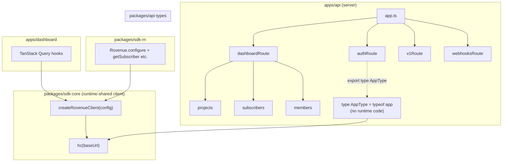

# Alan 2 — Hono RPC Integration

> **Status:** Design (2026-04-20) · **Priority:** Foundation (2/6), Drizzle ile paralel
> **Target:** `packages/sdk-rn` ve `apps/dashboard` için type-safe API client, el-yazması tipleri tamamen elimine et

---

## 1. Karar gerekçesi

### 1.1 Mevcut durumun sorunu

Rovenue'da dashboard ve SDK, Hono API'ye HTTP üstünden konuşuyor. Tiplemenin üç ayrı kaynağı var şu an:

1. **API tarafında**: Hono handler'ı içindeki Zod şeması + elle dönülen response objesi.
2. **Shared pakette**: `packages/shared/src/dashboard.ts` içinde elle yazılmış response tipleri (`ProjectDetail`, `SubscriberListResponse`, `AddMemberRequest`, vb.).
3. **Dashboard/SDK tarafında**: Bu tipleri import edip `fetch(...)`'in sonucunu `as ProjectDetail` ile cast eden query fonksiyonları.

Bu üçlü arasında **silent drift** kaçınılmaz:
- API response'u değişir, shared tipi güncellenmeyi unutur; dashboard eski şekil beklemeye devam eder, runtime'da sessizce undefined erişimleri başlar.
- Zod input şeması API'de sıkılaşır (yeni required field eklenir) ama SDK request gövdesi güncellenmeden deploy edilir; 400 response'ları production'da bulunur.
- Path parametresi ismi `/projects/:projectId` → `/projects/:id` olarak değişir, route pattern match olmaya devam eder ama `c.req.param("projectId")` her zaman undefined döner — sadece manuel testle yakalanır.

Mevcut `packages/shared/src/dashboard.ts` ~230 satır el-yazması tip. Her yeni endpoint burayı şişiriyor; tipler implementation'dan kopuk, iki tarafın uyumunu garanti eden hiçbir sözleşme yok.

### 1.2 Hono RPC ne yapar

Hono'nun `hc<AppType>()` helper'ı, **API app instance'ının tipini** tüketip client proxy üretir:

```typescript
import { hc } from "hono/client";
import type { AppType } from "@rovenue/api";

const client = hc<AppType>("https://api.rovenue.com");

// Autocomplete + full type inference:
const res = await client.dashboard.projects[":projectId"].$get({
  param: { projectId: "proj_123" },
});
// res.status narrowed by handler return types
// res.json() returns the exact success union type
```

Bu pattern'in sağladığı somut garantiler:

- **Route path'i derleme zamanında doğrulanır.** `client.dashboard.projects` yoksa (silinmişse veya yanlış imla ile yazılmışsa), TypeScript hata verir.
- **Param isimleri senkrondur.** `:projectId` → `param: { projectId: string }`. Yeniden adlandırma otomatik refactor olur.
- **Request body şeması handler'daki Zod şemasından çıkar.** `@hono/zod-validator` ile validator'lar bağlandığında, `client.route.$post({ json: ... })` içindeki `json` tipi inferred.
- **Response tipi handler'ın return tipinden çıkar.** `c.json(ok(payload))` pattern'i varsa `res.json()` otomatik olarak `{ data: payload }` döner.
- **Status-based narrowing.** `if (res.status === 200) { res.json() // success } else { res.json() // error shape }` — her status code'un kendi response şeması olabilir.

### 1.3 Paket ne yaratıyor

Hono RPC adopt edersek:

- `packages/shared/src/dashboard.ts` %80+ küçülür (yalnızca gerçekten cross-cutting tipler kalır: `MemberRoleName` gibi enum-alike'lar).
- Dashboard query fonksiyonları `hc.dashboard.projects.$get()` üstünden çalışır; elle `fetch` + `as Type` gitmiş olur.
- SDK'da public API endpoint'leri için aynı mekanizma; React Native SDK kullanıcısı `Rovenue.configure(...)` sonrası tipli bir client alır.
- Yeni endpoint eklemek **tek taraf** — route yaz, Zod şemanı tanımla, return type'ını c.json ile ver; client tarafı anında yeni tipleri görür.

### 1.4 Neye dikkat

Hono RPC tamamen **TypeScript type inference**'a dayanır. Bu güçlü ama üç pragmatic kısıtlama getiriyor:

- **Tip çıkarım derinliği patlar.** Çok route'lu Hono app'i tek `AppType` olarak export edince `tsc` bazen "Type instantiation is excessively deep and possibly infinite" hatası atar. Çözüm: route chaining disiplini (§6) + API'yi sub-app'lere bölme (§5).
- **Client yalnızca tip olarak bağlanmalı.** API kodu hiçbir şekilde client bundle'ına düşmemeli — `import type` disiplini şart. Aksi halde dashboard/SDK bundle'ı Prisma Client, BullMQ, pg Pool gibi server-only bağımlılıkları yutar.
- **Route'un tam URL şekli değişirse breaking change.** `/dashboard/projects/:projectId` → `/dashboard/projects/:id` client tarafında derleme zamanında görünür ama deploy sırası önemli: API önce deploy, sonra client. Versiyonlama (§9) bunu disipline bağlar.

---

## 2. Mimari diyagram



Kritik kural: **`packages/sdk-core` yalnızca `import type` ile API'ye bağlanır**, runtime'da API'nin tek satırını bile yüklemez.

---

## 3. Paketleme: üç katman

Rovenue monorepo'suna üç yeni paket / değişiklik geliyor.

### 3.1 `packages/api-types` (yeni, pure-type)

**Amaç:** `apps/api`'nin `AppType`'ını dışarı açmak. Kendi içinde runtime kod YOK.

```
packages/api-types/
├── src/
│   └── index.ts       # re-export type AppType from apps/api
├── package.json
└── tsconfig.json
```

`src/index.ts` tek satır:

```typescript
// Re-export the server's app type. This module must never be
// imported as a runtime value — it exists solely as a type graph
// conduit. Consumers use `import type` to prevent the server code
// from leaking into client bundles.
export type { AppType } from "@rovenue/api/app";
```

`package.json`:

```json
{
  "name": "@rovenue/api-types",
  "version": "0.0.0",
  "private": true,
  "type": "module",
  "exports": {
    ".": {
      "types": "./src/index.ts"
    }
  },
  "dependencies": {
    "@rovenue/api": "workspace:*"
  }
}
```

`exports` alanında yalnızca `types` field'ı var — runtime entry yok. Yanlışlıkla `import { AppType } from "@rovenue/api-types"` (without `type`) yazılırsa, bundler runtime'da hiçbir şey bulamaz ve hata verir. Bu istenilen davranış.

### 3.2 `packages/sdk-core` (yeni, runtime)

**Amaç:** Dashboard ve SDK-RN'in ortak kullanacağı, `hc<AppType>` client'ını config + auth injection ile saran runtime paket.

```
packages/sdk-core/
├── src/
│   ├── client.ts           # createRovenueClient()
│   ├── auth.ts             # auth header middleware
│   ├── errors.ts           # RovenueApiError class
│   ├── sse.ts              # SSE helper (for real-time config)
│   └── index.ts
└── package.json
```

Dependencies: `hono`, `@rovenue/api-types`. **No** Prisma, no BullMQ, no pg. Bundle disiplini: `pnpm why prisma` sonucu boş gelmeli.

### 3.3 `apps/api` export'u

`apps/api/package.json`:

```json
{
  "name": "@rovenue/api",
  "exports": {
    ".": {
      "import": "./dist/index.js",
      "types": "./dist/index.d.ts"
    },
    "./app": {
      "types": "./dist/app.d.ts"
    }
  }
}
```

`src/app.ts`'in sonunda `export type AppType = typeof app;` — route chaining tamamlandıktan sonra.

---

## 4. Tip çıkarım zinciri — nasıl çalışır

Hono RPC'nin tip çıkarımı bir zincir:

1. **Route tanımı zamanı.** Her `.get()`, `.post()` çağrısı dönen `Hono` instance'ına route imzasını ekler. Örneğin:

```typescript
const route = new Hono()
  .get("/:id", (c) => c.json({ id: c.req.param("id") }));
// type of `route`: Hono<Env, { "/:id": { $get: { param: { id: string }, output: { id: string } } } }>
```

2. **Zod validator entegrasyonu.** `@hono/zod-validator` `c.req.valid(target)` dönen tipi route imzasına işler:

```typescript
const schema = z.object({ name: z.string(), role: z.enum(["OWNER", "VIEWER"]) });
route.post("/", zValidator("json", schema), (c) => {
  const body = c.req.valid("json"); // { name: string, role: "OWNER" | "VIEWER" }
  return c.json({ ok: true });
});
```

3. **Route birleştirme.** `.route("/projects", projectsRoute)` her sub-route'un type'ını parent'a prefix ile ekler.

4. **`typeof app` export'u.** `AppType = typeof app` tam route grafını temsil eder.

5. **Client consumption.** `hc<AppType>(baseUrl)` bu grafı yürüyerek proxy üretir. `client.projects[":id"].$get` pattern'i yalnızca route-graph'ta karşılığı varsa fonksiyon olarak görünür.

**Çok önemli — route chaining disiplin:**

```typescript
// YANLIŞ — her çağrı ayrı variable'a atanıyorsa tip kaybolur
const route = new Hono();
route.get("/a", handler1);  // tipi route'a eklenmiş
route.post("/b", handler2);  // tipi route'a eklenmiş
// ama `typeof route` sadece IKI çağrıyı bilir? HAYIR — ama TS derleyicisi
// chaining olmadan narrowing yapmaz; bazı sürümlerde invariant kayar.

// DOĞRU — tek chain
export const route = new Hono()
  .get("/a", handler1)
  .post("/b", handler2);
```

Hono docs'ta da bu chaining zorunluluğu "explicit requirement" olarak geçer. Rovenue'nun mevcut route dosyaları zaten çoğunlukla chain pattern kullanıyor, ama birkaç yerde `route.get(...)` sonra satır atlayıp `route.post(...)` var — migration fırsatıyla hepsini chain'e çek.

---

## 5. Mevcut Hono app'i RPC-ready'ye çekme

Rovenue'nun `apps/api/src/app.ts`'i şöyle (özet):

```typescript
const app = new Hono();
app.use("*", ...);
app.route("/api/auth/*", authRoute);
app.route("/health", healthRoute);
app.route("/v1", v1Route);
app.route("/dashboard", dashboardRoute);
app.route("/webhooks", webhooksRoute);
```

### 5.1 `AppType` export ekleme

```typescript
// apps/api/src/app.ts (end of file)

// The chain-returned Hono instance captures every route type.
// Consumers (api-types package) re-export this type. Keep the
// creation and export in one file so `typeof app` matches what
// is actually served at runtime.
export const app = createApp();
export type AppType = typeof app;
```

`createApp()` fonksiyonunun return tipini `Hono<Env, ...>` olarak explicit etmek **yapma**. TypeScript inferred halini tut; aksi halde her route eklendiğinde `AppType`'ı elle güncellemek zorunda kalırsın.

### 5.2 Sub-app'leri `export type` ile dışa ver

Tek `AppType` yerine her modülün kendi tipini de export et — bazı senaryolarda (SDK sadece v1'e konuşur, dashboard sadece `/dashboard`'a konuşur) scope'u daraltmak tip derinliğini azaltır:

```typescript
// apps/api/src/routes/v1/index.ts
export const v1Route = new Hono()
  .route("/receipts", receiptsRoute)
  .route("/subscribers", subscribersRoute)
  .route("/product-groups", productGroupsRoute)
  .route("/experiments", experimentsRoute)
  .route("/config", configRoute);

export type V1RouteType = typeof v1Route;
```

Böylece SDK tarafında `hc<V1RouteType>("https://api.rovenue.com/v1")` yazılabilir; dashboard-only endpoint tipleri SDK bundle inference grafına girmez.

### 5.3 Middleware type'ları

Rovenue `c.set("user", ...)`, `c.set("project", ...)` gibi context extension'ları kullanıyor. RPC tarafı bu tipleri umursamıyor ama local type safety için `Env` definition şart:

```typescript
// apps/api/src/types/env.ts
import type { User } from "@rovenue/db";
import type { Project } from "@rovenue/db";

export type AppEnv = {
  Variables: {
    requestId: string;
    user?: { id: string; email: string };
    project?: { id: string; slug: string };
    db: DrizzleDb;
  };
};

// Every Hono instance should use this:
// new Hono<AppEnv>()
```

---

## 6. Route chaining + `@hono/zod-validator` pattern

Rovenue'nun mevcut handler'larından bir tane alalım ve RPC-uyumlu şekle çekelim.

### 6.1 Before (şu an rovenue'da)

```typescript
// apps/api/src/routes/dashboard/members.ts (mevcut kod, özet)
export const membersRoute = new Hono();
membersRoute.use("*", requireDashboardAuth);

membersRoute.post("/", async (c) => {
  const body = addSchema.parse(await c.req.json());
  // ...
  return c.json(ok(payload));
});
```

- Chaining yok (her statement ayrı).
- Validation elle try/catch içinde yapılıyor.
- Client tarafı `body` tipini bilmiyor.

### 6.2 After (RPC-ready)

```typescript
// apps/api/src/routes/dashboard/members.ts
import { Hono } from "hono";
import { zValidator } from "@hono/zod-validator";
import { z } from "zod";
import { memberRoleValues } from "../../constants";
import { requireDashboardAuth } from "../../middleware/dashboard-auth";
import type { AppEnv } from "../../types/env";

const addSchema = z.object({
  email: z.string().email(),
  role: z.enum(memberRoleValues),
});

const updateSchema = z.object({
  role: z.enum(memberRoleValues),
});

export const membersRoute = new Hono<AppEnv>()
  .use("*", requireDashboardAuth)
  // GET /
  .get("/", async (c) => {
    const projectId = c.req.param("projectId");
    const rows = await listMembers(c.get("db"), projectId);
    return c.json({ data: { members: rows } });
  })
  // POST /
  .post("/", zValidator("json", addSchema), async (c) => {
    const input = c.req.valid("json");
    const projectId = c.req.param("projectId");
    // ... logic
    return c.json({ data: { member: row } });
  })
  // PATCH /:userId
  .patch("/:userId", zValidator("json", updateSchema), async (c) => {
    const input = c.req.valid("json");
    const { userId } = c.req.param();
    // ...
    return c.json({ data: { member: updated } });
  })
  // DELETE /:userId
  .delete("/:userId", async (c) => {
    const { userId } = c.req.param();
    // ...
    return c.json({ data: { id: target.id } });
  })
  // POST /leave
  .post("/leave", async (c) => {
    // ...
    return c.json({ data: { id: membership.id } });
  });

export type MembersRouteType = typeof membersRoute;
```

Dikkat:
- Tek expression chain'i. Her `.x()` sonrası dönen tip daha zengin.
- `zValidator("json", schema)` response tipini değiştirmez ama `c.req.valid("json")` tipini güvenilir kılar. Client tarafı `$post({ json: ... })`'de `json`'u `z.infer<typeof addSchema>` olarak görür.
- Error path'leri `HTTPException` fırlatarak handle ediliyor (errorHandler middleware'i yakalar). Bu davranış RPC'nin dışında; client `res.status === 400` ile error case'i ayırt eder.

### 6.3 `c.json()` response tiplendirme

Rovenue `ok(payload)` helper'ı kullanıyor. Bunu RPC-friendly tutmak için helper'ın tipini korumalı:

```typescript
// apps/api/src/lib/response.ts
export function ok<T>(data: T): { data: T } {
  return { data };
}

export function fail(code: string, message: string): { error: { code: string; message: string } } {
  return { error: { code, message } };
}
```

Handler içinde:

```typescript
return c.json(ok({ member: row }));
// TS type of response body: { data: { member: ProjectMemberRow } }
// Client sees this exact shape in res.json()
```

Status code'u değiştirmek gerekirse:

```typescript
return c.json(ok({ member: row }), 201);
// Client side: if (res.status === 201) { ... narrowing ... }
```

---

## 7. Client paketi: `createRovenueClient`

Dashboard ve SDK-RN'in tüketeceği runtime paket.

### 7.1 `client.ts`

```typescript
// packages/sdk-core/src/client.ts
import { hc } from "hono/client";
import type { AppType } from "@rovenue/api-types";
import { RovenueApiError } from "./errors";

export type RovenueClientConfig = {
  baseUrl: string;
  /**
   * Either a static API key (SDK usage) or a function that returns
   * a fresh session cookie/token (dashboard usage). Called on every
   * request so callers can refresh without reconstructing the client.
   */
  auth: RovenueAuth;
  /**
   * Override the global fetch. Required on React Native below 0.74
   * where the default fetch lacks streaming support — consumers pass
   * `fetch` from `react-native-fetch-api` or similar polyfill.
   */
  fetch?: typeof fetch;
  /**
   * Default request timeout. Individual calls can override via
   * AbortSignal. Hard-caps runaway requests that would otherwise
   * pin the bundler's event loop.
   */
  timeoutMs?: number;
};

export type RovenueAuth =
  | { type: "apiKey"; key: string }
  | { type: "session"; credentials?: RequestCredentials }
  | { type: "bearer"; token: () => string | Promise<string> };

// Build the Hono RPC client once. All requests go through this
// instance; callers get the fully-typed proxy back.
export function createRovenueClient(config: RovenueClientConfig) {
  const fetcher = buildFetcher(config);

  const client = hc<AppType>(config.baseUrl, {
    fetch: fetcher,
  });

  return client;
}

function buildFetcher(config: RovenueClientConfig): typeof fetch {
  const baseFetch = config.fetch ?? globalThis.fetch;
  if (!baseFetch) {
    throw new Error(
      "createRovenueClient: no fetch available. Pass `fetch` in config.",
    );
  }

  return async function rovenueFetch(input, init = {}) {
    const headers = new Headers(init.headers);

    // Inject auth before every request. Doing this at fetch level
    // (not client construction) lets callers rotate credentials
    // without tearing down the client.
    await applyAuth(headers, config.auth);

    // Always propagate a request id so API logs and client logs can
    // be correlated without special server cooperation.
    if (!headers.has("X-Request-Id")) {
      headers.set("X-Request-Id", generateRequestId());
    }

    const controller = new AbortController();
    const timeoutId = config.timeoutMs
      ? setTimeout(() => controller.abort(), config.timeoutMs)
      : null;

    try {
      const res = await baseFetch(input, {
        ...init,
        headers,
        signal: init.signal ?? controller.signal,
      });

      if (!res.ok && res.status >= 500) {
        // Normalize 5xx into a typed error. 4xx responses are
        // returned as-is so the caller can handle domain errors.
        const body = await res.clone().text();
        throw new RovenueApiError({
          status: res.status,
          code: "server_error",
          message: body || res.statusText,
        });
      }

      return res;
    } finally {
      if (timeoutId) clearTimeout(timeoutId);
    }
  };
}

async function applyAuth(headers: Headers, auth: RovenueAuth): Promise<void> {
  switch (auth.type) {
    case "apiKey":
      headers.set("Authorization", `Bearer ${auth.key}`);
      return;
    case "session":
      // Cookies handled by fetch credentials; nothing to inject.
      return;
    case "bearer":
      headers.set("Authorization", `Bearer ${await auth.token()}`);
      return;
  }
}

function generateRequestId(): string {
  // crypto.randomUUID is available in Node 19+, modern browsers,
  // and RN 0.72+. Fallback keeps the polyfill footprint minimal.
  if (typeof crypto !== "undefined" && "randomUUID" in crypto) {
    return crypto.randomUUID();
  }
  return `req_${Date.now().toString(36)}_${Math.random().toString(36).slice(2)}`;
}
```

### 7.2 `errors.ts`

```typescript
// packages/sdk-core/src/errors.ts
export class RovenueApiError extends Error {
  readonly status: number;
  readonly code: string;

  constructor(args: { status: number; code: string; message: string }) {
    super(args.message);
    this.name = "RovenueApiError";
    this.status = args.status;
    this.code = args.code;
  }
}

// Discriminated helper: call this after an rpc call to normalize
// the envelope. The API always returns { data: ... } on success and
// { error: { code, message } } on failure.
export async function unwrap<T>(
  res: Response & { json: () => Promise<{ data?: T; error?: { code: string; message: string } }> },
): Promise<T> {
  const body = await res.json();
  if (res.ok && body.data !== undefined) return body.data;
  if (body.error) {
    throw new RovenueApiError({
      status: res.status,
      code: body.error.code,
      message: body.error.message,
    });
  }
  throw new RovenueApiError({
    status: res.status,
    code: "unknown",
    message: `Unexpected response shape for status ${res.status}`,
  });
}
```

### 7.3 Dashboard'da kullanım

```typescript
// apps/dashboard/src/lib/api.ts
import { createRovenueClient, unwrap } from "@rovenue/sdk-core";

export const api = createRovenueClient({
  baseUrl: import.meta.env.VITE_API_URL,
  auth: { type: "session", credentials: "include" },
  timeoutMs: 20_000,
});

// TanStack Query hook with full inference — no manual typing needed.
// `projectId` parameter is inferred from the route path, `members`
// shape from the handler return type.
export function useProjectMembers(projectId: string) {
  return useQuery({
    queryKey: ["project", projectId, "members"],
    queryFn: async () => {
      const res = await api.dashboard.projects[":projectId"].members.$get({
        param: { projectId },
      });
      return unwrap(res);
    },
  });
}

export function useAddMember(projectId: string) {
  return useMutation({
    mutationFn: async (input: { email: string; role: "OWNER" | "ADMIN" | "VIEWER" }) => {
      const res = await api.dashboard.projects[":projectId"].members.$post({
        param: { projectId },
        json: input,
      });
      return unwrap(res);
    },
  });
}
```

Burada `input` tipi `addSchema`'dan inferred — dashboard tarafında `AddMemberRequest` interface'ini elle yazmaya gerek kalmaz. `packages/shared/src/dashboard.ts`'deki `AddMemberRequest`, `AddMemberResponse`, `ListMembersResponse` kaybolur.

### 7.4 SDK-RN'de kullanım

```typescript
// packages/sdk-rn/src/rovenue.ts
import { createRovenueClient } from "@rovenue/sdk-core";
import type { V1RouteType } from "@rovenue/api/v1";

let client: ReturnType<typeof createRovenueClient> | null = null;

export function configure(config: { apiKey: string; baseUrl?: string }) {
  client = createRovenueClient({
    baseUrl: config.baseUrl ?? "https://api.rovenue.com/v1",
    auth: { type: "apiKey", key: config.apiKey },
    timeoutMs: 15_000,
    // RN < 0.74 needs a custom fetch for SSE streaming (see §10).
  });
}

export async function submitReceipt(args: {
  platform: "ios" | "android";
  receiptData: string;
  appUserId: string;
}) {
  assertConfigured();
  const res = await client!.receipts.$post({ json: args });
  return unwrap(res);
}
```

SDK-RN için `hc<V1RouteType>` scope kullanılacak (dashboard tipleri bundle'a girmez).

---

## 8. Error tiplerinin client'a yansıması

Rovenue handler'ları `HTTPException` fırlatıp errorHandler middleware'iyle `{ error: { code, message } }` şeklinde yakalıyor. Hono RPC **success response type'larını** iyi çıkarır; error response'ları çıkarmak daha naziktir.

İki yaklaşım var:

### 8.1 Uniform error envelope (önerilen)

Her error response aynı şekle sahipse, client'ta tek generic `unwrap` yeter (§7.2). `ok<T>`/`fail` helper'ları bunu sağlar. RPC tipi success shape'ini bilir; error shape'i uniform kontrat olduğu için client'ta değişmeden kalır. Basit, pragmatik, rovenue'nun mevcut pattern'ine uyumlu.

### 8.2 Status-code branching (daha zengin)

Handler'ın status'e göre farklı response tipleri döndürmesi için:

```typescript
.post("/", zValidator("json", schema), async (c) => {
  const existing = await findMember(input.email);
  if (existing) {
    return c.json({ error: { code: "already_member", email: existing.email } }, 409);
  }
  const created = await createMember(input);
  return c.json({ data: { member: created } }, 201);
});
```

Client tarafı:

```typescript
const res = await api.dashboard.projects[":projectId"].members.$post({ ... });
if (res.status === 201) {
  const body = await res.json(); // { data: { member: ... } }
} else if (res.status === 409) {
  const body = await res.json(); // { error: { code: "already_member", email: string } }
}
```

Bu zenginliği her endpoint için kurmak (özellikle zaten çalışan kodda) büyük refactor. Rovenue ölçeğinde §8.1 yeterli; §8.2 yalnızca özel endpoint'lerde (idempotency, race-condition) kullanılsın.

---

## 9. Versioning

`/v1/...` path prefix'i rovenue'da zaten mevcut. RPC ile uyumlu iki pattern:

### 9.1 Namespace prefix (şu anki)

`v1Route` ayrı bir Hono instance, ana app'e `/v1` prefix ile mount. Client tarafında:

```typescript
client.v1.receipts.$post({ ... });
```

Avantaj: tek client, tüm versiyonlar aynı URL altında.
Dezavantaj: Breaking change yapılacaksa `v2Route` eklenir; client iki namespace bilgi yükü taşır.

### 9.2 Versiyon başı ayrı client

```typescript
// SDK v1 only
import type { V1RouteType } from "@rovenue/api/v1";
const clientV1 = hc<V1RouteType>("https://api.rovenue.com/v1");

// Eventually SDK v2
import type { V2RouteType } from "@rovenue/api/v2";
const clientV2 = hc<V2RouteType>("https://api.rovenue.com/v2");
```

Avantaj: her versiyonun tip grafı izole.
Dezavantaj: ortak endpoint'ler iki kez bildiriliyor.

**Rovenue için öneri:** §9.1 default, ama `export type V1RouteType = typeof v1Route;` export et ki sub-consumer'lar (public SDK) dar scope'ta çalışabilsin. Major version bump geldiğinde `/v2/...` ayrı sub-app.

### 9.3 Breaking change protokolü

Deploy sırası zorunlu:
1. API'yi ekli yeni endpoint/parametre ile deploy et (backward compatible).
2. Client'ı yeni kontrata uyarla (derleme hatası yoksa eski kod da çalışır).
3. Eski endpoint'i deprecated flag ile işaretle (`@deprecated` JSDoc), bir sürümde kaldır.

Geriye dönük uyumsuz değişiklik (örn. `/v1/receipts` body field'ı rename) yapılamaz — `/v2/receipts` ile paralel serve.

---

## 10. React Native özellikleri

SDK-RN tarafı iki noktada dikkat ister:

### 10.1 Fetch polyfill

React Native'in yerleşik fetch'i JSON/form için yeterli ama **streaming body** desteklemez (AbortController evet, ReadableStream hayır). SSE endpoint'leri (Alan 5 config streaming) için polyfill gerekli:

```bash
pnpm add react-native-fetch-api
```

```typescript
// packages/sdk-rn/src/polyfill.ts
import { fetch as rnFetch } from "react-native-fetch-api";

export const sseCompatibleFetch: typeof fetch = ((input, init) =>
  rnFetch(input, {
    ...init,
    reactNative: { textStreaming: true },
  })) as typeof fetch;
```

SDK config:

```typescript
createRovenueClient({
  baseUrl: "...",
  auth: { type: "apiKey", key: apiKey },
  fetch: sseCompatibleFetch,
});
```

### 10.2 AbortController ve app state

Backgrounded RN app'ler fetch'leri hemen kesmez; 60+ saniye pending kalabilir. SDK default timeout (15s) ve AppState listener ile in-flight request'leri iptal et:

```typescript
import { AppState } from "react-native";

AppState.addEventListener("change", (next) => {
  if (next === "background") {
    // Cancel in-flight requests that aren't critical (config poll,
    // analytics beacons). Critical ones (purchase finalization)
    // should not be cancelled — have a separate controller.
    nonCriticalController.abort();
    nonCriticalController = new AbortController();
  }
});
```

### 10.3 Offline pattern

SDK-RN'de purchase/receipt submission offline'da MMKV cache'ye düşüyor (rovenue CLAUDE.md'de belirtilmiş). RPC client üstünde offline-safe wrapper:

```typescript
export async function submitReceiptSafe(args: SubmitArgs) {
  try {
    return await client.receipts.$post({ json: args });
  } catch (err) {
    if (isNetworkError(err)) {
      await mmkvQueue.enqueue(args);
      return { queued: true } as const;
    }
    throw err;
  }
}
```

RPC tipi `{ queued: true } | { data: Receipt }` union'ı olur; kullanıcı kodu discriminated olarak handle eder.

---

## 11. Build pipeline ve tsc emit

Hono RPC'nin type inference'ı çalışabilmesi için **API build artifact'ı tip tanımlarını içermelidir**. Turborepo pipeline'ı:

```json
// turbo.json
{
  "tasks": {
    "build": {
      "dependsOn": ["^build"],
      "outputs": ["dist/**"]
    },
    "typecheck": {
      "dependsOn": ["^build"],
      "outputs": []
    }
  }
}
```

### 11.1 `apps/api/tsconfig.json`

```json
{
  "extends": "../../tsconfig.base.json",
  "compilerOptions": {
    "outDir": "./dist",
    "declaration": true,
    "declarationMap": true,
    "rootDir": "./src",
    "composite": true
  },
  "include": ["src/**/*"],
  "references": [
    { "path": "../../packages/db" },
    { "path": "../../packages/shared" }
  ]
}
```

`composite: true` + `declaration: true` kritik — `tsc --build` project references üstünden artifact üretir, `@rovenue/api-types` bu artifact'ı tüketir.

### 11.2 Build emir

```bash
# Development: API kodunu değiştirince tipleri yayması için tsc --watch
pnpm --filter @rovenue/api tsc --build --watch

# Production: tek seferde tüm workspace
pnpm -r build
```

Turborepo caching: `apps/api/src/**` değişince `@rovenue/api-types` invalidate olur, onu tüketen `packages/sdk-core` ve `apps/dashboard` tipleri yeniden check edilir. Cache hit oranı tipik ~80%+ (sadece api değişikliklerinde miss).

### 11.3 `@rovenue/api-types` export'u

```json
// packages/api-types/package.json
{
  "name": "@rovenue/api-types",
  "exports": {
    ".": {
      "types": "./src/index.ts"
    }
  },
  "files": [],
  "scripts": {
    "typecheck": "tsc --noEmit"
  }
}
```

Bu paket build edilmez — `.ts` dosyasını doğrudan tüketir. Downstream build'i API'nin dist'ine bağlıdır.

---

## 12. Deployment notları

### 12.1 API Dockerfile

API imajına `dist/**` ve `node_modules`'ü kopyalamak yeterli:

```dockerfile
FROM node:22-alpine AS build
WORKDIR /app
COPY . .
RUN corepack enable && pnpm install --frozen-lockfile
RUN pnpm --filter @rovenue/api build

FROM node:22-alpine AS runtime
WORKDIR /app
COPY --from=build /app/apps/api/dist ./apps/api/dist
COPY --from=build /app/node_modules ./node_modules
# packages/db'nin compiled dist'i de gerekli
COPY --from=build /app/packages/db/dist ./packages/db/dist
ENV NODE_ENV=production
CMD ["node", "apps/api/dist/index.js"]
```

`@rovenue/api-types` ve `@rovenue/sdk-core` **API imajında yok** — onlar dashboard ve SDK tarafında kullanılıyor. Bu paketleri API imajına eklemek image'ı büyütür ve gereksiz.

### 12.2 Dashboard build

Vite dashboard build'i `@rovenue/api-types`'tan sadece tipleri alır; `@rovenue/sdk-core`'dan runtime import yapar. Bundle'da Hono RPC client (~15KB gzip) + proxy object (negligible) olur, API kodu **olmaz** (`import type` disiplini).

Doğrulama: `pnpm --filter @rovenue/dashboard build` sonrası

```bash
pnpm dlx source-map-explorer apps/dashboard/dist/assets/*.js
```

Çıktıda `@rovenue/api/*` görünmemeli. Görünüyorsa kod yerine type import'u bozulmuş — `import type` ekle.

### 12.3 SDK-RN bundle

SDK-RN Metro ile bundle'lanır, tree-shaking limitli. `@rovenue/sdk-core` + `@rovenue/api-types` tiplerinden başka şey bundle'a girmemeli. SDK package.json'da:

```json
{
  "dependencies": {
    "@rovenue/sdk-core": "workspace:*",
    "hono": "^4.x",
    "react-native-fetch-api": "^3.x"
  },
  "peerDependencies": {
    "react-native": ">=0.72"
  }
}
```

`@rovenue/api-types` **dependency olmamalı** — sadece devDependency olarak TS checking için. Yayınlanan SDK paketi başka geliştiricilerin indirmesi gereken runtime bağımlılığı olarak API types'ı istemez.

---

## 13. Test stratejisi

### 13.1 RPC tip testleri (compile-time)

`packages/sdk-core/tests/types.test-d.ts`:

```typescript
import { expectTypeOf } from "expect-type";
import { createRovenueClient } from "../src/client";

const client = createRovenueClient({
  baseUrl: "http://localhost:3000",
  auth: { type: "session" },
});

// Route existence
expectTypeOf(client.dashboard.projects.$get).toBeFunction();
expectTypeOf(client.v1.receipts.$post).toBeFunction();

// Param shape
type AddMemberInput = Parameters<
  typeof client.dashboard.projects[":projectId"].members.$post
>[0];
expectTypeOf<AddMemberInput>().toHaveProperty("param").toEqualTypeOf<{ projectId: string }>();
expectTypeOf<AddMemberInput>().toHaveProperty("json").toEqualTypeOf<{
  email: string;
  role: "OWNER" | "ADMIN" | "VIEWER";
}>();
```

`tsc --noEmit` CI step'i bu dosyayı kontrol eder; yanlış tipler derleme hatası atar.

### 13.2 Integration tests (runtime)

API + client birlikte:

```typescript
// apps/dashboard/tests/integration/members.test.ts
import { createApp } from "@rovenue/api/app";
import { createRovenueClient } from "@rovenue/sdk-core";
import { testClient } from "hono/testing";

describe("member crud via rpc", () => {
  const app = createApp();
  const client = testClient(app); // Hono's in-process test client

  test("add then list", async () => {
    const added = await client.dashboard.projects[":projectId"].members.$post({
      param: { projectId: "proj_test" },
      json: { email: "new@x.com", role: "ADMIN" },
    });
    expect(added.status).toBe(200);

    const listed = await client.dashboard.projects[":projectId"].members.$get({
      param: { projectId: "proj_test" },
    });
    const body = await listed.json();
    expect(body.data.members.some((m) => m.email === "new@x.com")).toBe(true);
  });
});
```

`hono/testing`'in `testClient` fonksiyonu HTTP sunucu ayağa kaldırmadan app'i çağırır — hem hızlı hem RPC tiplerinin doğruluğunu integration seviyesinde kanıtlar.

### 13.3 Tip regresyon testi

Routes silinince downstream kod derleme hatası atıyor mu? CI'da `pnpm -r typecheck` aşaması var; bir route'u kaldırıp dashboard'ı derleyince hata atması beklenen davranıştır. Bu test'i "happy path" CI'ında value-adding bir tazelemeyle yazmaya gerek yok, ama **silme PR'larının merge kontrolü** buna bağlı kalsın.

### 13.4 Error envelope uniform testi

```typescript
test("all 4xx responses follow { error: { code, message } } shape", async () => {
  const paths = extractRouteGraph(app); // custom helper, walks Hono instance
  for (const path of paths) {
    const res = await request(app).post(path).send({ malformed: true });
    if (res.status >= 400 && res.status < 500) {
      expect(res.body).toHaveProperty("error.code");
      expect(res.body).toHaveProperty("error.message");
    }
  }
});
```

Bu test uniform envelope invariant'ını CI'da koruyor — yeni bir endpoint `c.json({ message: "..." })` (wrapper olmadan) dönerse yakalanır.

---

## 14. DX: autocomplete ve common pitfalls

### 14.1 Autocomplete örnekleri

- `client.` tuşlayınca top-level route grupları (auth, dashboard, health, v1, webhooks) açılır.
- `client.dashboard.projects[":projectId"].` sonrası sub-route listesi (members, subscribers, credentials, ...).
- `.$get({ ` içinde `param`, `query`, `header` gibi input slotları.

### 14.2 Pitfall — "Type instantiation is excessively deep"

`AppType` çok genişlerse (50+ route + iç içe validator'lar) TypeScript patlar. Semptom: IDE response'u yavaşlar, `tsc` "excessively deep" hatası verir. Çözümler:

1. **Scope küçült.** SDK sadece `V1RouteType` kullansın, dashboard `AppType`. Birini diğerine kaynak yapma.
2. **Chaining'i kır.** Çok uzun `.use().get().post()...` chain'leri 15-20 call'dan sonra parçala:

```typescript
export const base = new Hono().use("*", mw1).use("*", mw2);
export const withGets = base.get("/a", h1).get("/b", h2);
export const full = withGets.post("/c", h3).post("/d", h4);
export type FullType = typeof full;
```

3. **Sub-route'ları ayrı dosyaya.** `routes/dashboard/*.ts` her biri küçük; `routes/dashboard/index.ts` sadece mount. TypeScript project reference sınırları bu bölünmeyi dakikalar mertebesinde hızlandırır.

### 14.3 Pitfall — `as` cast dönüşü

Yanlışlıkla `as ProjectDetail` yazmaya devam etmek kolay. Code review checklist'e ekle: "`as <DbOr­WireType>` var mı? Varsa gerçekten gerekli mi?"

### 14.4 Pitfall — Return type'ı incelikle değiştirmek

Handler'ın `return c.json(ok({ a: 1, b: 2 }))` → `return c.json(ok({ a: 1 }))` değişimi breaking change'dir. CI'da dashboard derlemesi bu değişikliği yakalar — ama sadece dashboard'un bu field'a eriştiği yerde. Field'ı kullanmayan yerler hatasız derlenir. Yeterli test kapsamı + `git blame` disiplinsiz bir kullanım görünce noise tetikler.

### 14.5 Pitfall — Runtime import sızıntısı

`import { something } from "@rovenue/api/routes/dashboard/projects"` (type değil) yazınca dashboard bundle'ı API route kodunu yutar. Guard: ESLint rule `@typescript-eslint/consistent-type-imports` + `no-restricted-imports` ile `@rovenue/api`'nin value import'unu client paketlerinde yasakla.

---

## 15. Potansiyel tuzaklar — bir kez daha (RPC-spesifik)

### T1 — Middleware'ın tip'i

`requireDashboardAuth` middleware'i `c.set("user", ...)` yapıyor. RPC client **bu context değişikliklerini umursamaz** — sadece request/response şeması RPC'ye dahil. Yani `c.get("user")` çağrısının var olup olmadığını client tarafı bilemez. Bu OK; ama middleware error'larını nasıl expose ettiğini client'a doğru yansıtmak gerekir (§8).

### T2 — Streaming ve SSE

Hono RPC `EventSource` tipinde streaming response'u doğrudan tiplemez. SSE endpoint'leri için elle wrapper yaz:

```typescript
// packages/sdk-core/src/sse.ts
export function subscribeConfig(client, projectId, onEvent) {
  const url = `${client.baseUrl}/v1/config/stream?projectId=${projectId}`;
  const es = new EventSource(url);
  es.addEventListener("config", (ev) => onEvent(JSON.parse(ev.data)));
  return () => es.close();
}
```

Tiplemeyi Zod ile parse'dan sonra elle yap. Bu sınırı Alan 5 (Experiment Engine) detayında işleyeceğiz.

### T3 — WebSocket tipleri

Aynı — Hono RPC WS mesajlarını tiplemez. Ayrı paket (`@rovenue/sdk-ws`) veya manuel protocol tanımı gerekir.

### T4 — Query parameter tipleri

`c.req.query()` default olarak `string | undefined` döner. Query'de type-safe parsing için `zValidator("query", z.object({...}))` şart. Client tarafında `.$get({ query: { cursor: "abc" } })` zorunlu olur.

### T5 — FormData ve file upload

`@hono/zod-validator` `"form"` target'ı destekler; dosya uploadları için `multipart/form-data` schema'sı yazılır. Client tarafı:

```typescript
const formData = new FormData();
formData.append("file", blob);
await client.upload.$post({ form: formData });
```

RN'de `FormData` API'si native destekli — polyfill gerekmez.

### T6 — Conditional route (feature flag'li endpoint)

Production'da kapalı, staging'de açık bir endpoint için:

```typescript
if (env.NODE_ENV !== "production") {
  dashboardRoute.route("/dev", devRoute);
}
```

**RPC bunu dinamik olarak tiplemez** — TypeScript static olarak hem var hem yok hali göremez. Client'ta `client.dashboard.dev` hep tipli görünür (var kabul edilir). Runtime 404 bu durumda yakalanır. Eğer dev-only endpoint'ler RPC grafından tamamen ayrık olsun isteniyorsa, ayrı `AppType` (`DevAppType`) export edilip ayrı client construct edilmeli.

### T7 — Prototype pollution vs proxy'nin davranışı

`hc<AppType>` tarafından dönen proxy, herhangi bir string key'e erişimi geçerli bir "route access" olarak yorumlar; runtime'da olmayan route'a fetch deneyecektir. Yani yanlış yazılmış bir route (type'ta olmayan) yakalanır, ama dynamic `client[userInputString]` riskli — user input'u route path'i olarak asla kullanma.

### T8 — `testClient` URL builder

`hono/testing`'in `testClient`'ı baseUrl'ü `http://localhost` kabul eder; gerçek URL'e bağlanan RPC proxy'sinin aksine. Tests'te relative path'ler çalışır, production-like URL beklemeyen assertion'lar yazma.

### T9 — JSON serialization subtleties

Date objesi `c.json({ createdAt: new Date() })` olarak dönerse, Hono `JSON.stringify` ile ISO string'e çevirir. Client tarafı `res.json()` sonrasında `createdAt` `string` tipindedir ama RPC type inference `Date` der. Bu mismatch rovenue'da mevcut bir sorun (manual `.toISOString()` çağrıları her yerde). Çözüm: handler'larda `.toISOString()` explicit, böylece tip `string` olarak çıkar ve client tarafı Date construct'ı bilerek yapar. Rovenue mevcut `ok(payload)` helper'ına `superjson`-style serializer eklemek alternatif — ama SDK size bütçesi düşünülünce manuel string tercih.

### T10 — `Request` constructor vs `RequestInit`

RN'de `Request` constructor bazı polyfill versiyonlarında eksik. `hc()` options.fetch'e `(input, init) => ...` imzalı fonksiyon verdiğimiz sürece bunu görmez — güvende.

---

## 16. Incremental adoption

Tüm endpoint'leri bir anda migrate etmek şart değil. Önerilen yol:

1. **Faz 1 (yarım gün):** `packages/api-types` + `packages/sdk-core` kurulur. API'de `export type AppType` ekle.
2. **Faz 2 (yarım gün):** Dashboard'da bir endpoint (örn. `useProjects`) RPC ile değiştir. `packages/shared/src/dashboard.ts`'deki ilgili tipleri sil. CI yeşilse devam.
3. **Faz 3 (sprint boyunca):** Her dashboard hook migration'ı PR bazında. Her PR `@rovenue/shared`'den bir-iki tip siler.
4. **Faz 4:** SDK-RN API endpoint'leri RPC'ye geçer. `/v1` scope'u export edilir.
5. **Faz 5:** `packages/shared/src/dashboard.ts` ve `packages/shared/src/index.ts` RPC coverage altına giren tipler temizlenir. Geride kalan tipler gerçekten shared olanlar (enum değerleri, constant'lar, SDK public API tipi).

Paralelde Drizzle migration (Alan 1) devam ediyor — ikisi bağımsız, eş zamanlı gidebilir.

---

## 17. Sonraki adım ve açık sorular

Implementation plan'ı yazılacak: `docs/superpowers/plans/2026-04-XX-hono-rpc.md`.

Karar gerektirenler:

1. **`@rovenue/sdk-core` paketi SDK-RN ile mı bundled yoksa ayrı yayınlanan dependency mi?** SDK-RN kullanıcıları `@rovenue/sdk-core`'u ayrı indirmek istemez — bundled tercih edilir ama monorepo'da paketler ayrı kalır, SDK-RN build'i `pnpm deploy` ile sdk-core'u kendi dist'ine kopyalar.
2. **`@rovenue/api-types`'ı public yayınlamak anlamlı mı?** Bizim kullanıcılarımız kendi HTTP client'larını type-safe yapmak isterse faydalı. AGPLv3 yükü düşünülünce ilk faz'da internal, sonra public düşün.
3. **Error code registry.** `already_member`, `server_error`, `not_found` gibi code'lar shared bir enum'a çekilsin — hem API hem client tek kaynaktan import etsin, yoksa typo'larla tutarsızlaşır.
4. **Request retry policy.** SDK-core'da built-in retry var mı? GET idempotent, POST çoğunlukla değil. İyi default: GET'lere 3x exponential backoff, POST/PATCH/DELETE'lere hiç retry yok — Idempotency-Key mevcutsa retry OK. Bu policy `createRovenueClient` config'inde override edilebilir.

---

*Alan 2 sonu. Sonraki: Alan 3 — Security & Compliance.*
