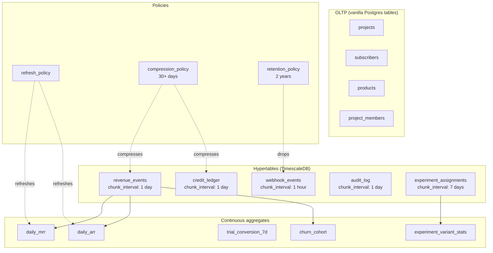

# Alan 4 — TimescaleDB Integration

> **Status:** Design (2026-04-20) · **Priority:** 4/6 (scale öncesi)
> **Target:** PostgreSQL üzerinde TimescaleDB extension, time-series veriler için hypertable + continuous aggregates + compression

---

## 1. Karar gerekçesi

### 1.1 Rovenue'nun time-series yükü

Rovenue'da büyümeyle en hızlı şişen tablolar:

- **`revenue_events`** — her purchase/renewal/refund bir satır. Dashboard MRR/ARR grafikleri burayı sorgular. 200K kullanıcılı bir uygulamada yılda 1-2M satır.
- **`credit_ledger`** — consumable/credit tabanlı uygulamada her "spend" bir satır. AI editleme uygulaması gibi credit-heavy senaryolarda kullanıcı başı günde 10-50 satır üretebilir — aylık milyonları bulur.
- **`webhook_events`** — her Apple/Google/Stripe notification'ı kayıt. 100K aktif abone ≈ günde 3-5K webhook.
- **`outgoing_webhooks`** — her müşteri-yönlendirmesi, attempt history ile. Retry politikası yüzünden asıl event sayısının 2-3 katı satır.
- **`experiment_assignments`** — her user × experiment = bir satır. 10 experiment × 100K user = 1M satır, kalıcı.
- **`audit_log`** — hash chain nedeniyle append-only (Alan 3). Kurumsal kullanımda yüksek hacim.

Bu tabloların tümü **time-indexed**: ya `createdAt` ya `occurredAt` üstünden sorgulanır, tarih aralığı filtresi baskın. Dashboard query'leri "son 30 gün", "bu yıl", "son 7 gün daily rollup" pattern'i.

### 1.2 Vanilla Postgres'in kısıtları

Vanilla Postgres bu yükü üç koldan zorlar:

- **Index bloat + planner confusion.** `revenue_events (projectId, createdAt)` b-tree index'i her yazıda büyür; veri ~50M satırı geçince planner bazen seq scan'a düşer (statistics güncel değilse).
- **Granüler aggregation pahalıdır.** Her dashboard açılışında "son 90 günü günlük bucket'la group by" sorgusu aynı hesabı tekrar yapar — sonuç cache'lenmediği için CPU harcanır. Materialized view + manuel refresh mümkün ama "only new rows" refresh'i yoktur (full rebuild).
- **Disk kullanımı.** 1M satır × 200 byte avg = 200MB, indexlerle 500MB. Yıl sonu 5-10GB single tablo. Hetzner VPS disk'i düşünülünce retention stratejisi zorunlu.
- **Delete maliyeti.** Eski veriyi silmek için `DELETE ... WHERE createdAt < now() - interval '90 days'` → index bloat + autovacuum kurbanı. Partitioning yok.

### 1.3 TimescaleDB'nin getirdikleri

TimescaleDB PostgreSQL'in bir **extension**'ı — farklı bir veritabanı değil. Aynı connection, aynı SQL, aynı Prisma/Drizzle client.

Üç temel özellik:

- **Hypertables:** Zaman aralığıyla otomatik partitioning. `CREATE TABLE ...` sonrası `SELECT create_hypertable(...)` ile tablo arkada `_hyper_N_chunks` şeklinde parçalanır. Query planner ilgisiz chunk'ları eler (chunk exclusion) — milyarlarca satırda date range query tek chunk okur.
- **Continuous aggregates:** Materialized view + incremental refresh. "Daily MRR" aggregate'i yazılır bir kez; yeni revenue_event satırları geldikçe aggregate arka planda güncellenir (on-demand veya policy ile). Dashboard sorgusu milisaniye'de döner.
- **Compression:** Eski chunk'lar (30+ gün) columnar formata sıkıştırılır. Rovenue tipik yüklerinde **10-20x compression ratio** — 100GB → 5-10GB. Sıkıştırılmış chunk hâlâ okunabilir (performans biraz düşer ama analytics için kabul edilir).

Bonus:
- **Retention policies:** "Drop chunks older than 2 years" bir kez tanımlanır, TimescaleDB kendisi siler. `DELETE` değil `DROP CHUNK` — zero vacuum overhead.
- **`time_bucket` fonksiyonu:** `date_trunc`'un üstün versiyonu, offset ve origin destekli.
- **Vanilla SQL compatibility:** Hypertable normal tablo gibi görünür; mevcut SELECT/INSERT/UPDATE/DELETE'ler değişmez (küçük istisnalar var, §14).

### 1.4 Maliyet

TimescaleDB Apache 2.0 (community features) + TSL (enterprise features). Rovenue için ihtiyaç duyduğumuz her şey **Community edition** içinde:

- Hypertables ✅ (Apache 2)
- Continuous aggregates ⚠️ **TSL** — `timescaledb.license=timescale` required
- Compression ⚠️ **TSL**
- Retention policies ⚠️ **TSL** (add_retention_policy uses the TSL job scheduler)
- Background-job scheduler ⚠️ **TSL**

TSL'in getirdiği kısıtlama: "TimescaleDB'yi DBaaS olarak 3. taraflara satma." Rovenue self-hosted subscription-management uygulaması, DBaaS değil — TSL kapsamında kalması problem değil. AGPLv3 uygulama kodu TSL runtime'a bağımlı ama iki ayrı süreç, iki ayrı lisans — çatışma yok. Multi-node + data tiering gibi TSL-only "enterprise" özellikler bizim ölçeğimizde gereksiz.

### 1.5 Karar

**Evet, TimescaleDB'ye geç**; ama seçici. Üç kategori var:

**Hypertable'a çevrilenler (Alan 4 tamamlandı):**
- `revenue_events` — 1 gün chunk, compression 30d, no retention (VUK 7y)
- `credit_ledger` — 1 gün chunk, compression 30d, no retention (VUK 7y)
- `outgoing_webhooks` — 6 saat chunk, compression 7d, retention 90d

**Hypertable'a aday, ayrı plan gerektiriyor:**
- `webhook_events` — `UNIQUE(source, storeEventId)` idempotency key'i redesign gerektirir; Alan 3 Redis replay guard app-layer dedup sağlıyor, DB unique'i düşürüp hypertable'layabiliriz.

**Intentionally vanilla (hypertable'a çevrilmeyecek):**
- `experiment_assignments` — büyüme zaman değil user×experiment, retention long-horizon, hypertable kazancı düşük, `UNIQUE(experimentId, subscriberId)` sticky-assignment invariant'ı redesign maliyeti yüksek.
- `audit_logs` — retention ∞ (SOC 2), `UNIQUE(rowHash)` hash-chain integrity'nin DB-level parçası, compression hash chain verifier için risk. Hypertable değeri çok düşük.

Projects, Subscribers, Products gibi OLTP tabloları **vanilla kalır** — hypertable her tablo için optimal değil (küçük tablolarda overhead getirir).

---

## 2. Mimari diyagram



---

## 3. Hypertable seçimleri ve ayarları

### 3.1 Hangi tablo hangi interval

Chunk interval seçimi dengelenmesi gereken iki şey arasında:
- Çok küçük (1 saat) → çok chunk, planning overhead, vacuum yükü.
- Çok büyük (30 gün) → chunk exclusion kaybı, compression granularity yetersiz.

Öneriler (rovenue tipik traffic assumption'ı: 200K user, 10K purchase/gün):

| Tablo                     | Chunk interval | Partitioning key | Neden                                   |
|---------------------------|----------------|------------------|-----------------------------------------|
| `revenue_events`          | 1 day          | `occurredAt`     | Dashboard günlük bazlı, retain 2 yıl    |
| `credit_ledger`           | 1 day          | `createdAt`      | High volume, daily query pattern        |
| `webhook_events`          | 1 hour         | `receivedAt`     | High ingest, 30-gün retention yeterli   |
| `outgoing_webhooks`       | 6 hours        | `createdAt`      | Orta hacim, retry window'una uyumlu     |
| `experiment_assignments`  | 7 days         | `assignedAt`     | Slow-change (experiment ömrü haftalar)  |
| `audit_log`               | 1 day          | `createdAt`      | SOC 2 için hash chain order kritik      |

### 3.2 Hypertable oluşturma

TimescaleDB'de hypertable yaratmak için **önce vanilla tablo** oluşturulur, sonra `create_hypertable` çağrılır:

```sql
-- migrations/0010_timescale_revenue_events.sql
-- Table structure unchanged; we just switch the storage backend.
-- The hypertable call does not copy data by default — it must be
-- called on an empty table or with `migrate_data => true`.
SELECT create_hypertable(
  'revenue_events',
  by_range('occurred_at', INTERVAL '1 day'),
  migrate_data => true,
  if_not_exists => true
);

-- Optional space partitioning: split chunks by project_id so a
-- single tenant's data stays co-located. Useful if we ever shard,
-- but adds overhead. Skip for rovenue v1 — revisit at 100+ tenants.
-- SELECT add_dimension('revenue_events', by_hash('project_id', 4));
```

### 3.3 Primary key ve unique constraint kısıtı

**Kritik TimescaleDB kuralı:** Hypertable'ın primary key'inde partition kolonu (örn. `occurred_at`) olmak **zorunda**. Vanilla tabloda `PRIMARY KEY (id)` varsa, hypertable'a çevrilirken `PRIMARY KEY (id, occurred_at)` olarak değiştirilir.

Bu rovenue için bir problem: `revenue_events.id` unique ama aynı id iki farklı chunk'ta olabilir mi? Hayır — `id` cuid2 global unique ama TimescaleDB bu garantiyi chunk-level index'le vermiyor, composite PK ister. Çözüm:

```sql
-- Before hypertable conversion:
ALTER TABLE revenue_events DROP CONSTRAINT revenue_events_pkey;
ALTER TABLE revenue_events ADD PRIMARY KEY (id, occurred_at);

-- Unique on id alone is NOT enforced by TimescaleDB across chunks,
-- but our cuid2 generator already guarantees global uniqueness.
-- If we need DB-level enforcement (extreme defense), we need a
-- separate BRIN index or application-level de-dup.
```

Mevcut application kodunda `findUnique({ where: { id } })` çağrıları **çalışmaya devam eder** — Postgres planner `id = 'x'` filtresini tüm chunk'larda scan eder ama BTREE index sayesinde hızlıdır. Chunk exclusion bu query pattern'i için çalışmaz; daha iyi pattern `WHERE id = 'x' AND occurred_at > 'Y'` (client tarihi biliyorsa).

### 3.4 Foreign key kısıtı

TimescaleDB hypertable'a **gelen** FK destekler, **giden** FK destekler ama performans uyarısı: child chunk'lara her insert parent tablo lookup'ı yapar. Rovenue'da `revenue_events.projectId → projects.id` zaten var, korunur. Tersi olmaz: `projects.primary_revenue_event_id` gibi bir FK hypertable'a kurulamaz.

---

## 4. Continuous aggregates

### 4.1 Tipik rovenue metrikleri

Dashboard'da göstermek istediklerimiz:

1. **Daily MRR** (Monthly Recurring Revenue): Her gün aktif subscription'ların aylık normalized toplam değeri.
2. **Daily new customers**: O gün içinde ilk purchase'ı olan subscriber sayısı.
3. **Trial conversion rate (7 day)**: Trial başlangıcından 7 gün sonra paid'e geçen oranı.
4. **Churn cohort** (monthly): Her ayki yeni abonelerin N ay sonra hâlâ aktif oranı.
5. **Experiment variant stats**: Variant başına assignment + conversion rate + revenue.

### 4.2 Daily MRR aggregate

```sql
-- migrations/0011_daily_mrr_aggregate.sql
CREATE MATERIALIZED VIEW daily_mrr
WITH (timescaledb.continuous) AS
SELECT
  time_bucket('1 day', occurred_at) AS day,
  project_id,
  -- Each revenue_event row has amount_cents and period_months.
  -- Normalize to monthly contribution then sum.
  SUM(
    CASE
      WHEN type IN ('INITIAL', 'RENEWAL')
        THEN (amount_cents::numeric / GREATEST(period_months, 1))
      WHEN type = 'REFUND'
        THEN -(amount_cents::numeric / GREATEST(period_months, 1))
      ELSE 0
    END
  )::bigint AS mrr_delta_cents
FROM revenue_events
GROUP BY day, project_id;

-- Refresh policy: recompute the last 3 days every 15 minutes.
-- Older days are stable; newer days may still receive late-arriving
-- webhook events for recent purchases.
SELECT add_continuous_aggregate_policy(
  'daily_mrr',
  start_offset => INTERVAL '7 days',
  end_offset => INTERVAL '30 minutes',
  schedule_interval => INTERVAL '15 minutes'
);
```

### 4.3 Trial conversion (window-based)

Trial conversion yedi gün sonra bakmak gerektiği için sliding window sorunlu. TimescaleDB continuous aggregate **realtime=false** modunda stable-lookback için uygun:

```sql
-- Daily cohorts of trial starts, with 7-day forward-looking
-- conversion rate. We store the cohort and conversion bool, then
-- aggregate on read.
CREATE MATERIALIZED VIEW trial_cohort_7d
WITH (timescaledb.continuous) AS
SELECT
  time_bucket('1 day', trial_started_at) AS cohort_day,
  project_id,
  COUNT(*) AS trial_count,
  SUM(CASE WHEN converted_at <= trial_started_at + INTERVAL '7 days' THEN 1 ELSE 0 END) AS converted_count
FROM trial_starts   -- a denormalized view derived from revenue_events
GROUP BY cohort_day, project_id;
```

Not: Bu aggregate için `trial_starts`'in kendisi ayrı bir base table olmalı (rovenue'da `revenue_events.type = 'TRIAL_START'` filtresi uygulanır; materialized view chain'i kurmak mümkün ama karmaşık — ayrı tablo daha net).

### 4.4 Experiment variant stats

```sql
CREATE MATERIALIZED VIEW experiment_variant_daily
WITH (timescaledb.continuous) AS
SELECT
  time_bucket('1 day', assigned_at) AS day,
  experiment_id,
  variant_id,
  COUNT(*) AS assignments,
  SUM(CASE WHEN converted_at IS NOT NULL THEN 1 ELSE 0 END) AS conversions,
  COALESCE(SUM(revenue_cents)::bigint, 0) AS revenue_cents
FROM experiment_assignments
GROUP BY day, experiment_id, variant_id;

SELECT add_continuous_aggregate_policy(
  'experiment_variant_daily',
  start_offset => INTERVAL '30 days',  -- experiment window
  end_offset => INTERVAL '1 hour',
  schedule_interval => INTERVAL '5 minutes'
);
```

### 4.5 Continuous aggregates'e Drizzle'dan erişim

Materialized view'lar Drizzle schema'sında normal tablo gibi tanımlanır:

```typescript
// packages/db/src/schema/aggregates.ts
import { pgView, bigint, timestamp, text } from "drizzle-orm/pg-core";

// Continuous aggregates appear as views to application code; define
// them with pgView so Drizzle can query with type safety. The view
// is managed by migrations, not Drizzle — we declare the shape to
// consume it.
export const dailyMrr = pgView("daily_mrr", {
  day: timestamp("day", { withTimezone: true, mode: "date" }).notNull(),
  projectId: text("project_id").notNull(),
  mrrDeltaCents: bigint("mrr_delta_cents", { mode: "number" }).notNull(),
}).existing();
```

Query:

```typescript
import { eq, gte, sql } from "drizzle-orm";
import { dailyMrr } from "@rovenue/db/schema/aggregates";

const rows = await db
  .select({
    day: dailyMrr.day,
    mrr: sql<number>`SUM(${dailyMrr.mrrDeltaCents}) OVER (
      ORDER BY ${dailyMrr.day}
      ROWS BETWEEN UNBOUNDED PRECEDING AND CURRENT ROW
    )`.as("cumulative_mrr"),
  })
  .from(dailyMrr)
  .where(
    and(
      eq(dailyMrr.projectId, projectId),
      gte(dailyMrr.day, sql`now() - INTERVAL '90 days'`),
    ),
  )
  .orderBy(dailyMrr.day);
```

---

## 5. Compression policy

### 5.1 Tipik sıkıştırma oranı

Rovenue verisinin row shape'i typical için:
- `credit_ledger`: `subscriber_id, type, amount, balance, created_at` → ~80 byte uncompressed, ~5 byte compressed (**16x**).
- `webhook_events`: JSON payload'ı büyük (~2KB) ama JSON-compressible (**~10x**).
- `revenue_events`: sayısal alanlar ağırlıklı, enum'lar tekrarlı (**~20x**).

### 5.2 Konfigürasyon

```sql
-- Compression works best when rows are grouped by a low-cardinality
-- column (segment_by) and ordered by time (order_by).
ALTER TABLE revenue_events SET (
  timescaledb.compress,
  timescaledb.compress_segmentby = 'project_id',
  timescaledb.compress_orderby = 'occurred_at DESC'
);

-- Compress chunks older than 30 days. The policy runs nightly by
-- default; Timescale picks chunks that meet the criteria.
SELECT add_compression_policy('revenue_events', INTERVAL '30 days');
```

### 5.3 Segment_by seçimi

`segment_by` kolonunun **kardinalite** doğru seviyede olmalı:
- Çok düşük (örn. `type` enum, 4-5 değer): segment başına çok row, iyi sıkıştırma.
- Çok yüksek (örn. `subscriber_id`, milyonlar): segment başına az row, sıkıştırma kötü, storage **artar**.
- Orta (örn. `project_id`, onlarca-yüzlerce): sweet spot.

Rovenue için `project_id` ideal — hem tenant isolation (query patterns'i project-filtered), hem cardinality uygun. `credit_ledger` için `(project_id, type)` ikilisi daha iyi olabilir, ama ilk implementation'da sadece `project_id` ile başla.

### 5.4 Sıkıştırılmış chunk'larda UPDATE/DELETE

TimescaleDB 2.11+ sıkıştırılmış chunk'larda `UPDATE`/`DELETE` destekler (decompress → modify → recompress). Ama yavaş. Rovenue'nun append-only tabloları için zaten mutation gerekmiyor — avantaj.

Bir istisna: GDPR anonimleştirme senaryosunda eski revenue_events'te subscriber_id güncellenmesi gerekir. Bu durumda:

```sql
-- Explicitly decompress the chunks we need to modify, update,
-- then let the policy recompress them on the next run.
SELECT decompress_chunk(chunk)
FROM show_chunks('revenue_events', older_than => INTERVAL '30 days') chunk;

UPDATE revenue_events SET subscriber_id = $anonymousId WHERE subscriber_id = $originalId;

-- Recompression happens automatically next time the policy runs.
```

GDPR silme çok nadir operasyon, bu overhead kabul edilebilir.

---

## 6. Retention policy

### 6.1 Stratejik retention

| Tablo                    | Retention | Gerekçe                                       |
|--------------------------|-----------|-----------------------------------------------|
| `revenue_events`         | 7 yıl     | Finansal kayıt, vergi yasaları (VUK: 5 yıl min) |
| `credit_ledger`          | 7 yıl     | Aynı, finansal audit                          |
| `webhook_events`         | 90 gün    | Debug + retry window; audit işi asıl handled events'te |
| `outgoing_webhooks`      | 90 gün    | DLQ + retry history yeterli                   |
| `experiment_assignments` | 2 yıl     | Statistical re-analysis ve longitudinal studies |
| `audit_log`              | ∞         | SOC 2 + hash chain integrity, asla silinmez   |

### 6.2 Policy kurulumu

```sql
-- Drop chunks older than 90 days on webhook_events. The drop is
-- instantaneous (no vacuum), unlike DELETE + autovacuum.
SELECT add_retention_policy('webhook_events', INTERVAL '90 days');

-- For audit_log: no retention policy. Explicitly document the
-- absence so nobody adds one by mistake.
COMMENT ON TABLE audit_log IS 'Append-only, no retention policy. Required for SOC 2 integrity.';
```

### 6.3 "Aged off" dataların archive'i

Drop'lanan chunk'lar tamamen gitmeden önce export edilmek istenirse:

```bash
# Nightly cron: dump chunks older than 90 days to object storage
# (Hetzner S3, Backblaze B2, etc.), then let retention policy drop.
pg_dump -Fc -t 'webhook_events__*_chunk_older_than_90' > archive.dump
```

Rovenue v1 için archive gerekli değil — policy direkt drop eder.

---

## 7. TimescaleDB-spesifik fonksiyonların Drizzle'da kullanımı

### 7.1 `time_bucket` helper

```typescript
// packages/db/src/helpers/timescale.ts
import { sql, type SQL } from "drizzle-orm";

/**
 * Wraps a Postgres timestamp column in TimescaleDB's time_bucket.
 * Drops the result into a typed SQL expression suitable for
 * GROUP BY and SELECT clauses.
 *
 * @example
 *   const day = timeBucket("1 day", revenueEvents.occurredAt);
 *   db.select({ day, total: sum(revenueEvents.amountCents) })
 *     .from(revenueEvents)
 *     .groupBy(day);
 */
export function timeBucket(
  interval: string,
  column: SQL.Aliased<Date> | { name: string } | SQL<Date>,
): SQL<Date> {
  return sql<Date>`time_bucket(${interval}::interval, ${column})`;
}
```

Kullanım:

```typescript
import { timeBucket } from "@rovenue/db/helpers/timescale";
import { revenueEvents } from "@rovenue/db/schema";

const day = timeBucket("1 day", revenueEvents.occurredAt).as("day");

const rows = await db
  .select({
    day,
    mrr: sql<number>`sum(${revenueEvents.amountCents})::bigint`.as("mrr"),
  })
  .from(revenueEvents)
  .where(eq(revenueEvents.projectId, projectId))
  .groupBy(day)
  .orderBy(desc(day))
  .limit(30);
```

### 7.2 `first()` ve `last()` aggregate'leri

Time-series için özel; Postgres'te tam karşılıkları yok:

```typescript
// First/last values ordered by a specific column — e.g., the first
// subscription state for a subscriber today.
export function firstValue<T>(value: SQL<T>, orderBy: SQL): SQL<T> {
  return sql<T>`first(${value}, ${orderBy})`;
}

export function lastValue<T>(value: SQL<T>, orderBy: SQL): SQL<T> {
  return sql<T>`last(${value}, ${orderBy})`;
}
```

### 7.3 `locf` (last observation carried forward)

Gap-filling için:

```typescript
// Useful for daily MRR charts where a day with no events should
// carry the previous day's MRR instead of appearing as zero.
const rows = await db.execute(sql`
  SELECT
    time_bucket_gapfill('1 day', occurred_at) AS day,
    locf(avg(mrr)) AS mrr
  FROM daily_mrr
  WHERE project_id = ${projectId}
    AND day BETWEEN ${start} AND ${end}
  GROUP BY 1
  ORDER BY 1
`);
```

`time_bucket_gapfill` ve `locf` Drizzle'da custom SQL ile çağrılır — helper'a sarılabilir ama genelde dashboard'un tek-iki raporunda kullanılır, effort değmeyebilir.

---

## 8. Coolify + Docker deployment

### 8.1 Image seçimi

Resmi image: `timescale/timescaledb:2.15.0-pg16` (veya en yeni stable). Rovenue'nun Postgres major version'u 16 — uyumlu.

```yaml
# deploy/docker-compose.yml (değişiklik)
services:
  postgres:
    image: timescale/timescaledb:2.15.0-pg16
    environment:
      POSTGRES_DB: rovenue
      POSTGRES_USER: rovenue
      POSTGRES_PASSWORD: ${POSTGRES_PASSWORD}
    volumes:
      - pgdata:/var/lib/postgresql/data
    ports:
      - "5432:5432"
    # TimescaleDB's "tune" sidecar would auto-tune settings but is
    # Coolify-unfriendly. Apply tuning manually via shared_buffers,
    # work_mem, etc. See §8.3.
```

### 8.2 Extension aktivasyonu

İlk başlangıçta migration ile:

```sql
-- migrations/0000_timescale_extension.sql
-- Must be run as superuser, which is the default POSTGRES_USER
-- in the TimescaleDB image on first boot.
CREATE EXTENSION IF NOT EXISTS timescaledb;
```

Coolify'da "pre-deployment command" veya migration script buna bakar. Extension aktif değilse `create_hypertable` çağrısı hata verir.

### 8.3 Postgres tuning

Hetzner VPS'i CX41 (4 vCPU, 16GB RAM, dedicated) tipik — TimescaleDB için tuning:

```conf
# postgresql.conf (COPY into image via bind-mount or ConfigMap)
shared_buffers = 4GB                 # 25% of RAM
effective_cache_size = 12GB          # 75% of RAM
work_mem = 32MB                      # per-query, not global
maintenance_work_mem = 1GB
max_connections = 100
random_page_cost = 1.1               # SSD assumption
effective_io_concurrency = 200       # SSD

# TimescaleDB specific
timescaledb.max_background_workers = 8
```

`timescaledb-tune` CLI mevcut — bir kere çalıştırıp çıktıyı repo'da tutabiliriz.

### 8.4 Backup stratejisi

**pg_dump sınırları:** Standart `pg_dump` hypertable'ları destekler ama chunk'ları ayrı ayrı dump eder — restore sırasında hypertable yeniden kurulur ama büyük veri setlerinde dakikalar sürer. TimescaleDB'nin önerdiği iki yol:

**A. pg_dump + pg_restore** (küçük-orta ölçek, <100GB):

```bash
pg_dump --format=custom --file=rovenue-backup.dump "$DATABASE_URL"
# Restore:
pg_restore -d "$NEW_DATABASE_URL" rovenue-backup.dump
```

TimescaleDB 2.10+ `pg_dump` ile tam uyumlu. Önceki sürümlerde `timescaledb-backup` aracı gerekiyordu — yeni sürümde obsolete.

**B. pgBackRest veya wal-g + base backup** (büyük, production-grade):

```bash
# pgBackRest incremental + full + WAL archive
pgbackrest --stanza=rovenue --type=full backup
```

Bu, Coolify'da sidecar container + S3-compatible storage (Hetzner Object Storage, Backblaze) gerektirir. Kurulum biraz iş ama restore speed + retention cost için değer.

Öneri: rovenue v1'de **pg_dump günlük** + **7-gün S3 retention**. Hacim 50GB'ı geçince pgBackRest'e yükselt.

### 8.5 Monitoring

TimescaleDB standart Postgres metrics'i verir (`pg_stat_*`). Ek olarak:

- `timescaledb_information.hypertables` — chunk count, disk usage per hypertable.
- `timescaledb_information.continuous_aggregates` — refresh lag, last run.
- `timescaledb_information.compression_settings` — compression ratios.

Prometheus exporter: `postgres_exporter` + custom queries yaml'i ile TimescaleDB-specific metrikleri scrape et. Grafana dashboard'u hazır (Grafana Labs ID 14178).

---

## 9. Migration path — vanilla'dan TimescaleDB'ye

### 9.1 Downtime-minimize plan

Rovenue zaten prod'da çalışıyorsa (ileride) — ya da dev/staging'den prod'a geçerken — aşağıdaki steps:

**Step 1: Extension install (non-breaking).**
```sql
CREATE EXTENSION timescaledb;
```

Bu extension'ı yüklemek mevcut tabloları etkilemez. Rollback: `DROP EXTENSION` (ama hypertable yoksa).

**Step 2: Yeni hypertable version oluştur, data migrate et.**

```sql
-- 1. Create new hypertable with same schema
CREATE TABLE revenue_events_new (LIKE revenue_events INCLUDING ALL);
SELECT create_hypertable('revenue_events_new', by_range('occurred_at', INTERVAL '1 day'));

-- 2. Copy data (online, can take hours for big tables)
INSERT INTO revenue_events_new SELECT * FROM revenue_events;

-- 3. Compare row counts (sanity check)
-- 4. Atomic swap during a maintenance window
BEGIN;
ALTER TABLE revenue_events RENAME TO revenue_events_old;
ALTER TABLE revenue_events_new RENAME TO revenue_events;
COMMIT;

-- 5. Drop old table after confidence period
DROP TABLE revenue_events_old;
```

Alternative: `create_hypertable(..., migrate_data => true)` — tek komutla convert eder, ama tablo lock'lanır (INSERT queue'lenebilir). Küçük tablolarda OK, büyüklerde step-1-to-5 tercih.

**Step 3: Index'leri yeniden oluştur.** Hypertable partitioning sonrası eski index'ler her chunk'a yayılır; yeni query pattern'lerine göre (chunk-local) index'ler ekle.

**Step 4: Continuous aggregates oluştur** (§4).

**Step 5: Policies aktive et** (§5, §6).

### 9.2 Dual-write period (daha ihtiyatlı)

Daha riskli migration için:
1. `revenue_events` (vanilla) + `revenue_events_ts` (hypertable) paralel.
2. Application dual-write: her INSERT her iki tabloya.
3. Read'leri yavaş yavaş `_ts`'e taşı.
4. Eski tablo silinir.

Dual-write uygulama karmaşıklığı getirir; sadece "migration riski kabul edilemez" durumunda önerilir.

---

## 10. Test stratejisi

### 10.1 Schema doğrulama

CI'da migration'ları testcontainers ile çalıştır, hypertable'ların gerçekten oluştuğunu doğrula:

```typescript
test("revenue_events is a hypertable", async () => {
  const result = await db.execute(
    sql`SELECT hypertable_name FROM timescaledb_information.hypertables WHERE hypertable_name = 'revenue_events'`,
  );
  expect(result.rows).toHaveLength(1);
});

test("compression is enabled on revenue_events", async () => {
  const result = await db.execute(
    sql`SELECT compression_enabled FROM timescaledb_information.compression_settings WHERE hypertable_name = 'revenue_events'`,
  );
  expect(result.rows[0].compression_enabled).toBe(true);
});
```

### 10.2 Continuous aggregate parity

Bir aggregate'in output'u manuel hesaplamayla eşleşiyor mu:

```typescript
test("daily_mrr aggregate matches raw SUM", async () => {
  // Seed 100 revenue events spread across 3 days
  await seedRevenueEvents(100);

  // Force aggregate refresh (normally policy-driven)
  await db.execute(sql`CALL refresh_continuous_aggregate('daily_mrr', NULL, NULL)`);

  const aggregated = await db.select().from(dailyMrr);
  const raw = await db.execute(sql`
    SELECT time_bucket('1 day', occurred_at) AS day,
           project_id,
           SUM(amount_cents / GREATEST(period_months, 1))::bigint AS mrr_delta_cents
    FROM revenue_events
    GROUP BY day, project_id
  `);

  expect(aggregated).toEqual(raw.rows);
});
```

### 10.3 Compression round-trip

```typescript
test("data survives compress + decompress cycle", async () => {
  await seedChunk("2025-01-01", 1000);
  const before = await db.select().from(revenueEvents).where(...);

  await db.execute(sql`SELECT compress_chunk(show_chunks('revenue_events', older_than => '2025-01-31'::date) LIMIT 1)`);
  const compressed = await db.select().from(revenueEvents).where(...);
  expect(compressed).toEqual(before);

  await db.execute(sql`SELECT decompress_chunk(...)`);
  const decompressed = await db.select().from(revenueEvents).where(...);
  expect(decompressed).toEqual(before);
});
```

### 10.4 Query performans baseline

Migration sonrası benchmark testleri:

```typescript
test("90-day MRR query under 100ms", async () => {
  await seedYearsOfData();

  const start = performance.now();
  await getMrrLast90Days(projectId);
  const elapsed = performance.now() - start;

  expect(elapsed).toBeLessThan(100);
});
```

Bu test'in asıl amacı regresyon — bir gün aggregate silinir veya index değişir, test failure CI'da yakalar.

### 10.5 testcontainers + TimescaleDB image

```typescript
// apps/api/tests/setup-timescale.ts
const container = await new GenericContainer("timescale/timescaledb:2.15.0-pg16")
  .withExposedPorts(5432)
  .withEnvironment({
    POSTGRES_DB: "test",
    POSTGRES_USER: "test",
    POSTGRES_PASSWORD: "test",
  })
  .withWaitStrategy(Wait.forLogMessage("ready to accept connections"))
  .start();
```

PostgreSQL container'dan daha büyük image (~500MB) ama CI cache ile bir kere indir, sonraki run'lar hızlı.

---

## 11. Potansiyel tuzaklar

### T1 — `id` unique constraint chunk'ı geçmez

Hypertable primary key'i `(id, occurred_at)` composite olmak zorunda. Application kodunda `findUnique({ where: { id } })` çalışır ama **tüm chunk'ları scan eder** — büyük data'da yavaş. Pattern'i `WHERE id = $1 AND occurred_at > $2` olarak sık sık yaz (caller tarihi biliyorsa).

### T2 — ORM migrations ile `create_hypertable` kombini

Drizzle migration'ları pure SQL dosyası ürettiği için `SELECT create_hypertable(...)` eklemek kolay. Ama **yanlış sıra**: önce tablo create, sonra hypertable convert. Aynı migration dosyasında:

```sql
CREATE TABLE revenue_events (...); -- vanilla first
SELECT create_hypertable('revenue_events', ...); -- then convert
```

Drizzle schema file'ına bu ekle değişikliği olmaz — SQL migration elle editlenir. Yeni hypertable eklerken Drizzle `generate` çıktısına elle hypertable call'ı eklemeyi unutma.

### T3 — Continuous aggregate'ler `RESET refresh_policy` olmadan refresh olmuyor

Aggregate oluşturulup policy eklenmeden bırakılırsa boş kalır. Policy eklendikten sonra ilk **manuel refresh** (tüm tarihler için) gerekir:

```sql
CALL refresh_continuous_aggregate('daily_mrr', NULL, NULL);
```

Policy sadece yeni gelen veriler için çalışır, eski veriyi backfill etmez.

### T4 — Backup restore'da extension install

`pg_dump` + `pg_restore` sonrası yeni server'da TimescaleDB extension **önceden yüklü olmalı**. Aksi halde restore "extension not found" hatası verir. Coolify'ın test ortamında unutulan yaygın sorun.

### T5 — `SELECT ... FOR UPDATE` sıkıştırılmış chunk'larda

Sıkıştırılmış chunk üstünde `FOR UPDATE` lock desteklenmez (TimescaleDB 2.11 öncesi). 2.11+ destekler ama decompress maliyeti var. Rovenue'nun append-only tablolarında lock zaten gereksiz — append-only disiplinin gereği.

### T6 — Continuous aggregate'leri başka aggregate'lerden türetmek

TimescaleDB 2.9+ "hierarchical continuous aggregates" destekler: daily → weekly → monthly. Önceki sürümlerde her seviye için raw table'a dayanmak gerekiyordu. Kurulum sırasında sürüm ≥2.9 doğrula; altı ise hiyerarşi yerine paralel aggregate'ler.

### T7 — Chunk'lar büyük max_locks_per_transaction istiyor

Çok sayıda chunk (1000+) içeren bir query (örn. 3 yıllık daily chunk = ~1000 chunk) Postgres'in `max_locks_per_transaction` limitini aşabilir. Varsayılan 64. Prod'da 256 veya 512'ye çek:

```conf
max_locks_per_transaction = 256
```

### T8 — `time_bucket` timezone ve origin

`time_bucket('1 day', ts)` UTC midnight'ta bölünür. Dashboard UTC+3 için lokalize göstermek istiyorsak:

```sql
time_bucket('1 day', occurred_at AT TIME ZONE 'Europe/Istanbul')
```

Veya `time_bucket` üçüncü argümanı ile `origin`. Kullanıcı timezone'u için application-level offset daha esnek.

### T9 — Drizzle `.where()` chunk exclusion'ı yanlış kullanabilir

Drizzle'ın oluşturduğu SQL bazen planner'a yardım etmez:

```typescript
// Bad: date range'i string literal olarak gönderir, planner chunk exclusion yapmaz
.where(sql`occurred_at > ${start.toISOString()}`)

// Good: timestamp type cast
.where(sql`occurred_at > ${start}::timestamptz`)
```

EXPLAIN ANALYZE her kritik query'de gözle; plan `Custom Scan (ChunkAppend)` içeriyorsa exclusion çalışıyor.

### T10 — Continuous aggregate'in `finalized: false` modu

TimescaleDB 2.13+ `finalized` flag'i ile aggregate davranışı değişti. Yeni default `finalized = true` — real-time aggregation için sadece materialized portion + on-the-fly aggregate birleştirilir. Eski sürümlerden upgrade yaparken bu geçişi özellikle test et.

### T11 — Timescale license (TSL) sızması

Community features Apache 2 ama cagg, compression, retention, ve
background-job scheduler **TSL'e tabi** (2.17 empirik olarak doğrulandı,
Alan 4 uygulaması sırasında). Rovenue bu özellikleri kullandığı için
`timescaledb.license=timescale` (default) ile çalışır; apache pin'i
cagg/compression/retention migration'larının uygulanmasını engeller.

Doğrulama:

```sql
SHOW timescaledb.license; -- should be "timescale" for rovenue's feature set
```

TSL'in tek kısıtı (self-host rovenue için): "TimescaleDB'nin kendisini
managed DB service olarak satamazsın." Rovenue subscription-management
uygulaması, DBaaS değil — TSL kapsamı içinde kalır.

### T12 — JSON aggregation ve compression

`jsonb` kolonlar iyi sıkıştırılmaz (zaten kendi içinde kompak). Eğer `webhook_events.payload jsonb` çok yer kaplıyorsa, payload'ı **ayrı tabloya** çek (blob-store pattern) veya `TOAST` behavior'u tune et. Segment_by'a `payload` koyma (yüksek kardinalite, berbat oranlar).

---

## 12. Sonraki adım

Implementation plan: `docs/superpowers/plans/2026-04-23-timescaledb.md` (tamamlandı 2026-04-23, doğrudan `main`'e commit edildi).

Tamamlanan iş:

- TimescaleDB extension registration ✅ (Task 1.1, migration 0001)
- `revenue_events` hypertable ✅ (Task 2.1 + 2.2, composite PK (id, eventDate), 1-day chunks)
- `credit_ledger` hypertable ✅ (Task 3.1 + 3.2, composite PK (id, createdAt), 1-day chunks)
- `outgoing_webhooks` hypertable ✅ (Task 4.1 + 4.2, composite PK (id, createdAt), 6-hour chunks)
- `daily_mrr` continuous aggregate ✅ (Task 5.1, time_bucket 1 day, refresh policy 10min/7d/1h)
- Compression policies ✅ (Task 6.1, segmentby=projectId on all three; 30d cutoff for revenue_events + credit_ledger, 7d for outgoing_webhooks)
- Retention policy ✅ (Task 7.1, 90d on outgoing_webhooks only; finansal tablolar retention'sız, VUK 5-yıl+)
- `db:verify:timescale` CLI ✅ (Task 8.1, assertion coverage: hypertables, cagg, compression_enabled, policy existence, scheduled=true)
- TSL license kararı ✅ (deneysel olarak doğrulandı: cagg+compression+scheduler Apache altında çalışmıyor; TSL'in tek kısıtı "TimescaleDB'yi DBaaS olarak sunma" — rovenue DBaaS değil)

Out of scope (ayrı plan/spec):

- `webhook_events` hypertable — `UNIQUE(source, storeEventId)` idempotency key partition kolonunu içermiyor, redesign lazım.
- `experiment_assignments` hypertable — `UNIQUE(experimentId, subscriberId)` sticky assignment guarantee aynı şekilde redesign ister.
- `audit_logs` hypertable — `UNIQUE(rowHash)` hash-chain integrity için load-bearing, SOC 2 karar turu gerektiriyor.
- Postgres tuning config (§8.3) — target VPS shape belli olunca.
- Backup strategy (§8.4, pgBackRest + S3-compatible archive) — disk 50 GB'a yaklaşınca.

Gerçekleşen: 8 migration + 3 schema commit + 1 license pivot + 1 verify CLI (2 commit) = 14 commit main'de. Workspace test sayıları: `@rovenue/db` 42→45, `@rovenue/api` 382 (değişmedi, ilgili kod cagg reader üstü hazır halde zaten in-tree'ydi), `@rovenue/dashboard` 5 (değişmedi).

Açık sorular (log'lanmış follow-up'lar):

- `daily_mrr` cagg `start_offset=7d` — Apple/Google late-arriving webhook backfill senaryosu (task #27).
- Dashboard manual-retry (`resetWebhookForRetry`, `markWebhookDismissed`) 7 günlük compression cutoff'unun üstündeki DEAD webhook'ları decompress edebilir (task #21).
- Policy migration'larında `if_not_exists => true` eksik (tasks #26).
- `credit_ledger` "append-only by DB trigger" iddiası yanlış; trigger yok, sadece repo-level convention (task #19).
- `gross_usd` typmod drift + nullability drift between MV and Drizzle binding (task #24).
- `COUNT(DISTINCT)` caggs scale consideration (task #22).
- Cagg backfill step in verify CLI (task #23).
- Migration 0004 comment sayıları (task #20).
- Plan doc compression_settings query column names (task #25).

---

*Alan 4 sonu. Sonraki: Alan 5 — Experiment & Feature Flag Engine.*
