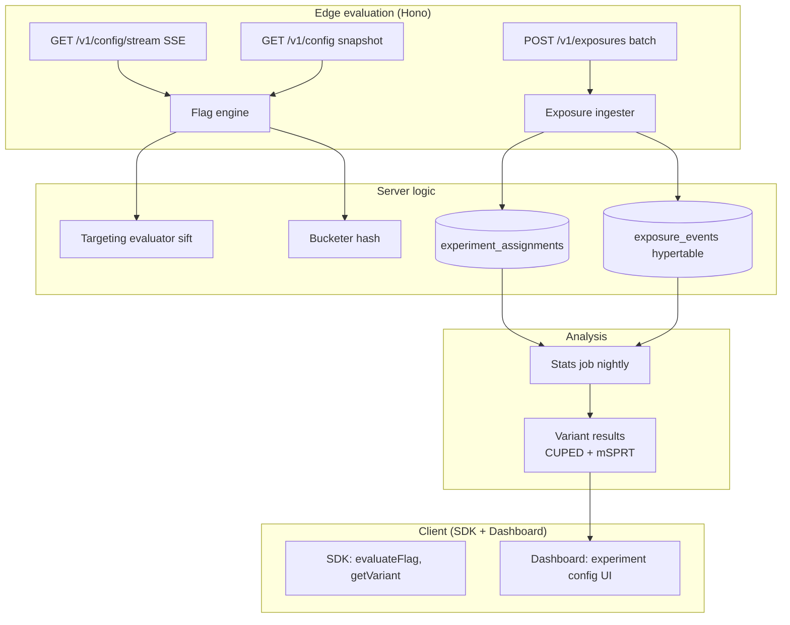

# Alan 5 — Experiment & Feature Flag Engine

> **Status:** Design (2026-04-20) · **Priority:** 5/6 (ürün farklılaştırıcı)
> **Target:** Production-grade A/B testing + feature flags, ~42KB SDK bundle hedefi, stats-doğru analiz

---

## 1. Karar gerekçesi

### 1.1 Rovenue'nun experiment stack ihtiyacı

Subscription apps'lerin en para getiren deneyleri paywall + pricing deneyleri:
- "$9.99 vs $7.99 lifetime" conversion karşılaştırması.
- Trial süresi (3 gün vs 7 gün vs 14 gün) hangi cohort retain ediyor.
- Onboarding flow A/B'si (trial'a yönlendirme agresivliği).
- Feature gating (AI edit credit limitleri).

Bu tür deneylerin üç alt sistemle iç içe olması lazım:

1. **Bucketing**: Her user deterministik olarak aynı variant'a düşmeli — cross-device, cross-session. Rovenue subscriber'ın `appUserId`'sini SDK'dan alır; bucketing burada kurulur.
2. **Evaluation**: Targeting rule'ları (Türkiye'deki iOS kullanıcıları, trial'daki user'lar, premium tier'dakiler) server + client aynı sonucu verecek şekilde.
3. **Analysis**: İstatistiksel anlam, variance reduction, erken durdurma. "3 gün sonra variant B kazanıyor gibi, durduralım mı?" sorusunu disiplinli cevaplamak.

RevenueCat'in experiments'ı bu üç alanda pragmatik — biz disiplin + şeffaflık açısından **daha iyisini** açabiliriz (AGPLv3 uyumlu, self-host). Rovenue'nun mevcut planı (`murmurhash-js + sift + simple-statistics`, ~42KB) doğru temel; bu doküman production'a hazırlayan katmanları açıklar.

### 1.2 Mevcut durum

Repo git status'unda `flag-engine.ts`, `experiment-engine.ts`, `bucketing.ts`, `targeting.ts`, `experiment-stats.ts` gibi yeni dosyalar var. Temel implementasyon başlamış. Bu doküman **şu şekilde tamamlanması gerekenleri** belirliyor — yoksa var olanı düzeltiyor değil.

### 1.3 Bu alanın kararları

- **Bucketing**: 64-bit MurmurHash3 (`murmurhash-js`'in `murmurhash3_32_gc` değil, **64-bit** varyantı — `@node-rs/xxhash` veya SHA-256 ilk 8 byte). Deterministik, cross-platform tutarlı.
- **Targeting DSL**: `sift` (MongoDB-style query) zenginliği yetişir ama operator whitelist'i sıkıca tanımlanır. Tüm sift operatör'leri kabul edilmez — type coercion edge case'leri ve performans için.
- **Statistical analysis**: simple-statistics + elle yazılmış CUPED + mSPRT implementation'ı. Neyin hesaplandığını ve hangi varsayımlar yapıldığını test + docs ile açık.
- **Real-time delivery**: SSE (Server-Sent Events) default; fallback long-polling. WebSocket değil — overkill ve browser/RN native destekli SSE yeter.
- **SDK size**: Core bucketing + targeting ≤15KB minified. Stats kısmı server-side only (SDK'ya girmez).
- **Event tracking**: Exposure events batched + sampled. Her variant assignment'da değil, 5s buffer veya app background'a geçişte flush.

---

## 2. Mimari diyagram



---

## 3. Bucketing — deterministik, cross-platform

### 3.1 Gereksinimler

- **Deterministik**: `bucket(userId, experimentKey)` hep aynı sonucu verir.
- **Uniform**: User'lar variant'lara eşit dağılır (weight'e göre).
- **Cross-language**: TS (SDK + server), Swift (iOS native), Kotlin (Android native) aynı user'ı aynı bucket'a koyar.
- **Fast**: Per-request ~µs — SDK hot path.

### 3.2 Algoritma seçimi

`murmurhash-js` 32-bit — 2^32 bucket space, 10K+ experiment'li senaryoda collision olasılığı yükselir. 64-bit tercih. Java/Swift/Kotlin'de MurmurHash3_x64_128 native implementation'ları var. TS için `@node-rs/xxhash` (Rust-backed, hem server'da hızlı hem deterministic).

Alternatif: SHA-256 ilk 64-bit'i. Biraz yavaş ama her dilde standard. Rovenue için SDK perf kritikse xxhash, değilse SHA-256.

**Öneri:** xxhash3_64 (saatler nanosaniye dakikalarda bucket), SDK target runtime'larda native destek var.

### 3.3 Kod

```typescript
// packages/shared/src/bucketing.ts
import { xxhash3 } from "@node-rs/xxhash"; // native in Node + RN

/**
 * Maps a user+experiment pair to a number in [0, 1). Deterministic
 * across platforms given the same hash function. Used for both
 * percentage rollouts (flag enabled for first N% of users) and
 * variant assignment (which bucket does this user fall in).
 */
export function bucket(userId: string, experimentKey: string): number {
  const input = `${experimentKey}:${userId}`;
  const h = xxhash3.xxh64(input); // bigint
  // Take top 53 bits (safe integer range) then normalize to [0, 1)
  const norm = Number(h & 0x1fffffffffffffn) / 0x20000000000000;
  return norm;
}

/**
 * Select a variant from a weighted distribution using the bucket value.
 * Weights should sum to 1.0 (validated on write — any drift from 1.0
 * would silently skew assignments).
 */
export function pickVariant<T extends { id: string; weight: number }>(
  userId: string,
  experimentKey: string,
  variants: T[],
): T {
  const b = bucket(userId, experimentKey);
  let cumulative = 0;
  for (const v of variants) {
    cumulative += v.weight;
    if (b < cumulative) return v;
  }
  // Floating-point edge case: bucket is 0.9999... and cumulative
  // sums to 0.9999... due to rounding. Return the last variant.
  return variants[variants.length - 1];
}
```

### 3.4 Anonymous → authenticated merge

Kullanıcı SDK'ya önce anonymous (`appUserId: "anon_xyz"`) olarak bağlanır, sonra login olup `appUserId: "user_123"` olur. İki ID aynı cihaz için farklı bucket sonucu verir → variant değişebilir → UX bozulur.

Çözüm: SDK tarafında **stable identifier** tut. `configure(apiKey)` sonrası:

```typescript
// packages/sdk-rn/src/identity.ts
export async function resolveStableUserId(): Promise<string> {
  // 1. If authenticated (server-provided user id exists), use it.
  const serverUserId = await mmkv.get("rovenue.userId");
  if (serverUserId) return serverUserId;

  // 2. Otherwise use cached anonymous id. Generated once per install.
  let anon = await mmkv.get("rovenue.anonId");
  if (!anon) {
    anon = `anon_${crypto.randomUUID()}`;
    await mmkv.set("rovenue.anonId", anon);
  }
  return anon;
}

// When the app later calls rovenue.identify("user_123"):
export async function identify(realUserId: string) {
  const prev = await mmkv.get("rovenue.anonId");
  await mmkv.set("rovenue.userId", realUserId);

  // Tell the server to merge — preserves existing assignments.
  await api.v1.identify.$post({ json: { anonymousId: prev, userId: realUserId } });
}
```

Server tarafında merge:
```typescript
// POST /v1/identify handler
async function handleIdentify(input) {
  // Any experiment_assignment with userId = anon becomes userId = real,
  // so subsequent bucketing calls produce the same variant.
  await db
    .update(experimentAssignments)
    .set({ userId: input.userId })
    .where(eq(experimentAssignments.userId, input.anonymousId));
}
```

---

## 4. Targeting — `sift` + operator whitelist

### 4.1 DSL örnekleri

Dashboard'da OWNER bir experiment için targeting yazacak:

```json
{
  "and": [
    { "platform": { "$eq": "ios" } },
    { "country": { "$in": ["TR", "DE", "UK"] } },
    { "attributes.tier": { "$in": ["trial", "free"] } },
    { "appBuildNumber": { "$gte": 1200 } }
  ]
}
```

`sift` doğrudan bu şekli değerlendirir — ama her operator'ü kabul etmek istemiyoruz.

### 4.2 Operator whitelist

```typescript
// packages/shared/src/targeting.ts
import sift from "sift";

// Allowed operators. Anything else in the rule throws on compile —
// we never evaluate an unsafe operator. Excludes $where (arbitrary
// JS eval) and $regex (ReDoS risk) by design.
const ALLOWED_OPS = new Set([
  "$eq",
  "$ne",
  "$in",
  "$nin",
  "$gt",
  "$gte",
  "$lt",
  "$lte",
  "$exists",
  "$and",
  "$or",
  "$not",
]);

export function validateTargetingRule(rule: unknown): void {
  walkRule(rule, (key) => {
    if (key.startsWith("$") && !ALLOWED_OPS.has(key)) {
      throw new TargetingValidationError(
        `Operator ${key} is not allowed in targeting rules`,
      );
    }
  });
}

export function evaluateTargeting(
  rule: unknown,
  context: UserContext,
): boolean {
  // Validate once on write; re-validating on every eval is wasteful
  // but cheap (rules are small). During early days keep the check
  // in eval too as defense-in-depth.
  validateTargetingRule(rule);
  return sift(rule)(context);
}

function walkRule(node: unknown, onKey: (key: string) => void): void {
  if (Array.isArray(node)) return node.forEach((n) => walkRule(n, onKey));
  if (node === null || typeof node !== "object") return;
  for (const [k, v] of Object.entries(node as Record<string, unknown>)) {
    onKey(k);
    walkRule(v, onKey);
  }
}
```

### 4.3 User context shape

Dashboard rule'u yazarken hangi field'lara erişebileceğini bilmeli. Rovenue'nun standart context'i:

```typescript
export type UserContext = {
  appUserId: string;
  platform: "ios" | "android" | "web";
  country: string;       // ISO-3166-1 alpha-2
  language: string;      // BCP-47
  appBuildNumber: number;
  appVersion: string;
  firstSeenAt: string;   // ISO
  entitlements: string[];
  // Free-form — rovenue pass-through
  attributes: Record<string, string | number | boolean>;
};
```

Dashboard'da rule editor bu shape'in autocomplete'ini verir (OpenAPI-style spec + monaco editor combination).

### 4.4 Type coercion tuzakları

`sift` bazı operator'lerde JS loose comparison yapar:
- `{ age: "18" } $gte 18` → true (string → number coerce).
- `{ active: 1 } $eq true` → false (strict equality).

Tahmin edilebilir olması için:
- Context'te tip cast'i uygulama zamanında değil, yazıldığında yap (Zod parse with coercion: `z.coerce.number()`).
- Dashboard editor'de field tipini açıkça göster (`age (number)`).

---

## 5. Flag evaluation + variant assignment

### 5.1 Tam akış

```typescript
// apps/api/src/services/flag-engine.ts
type EvaluationInput = {
  flagKey: string;
  userId: string;
  context: UserContext;
};

export async function evaluateFlag(input: EvaluationInput): Promise<FlagResult> {
  const flag = await loadFlag(input.flagKey); // cached, see §6
  if (!flag || !flag.enabled) {
    return { enabled: false, variant: null, reason: "disabled" };
  }

  // Rollout gate: only a percentage of users get the flag on at all.
  const rolloutBucket = bucket(input.userId, `${input.flagKey}:rollout`);
  if (rolloutBucket > flag.rolloutPct) {
    return { enabled: false, variant: null, reason: "rollout_gate" };
  }

  // Targeting rules
  for (const audience of flag.audiences) {
    if (evaluateTargeting(audience.rule, input.context)) {
      if (flag.type === "VARIANT" && audience.variant) {
        return { enabled: true, variant: audience.variant, reason: "audience_override" };
      }
      return { enabled: true, variant: null, reason: "audience_match" };
    }
  }

  // If no audience matched but rollout passed, default-on (if configured)
  if (flag.defaultEnabled) {
    return { enabled: true, variant: null, reason: "default" };
  }
  return { enabled: false, variant: null, reason: "no_match" };
}

export async function assignVariant(input: EvaluationInput): Promise<VariantResult> {
  const experiment = await loadExperiment(input.flagKey);
  if (!experiment || experiment.status !== "RUNNING") {
    return { variant: experiment?.controlVariant ?? null };
  }

  // Check mutual exclusion first (§5.2)
  if (experiment.exclusionGroup) {
    const enrolled = await getEnrolledExclusionGroup(input.userId);
    if (enrolled && enrolled !== experiment.exclusionGroup) {
      return { variant: experiment.controlVariant };
    }
  }

  // Targeting rule
  if (!evaluateTargeting(experiment.targetingRule, input.context)) {
    return { variant: experiment.controlVariant };
  }

  // Bucket into a variant
  const variant = pickVariant(input.userId, experiment.key, experiment.variants);

  // Fire-and-forget write exposure event
  exposureQueue.enqueue({
    experimentId: experiment.id,
    variantId: variant.id,
    userId: input.userId,
    context: input.context,
    ts: Date.now(),
  });

  return { variant };
}
```

### 5.2 Mutual exclusion groups

İki experiment aynı kullanıcı segmentini etkiliyorsa (pricing + onboarding flow) "mutually exclusive" flag'le: bir kullanıcı **en fazla bir tanesine** girsin. Bucket-space ayır:

```typescript
// Kullanıcı bir exclusion group'a girdiğinde, o group'un tüm experiment'leri
// aynı bucket'ı paylaşır. 100 exclusion slot varsayalım, her experiment
// kendi slot aralığına düşer.
function assignInExclusionGroup(userId: string, groupKey: string, experiments: Experiment[]) {
  const slot = Math.floor(bucket(userId, groupKey) * 100);
  for (const exp of experiments) {
    if (slot >= exp.exclusionSlotStart && slot < exp.exclusionSlotEnd) {
      return exp;
    }
  }
  return null; // user didn't land in any experiment's slot range
}
```

Dashboard'da exclusion group oluştururken slot'ları görsel tahsis edilir (toplamı 100'ü geçmemeli).

---

## 6. Real-time config delivery

### 6.1 Seçenek analizi

| Yöntem            | Latency | RN native | Bandwidth | Complexity |
|-------------------|---------|-----------|-----------|------------|
| Poll (every 5m)   | 5 min   | ✅         | Low       | Trivial    |
| Long-poll         | <30s    | ✅         | Medium    | Medium     |
| SSE (EventSource) | <1s     | Polyfill  | Low       | Medium     |
| WebSocket         | <1s     | ✅         | Low       | High       |

Rovenue için:
- **SDK (mobile)**: SSE. Dashboard + config dağıtımı için native app'te `react-native-sse` veya polyfill'li `EventSource` yeter.
- **Dashboard (browser)**: Native `EventSource` zaten var.
- **Fallback**: SSE bağlantısı başarısız olursa (proxy limitleri), SDK 60s'de bir polling'e düşer.

WebSocket ihtiyacı yok — tek yönlü server→client iletişim. SSE daha basit, HTTP/2 multiplexing üstünden çalışır, proxy-friendly.

### 6.2 Hono SSE endpoint'i

```typescript
// apps/api/src/routes/v1/config-stream.ts
import { streamSSE } from "hono/streaming";

export const configStreamRoute = new Hono().get(
  "/stream",
  requireApiKey,
  async (c) => {
    const projectId = c.get("apiKey").projectId;
    const lastEventId = c.req.header("Last-Event-Id"); // for resumption

    return streamSSE(c, async (stream) => {
      // 1. Send current snapshot immediately
      const snapshot = await getConfigSnapshot(projectId);
      await stream.writeSSE({
        event: "config",
        data: JSON.stringify(snapshot),
        id: snapshot.version,
      });

      // 2. Subscribe to Redis pub/sub for change notifications
      const sub = redisPub.duplicate();
      await sub.subscribe(`config:${projectId}`);

      sub.on("message", async (_channel, message) => {
        await stream.writeSSE({
          event: "config",
          data: message,
          id: parseVersion(message),
        });
      });

      // 3. Heartbeat every 20s so proxies don't close idle connection
      const heartbeat = setInterval(async () => {
        await stream.writeSSE({ event: "heartbeat", data: "" });
      }, 20_000);

      stream.onAbort(() => {
        clearInterval(heartbeat);
        sub.unsubscribe();
        sub.quit();
      });
    });
  },
);
```

### 6.3 Dashboard publishes config change

Dashboard'da experiment edit edilince:

```typescript
// apps/api/src/routes/dashboard/experiments.ts
.patch("/:id", async (c) => {
  const updated = await db.update(experiments).set(...).returning();

  // Publish to all connected SDK clients for this project
  const snapshot = await getConfigSnapshot(updated.projectId);
  await redisPub.publish(`config:${updated.projectId}`, JSON.stringify(snapshot));

  return c.json(ok({ experiment: updated }));
});
```

Cache invalidation: `loadFlag`/`loadExperiment` local LRU cache'lerinin de invalidate olması gerek — Redis pub/sub mesajını dinleyen bir listener cache'i purge eder.

### 6.4 SDK SSE client (with reconnect/backoff)

```typescript
// packages/sdk-core/src/sse.ts
export function subscribeConfig(
  client: RovenueClient,
  onUpdate: (snapshot: ConfigSnapshot) => void,
): () => void {
  let backoffMs = 1000;
  let currentAbort: AbortController | null = null;
  let cancelled = false;

  async function connect() {
    if (cancelled) return;

    const abort = new AbortController();
    currentAbort = abort;

    try {
      const es = new EventSourcePonyfill(`${client.baseUrl}/v1/config/stream`, {
        headers: { Authorization: `Bearer ${client.apiKey}` },
        // signal: abort.signal, // if ponyfill supports
      });

      es.addEventListener("config", (ev) => {
        try {
          onUpdate(JSON.parse(ev.data));
          backoffMs = 1000; // reset backoff on success
        } catch (err) {
          // Snapshot is malformed — log and keep the previous
          // version. Better to run on stale config than crash.
          console.warn("[Rovenue] Invalid config snapshot, keeping previous");
        }
      });

      es.addEventListener("error", async () => {
        es.close();
        if (cancelled) return;
        // Exponential backoff with jitter, capped at 60s.
        const wait = Math.min(60_000, backoffMs + Math.random() * 500);
        backoffMs *= 2;
        setTimeout(connect, wait);
      });
    } catch (err) {
      if (!cancelled) setTimeout(connect, backoffMs);
    }
  }

  connect();

  return () => {
    cancelled = true;
    currentAbort?.abort();
  };
}
```

---

## 7. İstatistiksel analiz

### 7.1 Temel t-test

`simple-statistics` `tTestTwoSample` sunar. Yeterli mi? Rovenue senaryosu için:
- **Metrik**: conversion rate (binary) veya revenue per user (continuous).
- **Hipotez**: H0 variant = control, H1 variant ≠ control.
- **Alpha**: 0.05 (%5 tip-I error).
- **Power**: 0.8 (örneklem planlaması için).

Örneklem büyüklüğü hesabı:

```typescript
// packages/shared/src/experiments/stats/sample-size.ts
// Based on standard two-proportion z-test. Returns the number of
// users required per variant to detect an absolute lift of `mde`
// (minimum detectable effect) at the given alpha/power.
export function sampleSizeForProportion(
  baseline: number, // e.g. 0.05 for 5% baseline conversion
  mde: number, // e.g. 0.01 = detect 1% absolute lift
  alpha: number = 0.05,
  power: number = 0.8,
): number {
  const zAlpha = 1.96; // two-sided 0.05
  const zBeta = 0.84;  // 0.8 power

  const p1 = baseline;
  const p2 = baseline + mde;
  const pBar = (p1 + p2) / 2;

  const n =
    (zAlpha * Math.sqrt(2 * pBar * (1 - pBar)) +
      zBeta * Math.sqrt(p1 * (1 - p1) + p2 * (1 - p2))) **
      2 /
    mde ** 2;

  return Math.ceil(n);
}
```

Dashboard deney oluştururken: "Baseline %5, MDE %1 → her variant için ~6K user lazım" mesajı göster.

### 7.2 CUPED — variance reduction

CUPED (Controlled-Experiment Using Pre-Experiment data) varyansı %30-70 azaltır → aynı precision'a daha az örnekle ulaşılır. Formül:

```
Y_adjusted = Y - θ * (X - E[X])
θ = Cov(X, Y) / Var(X)
```

Burada `X` pre-experiment metric (örn. deney başlamadan önce user'ın revenue'si), `Y` deney sonrası revenue.

```typescript
// packages/shared/src/experiments/stats/cuped.ts
export function cupedAdjust(
  preMetric: number[],
  postMetric: number[],
): { adjusted: number[]; theta: number; varianceReduction: number } {
  if (preMetric.length !== postMetric.length) {
    throw new Error("CUPED: pre and post arrays must have same length");
  }

  const meanX = mean(preMetric);
  const theta = covariance(preMetric, postMetric) / variance(preMetric);

  const adjusted = postMetric.map((y, i) => y - theta * (preMetric[i] - meanX));

  const varReduction = 1 - variance(adjusted) / variance(postMetric);
  return { adjusted, theta, varianceReduction: varReduction };
}
```

**Ne zaman kullanılır:**
- Pre-experiment veri var (user deney başlamadan önce sistemde aktif).
- Pre-metric ile post-metric arasında **pozitif korelasyon** (r > 0.3 tipik).
- Metric continuous (revenue, session length) veya pseudo-continuous.

**Ne zaman kullanılmaz:**
- Yeni user'lar (pre-metric yok).
- Binary metric (conversion) — CUPED varyans formülü uymaz; delta method veya başka adjustment.
- Pre-period kontaminasyonu: deney başlamadan önce user deneyin bir tarafından etkilenmişse (spillover).

### 7.3 Sequential testing — mSPRT

Fixed-sample t-test sonucu **deney bitmeden önce** bakmak yanıltıcıdır (peeking problem). Sequential test early stopping'e izin veren framework.

mSPRT (Mixture Sequential Probability Ratio Test) basitçe: her gün log-likelihood ratio'yu güncelleyip threshold'u aşarsa durdur.

```typescript
// packages/shared/src/experiments/stats/msprt.ts
type MsprtInput = {
  variantSamples: number[];
  controlSamples: number[];
  alpha: number; // tip-1 error, 0.05 typical
  tau: number;   // mixing parameter, 0.01 reasonable default
};

export function msprtDecision(input: MsprtInput): {
  decision: "reject_null" | "accept_null" | "continue";
  logLikelihoodRatio: number;
} {
  const { variantSamples, controlSamples, alpha, tau } = input;
  const n1 = variantSamples.length;
  const n2 = controlSamples.length;
  const mean1 = mean(variantSamples);
  const mean2 = mean(controlSamples);
  const var1 = variance(variantSamples);
  const var2 = variance(controlSamples);

  const deltaHat = mean1 - mean2;
  const se = Math.sqrt(var1 / n1 + var2 / n2);

  // Mixture log-likelihood ratio with variance tau on the prior
  const numerator = Math.log(
    (se ** 2 / (se ** 2 + tau)) ** 0.5 *
      Math.exp((deltaHat ** 2) / (2 * (se ** 2 + tau))),
  );
  const logLR = numerator;

  // Threshold: log(1/alpha)
  const threshold = Math.log(1 / alpha);

  if (logLR > threshold) return { decision: "reject_null", logLikelihoodRatio: logLR };
  if (logLR < -threshold) return { decision: "accept_null", logLikelihoodRatio: logLR };
  return { decision: "continue", logLikelihoodRatio: logLR };
}
```

**Not:** Bu implementasyon basit — gerçek production'da `msprt` literature'daki `H(delta)` fonksiyonu Gaussian prior assumption'ı ile yazılır. Daha sağlam uygulama için referans: Johari et al., "Always Valid Inference" (2021).

### 7.4 Dashboard sonuç sunumu

```typescript
// Dashboard experiment detail page rendering summary
type VariantSummary = {
  variant: string;
  users: number;
  conversionRate: number;
  conversionCI: [number, number]; // 95% confidence interval
  revenuePerUser: { mean: number; cuped?: number };
  liftVsControl: number;
  pValue: number;
  msprtDecision: "continue" | "reject_null" | "accept_null";
};
```

UI mesajları:
- "Still collecting — estimated 4 more days to reach target sample."
- "Variant B shows +12% lift (p=0.03, mSPRT says reject null) — safe to ship."
- "Not enough data — no reliable signal yet."

---

## 8. Exposure event pipeline

### 8.1 Toplama

Her `assignVariant` çağrısı bir exposure event üretir. Her seferinde DB yazmak HOT path'i kilitler. Çözüm: process-local buffer + periodic flush.

```typescript
// apps/api/src/services/exposure-buffer.ts
class ExposureBuffer {
  private buf: ExposureEvent[] = [];
  private flushTimer: NodeJS.Timeout | null = null;

  // Batch size for ingest. 100 events per batch keeps Postgres
  // insert latency low while amortizing transaction overhead.
  private readonly BATCH = 100;
  private readonly INTERVAL_MS = 5000;

  enqueue(event: ExposureEvent) {
    this.buf.push(event);
    if (this.buf.length >= this.BATCH) this.flush();
    else this.scheduleFlush();
  }

  private scheduleFlush() {
    if (this.flushTimer) return;
    this.flushTimer = setTimeout(() => this.flush(), this.INTERVAL_MS);
  }

  private async flush() {
    if (this.flushTimer) clearTimeout(this.flushTimer);
    this.flushTimer = null;
    const batch = this.buf.splice(0, this.buf.length);
    if (batch.length === 0) return;

    try {
      await db.insert(exposureEvents).values(batch);
    } catch (err) {
      // Don't block the queue on a bad insert; log and drop.
      logger.error({ err, count: batch.length }, "exposure batch insert failed");
    }
  }
}

export const exposureQueue = new ExposureBuffer();
```

SIGTERM'de buffer'ı drain et (graceful shutdown hook'unda).

### 8.2 Sampling

Çok yüksek traffic'te %100 exposure event rate'i storage'ı şişirir. Sampling strategy:

- **Her assignment'da kaydetme.** Rule: her `bucket(userId, experimentKey)` per user **bir kere** kaydedilir. Session cache (MMKV/Redis) ile aynı user aynı experiment'ten gün içinde bir kez atılır.
- **Aggregate-only high-traffic experiments.** Bazı experiment'ler (UI rendering color) için exposure attribution gereksiz; dashboard sayılı "assignment count by variant" görebilir.

### 8.3 Schema (`exposure_events`, hypertable — Alan 4'ten bağımlı)

```typescript
export const exposureEvents = pgTable("exposure_events", {
  id: text("id").primaryKey().$defaultFn(() => createId()),
  experimentId: text("experiment_id").notNull(),
  variantId: text("variant_id").notNull(),
  userId: text("user_id").notNull(),
  projectId: text("project_id").notNull(),
  context: jsonb("context"),
  exposedAt: timestamp("exposed_at", { withTimezone: true, mode: "date" })
    .notNull()
    .defaultNow(),
});
```

TimescaleDB hypertable, `exposed_at` partition key, 1-day chunks, 90-day retention (aggregate'ler birikmiş veriden beslenir — raw'a artık gerek yok).

---

## 9. SDK bundle size

### 9.1 Hedef: ≤15KB core + stats ayrı

Core SDK (bucketing + targeting + SSE client): ≤15KB gzipped. İçeri giren:
- `bucket.ts` (~200 LOC) + `@node-rs/xxhash` (native, RN bundle'a girmiyor, iOS/Android binary olarak).
- `targeting.ts` (~300 LOC) + sift (~8KB gzip).
- `sse.ts` (~200 LOC) + EventSource polyfill (opsiyonel, ~3KB).
- RPC client (~5KB).

**Stats (CUPED, mSPRT, t-test) server-side only** — SDK'ya girmez. Dashboard ihtiyaçlarında server endpoint'i (`GET /experiments/:id/results`) çağrılır.

### 9.2 Tree-shaking disipli

```typescript
// packages/sdk-rn/src/index.ts
export { configure } from "./config";
export { getVariant } from "./experiments";
export { isEnabled } from "./flags";
// Do NOT re-export stats or server-only helpers
```

ESM-first package. `package.json`:

```json
{
  "type": "module",
  "exports": {
    ".": { "import": "./dist/index.js", "types": "./dist/index.d.ts" }
  },
  "sideEffects": false
}
```

`sideEffects: false` Metro/webpack tree-shaking'e "bu modülü tam siler" diyor — dead code elimine olur.

### 9.3 Bundle size regression guard

CI'da:

```bash
pnpm --filter @rovenue/sdk-rn build
size-limit --config size-limit.json
```

```json
// packages/sdk-rn/size-limit.json
[
  { "name": "core", "path": "dist/index.js", "limit": "15 KB" },
  { "name": "core + flags", "path": "dist/flags.js", "limit": "18 KB" }
]
```

PR üstünde bundle büyürse CI fail — disipline zorlar.

---

## 10. Kontrol ve sıkı testler

### 10.1 Bucketing determinism

```typescript
test("bucket is deterministic across runs", () => {
  expect(bucket("user_1", "experiment_a")).toBe(bucket("user_1", "experiment_a"));
});

test("bucket uniform distribution", () => {
  const counts = new Array(10).fill(0);
  for (let i = 0; i < 100_000; i++) {
    const b = bucket(`user_${i}`, "experiment_a");
    counts[Math.floor(b * 10)]++;
  }
  // Each bucket should have ~10% of samples. Chi-square goodness-of-fit.
  const expected = 10_000;
  const chiSq = counts.reduce((sum, c) => sum + ((c - expected) ** 2) / expected, 0);
  // 9 DoF, alpha=0.05 critical value = 16.92
  expect(chiSq).toBeLessThan(16.92);
});
```

### 10.2 Cross-language parity

Server ve SDK aynı bucket'ı hesapladığını doğrula. SDK'nın native library'si (iOS xxhash framework) ile TS xxhash için parity suite:

```typescript
// packages/shared/tests/bucket-parity.test.ts
import parityVectors from "./bucket-parity-vectors.json";

test("bucket output matches known reference values", () => {
  for (const { userId, experimentKey, expected } of parityVectors) {
    expect(bucket(userId, experimentKey)).toBe(expected);
  }
});
```

`bucket-parity-vectors.json` iOS/Android native lib'lerin ürettiği referans değerler — Swift test + Kotlin test aynı dosyayı okur.

### 10.3 Targeting rule injection

```typescript
test("rejects $where operator", () => {
  expect(() => validateTargetingRule({ $where: "return true" })).toThrow();
});

test("rejects $regex operator", () => {
  expect(() => validateTargetingRule({ name: { $regex: ".*" } })).toThrow();
});
```

### 10.4 CUPED correctness

Known fixture'larla:

```typescript
test("CUPED reduces variance when pre is correlated with post", () => {
  // Synthesize correlated data: Y = X + noise
  const pre = Array.from({ length: 1000 }, () => Math.random() * 100);
  const post = pre.map((x) => x + Math.random() * 10);

  const { varianceReduction } = cupedAdjust(pre, post);
  expect(varianceReduction).toBeGreaterThan(0.5); // expect substantial reduction
});
```

### 10.5 SSE reconnect

```typescript
test("SSE client reconnects with backoff after drop", async () => {
  const server = setupMockSSE();
  const onUpdate = vi.fn();
  const unsub = subscribeConfig(client, onUpdate);

  await server.dropConnection();
  await wait(100);
  await server.acceptAndSend({ version: 2, flags: [] });
  await wait(1500); // wait for reconnect backoff

  expect(onUpdate).toHaveBeenCalledTimes(2); // once before drop, once after
  unsub();
});
```

---

## 11. Potansiyel tuzaklar

### T1 — Bucketing algoritması değişince assignment değişir

MurmurHash → xxhash geçişi tüm user'ların bucket'ını yeniden atar → aktif experiment'ler bozulur. Algoritma değişimi **yeni experiment'lerle** yapılır; var olan experiment'ler eski algoritma ile devam eder (`experiment.hashVersion: 1 | 2` field'ı).

### T2 — `sift` silent type coercion

`{ age: "18" } $gte 18` true dönüyor. Dashboard'da rule yazarken field tipini göster ve validasyon uygula. Context'i Zod ile parse et.

### T3 — SSE connection proxies closing

Nginx default idle timeout 60s. Heartbeat göndermeyen SSE connection düşer. `proxy_read_timeout 3600s` + heartbeat every 20s.

### T4 — Experiment winner deploy'u sırasında variant kaldırılırsa

Variant silinen experiment'in kullanıcıları stale assignment ile kalır. Silme değil **archive**: experiment durumunu `COMPLETED` yap, assignments silinmez ama yeni assignment durur. Dashboard UI'da archived experiment tıklanınca "results frozen" göster.

### T5 — Multi-arm bandit yerine naive A/B

Bu doküman naive A/B/n anlatıyor. Bandit (Thompson sampling vs) kompleks; v1'de dahil etme. Rovenue v2 feature'ı.

### T6 — Simpson's paradox — country-level confound

Bir variant "overall kazanıyor" ama her country için kaybediyor olabilir (Simpson's paradox). Dashboard'da **stratified** view göster — country/platform bazlı breakdown + overall.

### T7 — Peeking without mSPRT

Statistics-naive çalışan ekipler fixed-sample t-test'i her gün bakıp "p < 0.05 mi?" sorar — false positive rate %50'lere kadar çıkar. Dashboard dashboard peeking yapanı mSPRT ile disipline etmeli: "mSPRT henüz `continue` — durdurmayın."

### T8 — SRM (Sample Ratio Mismatch)

Variant'lara atama ratio'su beklenenden sapıyorsa (50/50 değil 52/48 gibi) bucketing'de bir bug var — sonuçları çöpe at. Dashboard SRM check'i her deney için otomatik çalıştırsın (chi-square, p<0.001 threshold'da uyarı).

### T9 — CUPED pre-period seçimi

Pre-period deney başlangıcından hemen önceki N gün — çok kısa korelasyon zayıf, çok uzun hem yavaş hem seasonality sızar. 30 gün tipik, config'lenebilir. Yeni user'larda CUPED'i skip et (pre-metric = 0 → theta = 0, effectively identity).

### T10 — Target context'te PII tutma

Targeting rule'da `email` kullanılabiliyor mu? Evet ama **hashlenmiş**: SDK `sha256(email)` göndersin, sunucu `$eq` ile karşılaştırsın. Plain email'i loglardan ayıklamak GDPR için temizlik.

### T11 — SDK offline + stale config

App uçağa binip 8 saat offline → client stale config ile çalışır. Default davranış: stale-but-cached config'i kullan, user'a görünmez. Ama variant assignment'ı eski olabilir → sonuçlar hafif bulanık. Exposure event'leri MMKV queue'ya yaz, online olunca flush.

### T12 — Event ingest DoS

Saldırgan SDK API key'iyle sahte exposure event pump'larsa DB'yi doldurur. Rate limiting per API key (Alan 3) + exposure event'lerde `userId` uniqueness constraint (aynı user aynı variant'a bir kez exposed).

---

## 12. Sonraki adım

Implementation plan: `docs/superpowers/plans/2026-04-XX-experiment-engine.md`.

Görev sıralaması:

1. **Faz 1** (1 gün): Bucketing (`@node-rs/xxhash` + parity vectors).
2. **Faz 2** (1-2 gün): Targeting (`sift` wrapper + operator whitelist + tests).
3. **Faz 3** (1 gün): Flag/experiment engine (evaluateFlag, assignVariant).
4. **Faz 4** (1-2 gün): SSE endpoint + SDK client.
5. **Faz 5** (1 gün): Exposure buffer + ingest pipeline.
6. **Faz 6** (2 gün): Stats (sample size, CUPED, mSPRT) + dashboard sonuç sayfası.
7. **Faz 7** (1 gün): Bundle size monitor + parity tests + cross-language.

Toplam: ~2 sprint (3-4 hafta).

Açık sorular:

1. **Native hash library** iOS/Android için ayrı binding mi yazılacak, yoksa SDK tarafı pure-TS xxhash (~2KB) fallback mi? Performansı tartılmalı.
2. **Stats library choice:** simple-statistics yeter mi, yoksa `@stdlib/stats` (daha kapsamlı, ~50KB server) gerekli mi? Server-side olduğu için size önemli değil; precision için stdlib iyi.
3. **Multi-variate testing (MVT):** 3+ variant testi basit; ama full factorial MVT (A × B × C) variance modeline gerek. İlk sürümde skip, v2'de planla.
4. **Feature flag targeting vs Experiment targeting:** UI'da tek form mu, ayrı mı? Ayrı olmalı — flag "enable for X%" basit, experiment çok daha zengin (variants, exposure tracking, stats).

---

## 13. 2026-04-23 Addendum — drift ve plan kararları

Bu bölüm orijinal spec (2026-04-20) ile repo'nun 2026-04-23 hâli arasındaki drift'i ve implementation plan'e geçmeden kilitlenen kararları içerir. Yukarıdaki bölümlerle çelişen her şeyde **bu addendum kazanır**.

### 13.1 Repo durumu (2026-04-23 itibarıyla)

In-tree implementation `packages/shared` yerine `apps/api` altına yazılmış durumda:

```
apps/api/src/lib/bucketing.ts          65 LOC
apps/api/src/lib/targeting.ts          95 LOC
apps/api/src/lib/experiment-stats.ts   269 LOC
apps/api/src/services/flag-engine.ts   213 LOC
apps/api/src/services/experiment-engine.ts 614 LOC
+ 1,893 LOC vitest coverage
```

SDK tarafı (SSE client, identity merge, `getVariant`), SSE endpoint, exposure buffer, dashboard UI — henüz yok.

Alan 4 (TimescaleDB) shipped ancak `experiment_assignments` hypertable'ını `UNIQUE(experimentId, subscriberId)` + partition-key çakışması nedeniyle **defer etti** (bkz. `docs/superpowers/plans/2026-04-23-timescaledb.md` scope note). Spec §8.3'ün `exposure_events` hypertable planı değişmiyor; sadece `experiment_assignments` için yaklaşım yeniden seçiliyor (bkz. §13.3).

### 13.2 Kod lokasyonu — karışık yerleşim (supersedes §9.1 üstü)

- `packages/shared/src/experiments/bucketing.ts` — correctness-critical, SDK + server **aynı implementation'ı import eder**.
- `packages/shared/src/experiments/targeting.ts` — rule validator + sift-backed evaluator; SDK offline eval yapabilmek için shared.
- `apps/api/src/services/flag-engine.ts`, `experiment-engine.ts` — DB orchestration, server-only; shared'dan bucketing+targeting import eder.
- `apps/api/src/lib/experiment-stats.ts` — server-only, SDK'ya hiç girmez (CUPED/mSPRT/sample-size).

Rasyonel: Cross-platform assignment tutarlılığı parity vector test'lerinin **önleyeceği** değil, **yakalayacağı** bir sorun. Tek kaynak zorunlu. 160 LOC'luk relocation, plan'ın ilk task'ı.

### 13.3 `experiment_assignments` — vanilla Postgres tablo (supersedes §5 implicit varsayımı)

Hypertable **değil**. Bu tablo event değil state: "user X, experiment Y için variant Z" kaydı sticky — immutable değil ama time-series de değil. Shape:

```typescript
export const experimentAssignments = pgTable(
  "experiment_assignments",
  {
    id: text("id").primaryKey().$defaultFn(() => createId()),
    projectId: text("project_id").notNull(),
    experimentId: text("experiment_id").notNull(),
    subscriberId: text("subscriber_id").notNull(),
    variantId: text("variant_id").notNull(),
    hashVersion: smallint("hash_version").notNull().default(1),
    assignedAt: timestamp("assigned_at", { withTimezone: true }).notNull().defaultNow(),
  },
  (t) => ({
    stickyUnique: uniqueIndex("experiment_assignments_sticky_unique")
      .on(t.experimentId, t.subscriberId),
    projectExpIdx: index("experiment_assignments_project_exp_idx")
      .on(t.projectId, t.experimentId),
  }),
);
```

`UNIQUE(experimentId, subscriberId)` korunur. Archived experiment'ler silinmez (spec §T4).

Ölçek kontrolü: 100K subscriber × 20 eşzamanlı experiment = 2M row. Postgres tek tablo için sorun değil; partition/hypertable gerektirmiyor.

`exposure_events` zaten time-series, Alan 4 pattern'ıyla hypertable kalır (spec §8.3).

### 13.4 Hash algoritması — SHA-256, mevcut API korunur (supersedes §3.2, §3.3, §12 soru 1)

**Mevcut durum (2026-04-23):** `apps/api/src/lib/bucketing.ts` `murmurhash-js.murmur3` (32-bit) kullanıyor ve **10,000 discrete bucket** API'si sunuyor: `assignBucket(subscriberId, seed) → int [0, 9999]`. Spec §3 float [0,1) varsayıyordu — yanlıştı, in-tree discrete-bucket API korunacak.

**Değişen tek şey:** hash fonksiyonu. `murmur3` → SHA-256 ilk 32 bit.

Rasyonel:
- `murmurhash-js` RN'de native destek yok, SDK'ya pure-JS olarak girse de Android/iOS native ekiplere parity implementasyonu yazdırmak külfet.
- SHA-256 üç platformda da built-in: Node `crypto`, WebCrypto, RN `crypto.subtle` (0.73+) / Kotlin `MessageDigest` / Swift `CryptoKit`.
- Perf farkı hot path değil — assignBucket her `assignVariant` başına bir kez çalışır.

**10,000-bucket API** (korunur, sadece hash iç) — current `assignBucket`/`selectVariant`/`isInRollout` signatüreleri aynı kalır:

```typescript
// packages/shared/src/experiments/bucketing.ts
import { createHash } from "node:crypto";

const BUCKET_COUNT = 10_000;

export function assignBucket(subscriberId: string, seed: string): number {
  const digest = createHash("sha256").update(`${subscriberId}:${seed}`).digest();
  // İlk 4 byte big-endian u32 → bucket space'e mod. Full 64-bit'e
  // gerek yok; 2^32 mod 10000 bias ihmal edilebilir.
  const hash = digest.readUInt32BE(0);
  return hash % BUCKET_COUNT;
}
```

`selectVariant` ve `isInRollout` fonksiyon gövdeleri **aynen korunur** — sadece hash import'u değişir.

**Platform adapter:** `packages/shared` zaten Node runtime'ı hedefliyor (API + dashboard build-time); SDK için iki yol var:

- **(i) Pure-JS SHA-256**: SDK tarafı `js-sha256` (~3KB minified) bağımlılığı ile shared bucketing.ts'yi doğrudan import eder. Bundle ≤15KB hedefi için yeterli.
- **(ii) Platform-injected adapter**: Shared bucketing `(subscriberId, seed) → Uint8Array` signatüre'lü bir hash fn kabul eder; server `crypto.createHash`, RN `react-native-quick-crypto` kullanır.

**Plan A bu seçimi içerir** — yukarıdaki kod (i) ile daha basit; (ii) SDK bundle'ında byte kazandırır. Plan yazma aşamasında performans/size ölçümü yapılıp karar netleşir. **Her iki durumda da shared modül bucket sayıları aynı output üretir** — bu invariant parity vector test'iyle pinlenir.

### 13.5 Plan splitting (supersedes §12 "~2 sprint tek plan")

Tek plan yerine iki ayrı implementation plan:

**Plan A — `2026-04-23-experiment-engine-core.md`** (Faz 1-3, ~1 sprint)
1. Bucketing'i SHA-256'ya çevir, `packages/shared/src/experiments/` taşı, parity vector fixture üret.
2. Targeting'i `packages/shared/src/experiments/` taşı.
3. `experiment_assignments` tablosu (§13.3 shape) + Drizzle migration.
4. `flag-engine.ts` / `experiment-engine.ts` import'ları shared'a çevir.
5. Dashboard CRUD: flags + experiments + targeting editor + exclusion groups.
6. Test coverage: determinism, uniform dağılım (chi-square), parity, rule injection (`$where`/`$regex` reject), SRM check helper.

**Plan B — `2026-04-XX-experiment-delivery.md`** (Faz 4-7, ~1 sprint, Plan A merge sonrası yazılır)
1. SSE endpoint (`GET /v1/config/stream`) + Redis pub/sub invalidation.
2. Exposure buffer + `exposure_events` hypertable (Alan 4 pattern).
3. SDK-RN: identity merge, SSE client with backoff, `getVariant`/`isEnabled`, MMKV offline exposure queue.
4. Stats endpoint (`GET /experiments/:id/results`) — CUPED + mSPRT + sample-size calc.
5. Dashboard results UI — stratified (country/platform) view, SRM warning, sample-size progress.
6. `size-limit` CI guard (SDK core ≤15KB gzip).

Plan B'nin detaylı şekli Plan A sonuçlarından sonra yazılır (subagent-driven-development disiplinine uygun).

### 13.6 Spec §12 kalan açık soruları — karar

1. **Native hash library:** iptal. SHA-256 (§13.4).
2. **Stats library:** `simple-statistics` + elle yazılmış CUPED/mSPRT (spec §7 zaten bu şekilde). YAGNI — precision sorun olursa sonra upgrade.
3. **MVT:** v1'de skip. Plan "out of scope" notu şart.
4. **Flag vs experiment targeting UI:** shared validator (`validateTargetingRule`), ayrı dashboard component (`<FlagTargetingEditor>` ve `<ExperimentTargetingEditor>`). Tek validation, iki UX affordance.

### 13.7 Hash algoritma migration (supersedes spec T1)

Spec §T1 "MurmurHash → xxhash" geçişini engellemek için `hashVersion` field önerir. Bu addendum xxhash yolunu tamamen iptal ettiği için migration basit:

- **Mevcut in-tree kod** `murmurhash-js.murmur3` kullanıyor. Pre-launch'ta olduğumuz için aktif assignment yok → SHA-256'ya doğrudan geçilir, parity vector fixture SHA-256'dan baştan üretilir.
- **Yeni experiment'ler**: `hashVersion = 1` (SHA-256 bucketing) — ilk sürüm için default ve tek versiyon.
- `hashVersion` field tabloda kalır; ileride algoritma değişirse aktif experiment'leri bozmadan versiyonlu bucketing yapılabilir (spec §T1'in orijinal niyeti).

---

*Alan 5 sonu. Sonraki: Alan 6 — ClickHouse Analytics Layer.*
