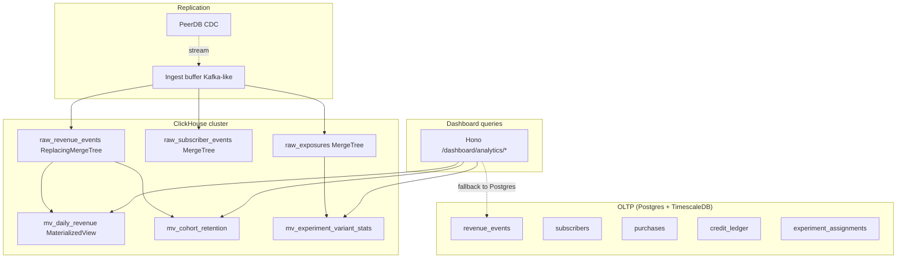

# Alan 6 — ClickHouse Analytics Layer

> **Status:** Design (2026-04-20) · **Priority:** 6/6 (ölçek geldiğinde)
> **Target:** Postgres (OLTP) + ClickHouse (OLAP) ayrımı, RevenueCat Charts eşdeğeri analytics

---

## 1. Karar gerekçesi

### 1.1 Neden ClickHouse — ve ne zaman

TimescaleDB (Alan 4) Postgres'in time-series yeteneklerini genişletir, ama hâlâ satır-bazlı OLTP motoru. ClickHouse **kolon-bazlı analytical database**, on-the-fly 10-100M satır üzerinde saniyealtı aggregation yapar. Rovenue'nun "analytics" ihtiyacı gerçekten bunu gerektirecek mi?

**TimescaleDB yeter** (ölçek: 10M-100M event satırı):
- Daily MRR, churn, conversion cohort rollup'ları continuous aggregates ile ms altında.
- Filterlı time-range query'leri chunk exclusion ile hızlı.
- Storage 50-100GB compressed.

**ClickHouse gerekir** (ölçek: 100M+ event satırı, yüksek query concurrency):
- **Cohort analysis ad-hoc**: "Son 12 ayın yeni user'larının 90-day retention'ı, platform × country × acquisition_source kesiti" — TimescaleDB'de continuous aggregate yazmadan bu query 30-120s. ClickHouse'ta 1-3s.
- **Funnel analysis**: "App opened → paywall viewed → trial started → converted" 4-step funnel conversion rate by experiment variant. TimescaleDB'de CTE yığını, ClickHouse'ta native `windowFunnel()`.
- **Behavioral event firehose**: Dashboard'da her user'ın event timeline'ı, 1M+ event. TimescaleDB tek row filtre yapar; ClickHouse projection'la sub-saniye.
- **User-facing query concurrency**: Hosted rovenue'da 100 müşteri aynı anda dashboard açıyor, her biri analytical query tetikliyor. Postgres 10-20 concurrent analytical query'de RAM doygunluğu. ClickHouse 100+ concurrent.

### 1.2 ClickHouse'a "çok erken" geçiş maliyeti

Yanlış zamanda eklenirse:
- **Operasyonel yük:** Ayrı cluster, ayrı backup, ayrı monitoring, ayrı schema migration yolu.
- **Dual-write karmaşıklığı:** OLTP Postgres + analytical ClickHouse replication pipeline bir engineering fazı.
- **Schema drift riski:** ClickHouse schema değiştikçe replication pipeline (Kafka/Debezium mesajları, CDC) güncellenmeli.
- **Learning curve:** ClickHouse SQL Postgres SQL'e benzer ama yeterince farklı — yeni mental model (materialized view chains, data skip indexes, projections).

### 1.3 Geçiş sinyalleri

ClickHouse'u tetikleyen **somut eşikler**:

| Sinyal                                          | Eşik           | Ne zaman ClickHouse |
|-------------------------------------------------|----------------|---------------------|
| `revenue_events` / `exposure_events` total size | >100M satır    | Gündem              |
| p95 dashboard query latency                     | >2s sustained  | Acil                |
| Postgres CPU (analytics node)                   | >70% sustained | Gündem              |
| Müşteri sayısı (hosted)                         | >100 tenants   | Planlı              |
| Analytics query concurrency                     | >50 qps        | Acil                |
| Cohort/funnel feature request                   | Ürün roadmap   | Planlı              |

Rovenue v1 kapsamında **muhtemelen ClickHouse'a ihtiyaç yok**. Bu doküman v2/v3 için zemin hazırlar — migration yolunu erken düşünmek geri dönüşsüz hatalardan korur.

### 1.4 Lisans

ClickHouse Apache 2.0 — rovenue AGPLv3 ile uyumlu. ClickHouse Cloud ticari SaaS; self-host seçeneği aynı kod tabanını kullanır. AGPLv3 copyleft ClickHouse'a yayılmaz (ayrı process, network boundary üstünden).

### 1.5 Karar

**Evet, planla; hemen kurma.** Bu alan:
- TimescaleDB'nin yetersiz kaldığı somut eşikleri tanımlar.
- Postgres → ClickHouse replication yolunu en az "geri alınabilir" biçimde seçer.
- Schema'yı query pattern'lerine göre tasarlar.
- Hangi chart'ların ClickHouse'a taşınacağını / hangilerinin Postgres'te kalacağını netleştirir.

---

## 2. Mimari diyagram



---

## 3. Event ingestion pipeline — seçenek analizi

Postgres'teki insert/update/delete'leri ClickHouse'a akıtmak için dört yaklaşım:

### 3.1 PeerDB

**Ne:** Postgres-to-ClickHouse open source replication tool. Logical replication (WAL) tabanlı, managed iş akışı. Self-host Docker Compose ile.

**Artı:** Kurulum 30 dakika; schema mapping otomatik; DDL değişikliklerini destekler; zero-code — Hono tarafında tek satır yok.
**Eksi:** Tool olgunluğu Debezium kadar değil; karmaşık schema değişikliklerinde manuel müdahale; lisans değişkenliği (şu an Apache 2, gelecek belirsiz olabilir).
**Latency:** 1-5s (typical).

### 3.2 ClickHouse `MaterializedPostgreSQL` engine

**Ne:** ClickHouse'un kendi Postgres replication engine'i — Postgres'i "external table" olarak mount eder, WAL'u tüketir.

**Artı:** ClickHouse içinde, ayrı service yok; çok basit kurulum.
**Eksi:** Deneysel/beta olarak işaretli ClickHouse doksında; production'da uyarı listesi uzun; schema changes manuel; büyük tablolarda replication stall ediyor (community reports). Production'a hazır değil, v24'ten sonraki sürümleri test et.
**Latency:** 1-5s.

### 3.3 Debezium + Kafka

**Ne:** Debezium Postgres CDC connector → Kafka → Kafka Engine table (ClickHouse) → MaterializedView → target table.

**Artı:** Endüstri standardı; olgun; arbitrary transformations Kafka Streams ile; birden fazla downstream (ClickHouse + data lake + metrics).
**Eksi:** Operasyonel yük büyük (Kafka cluster, Connect worker, Debezium, Schema Registry); rovenue'nun "basit stack" felsefesine ters.
**Latency:** <1s p95.

### 3.4 Direct dual-write

**Ne:** Hono handler'ı hem Postgres hem ClickHouse'a yazar.

**Artı:** Basit; ek service yok.
**Eksi:** Transactional safety yok — Postgres commit olur ama ClickHouse insert fail ederse inconsistency. Rollback tek yönlü. Her endpoint'e müdahale. **Kötü choice.**

### 3.5 Öneri

Rovenue için **PeerDB** (§3.1). Gerekçe:
- Self-host friendly.
- Kafka cluster yönetme sıkıntısı yok.
- Schema evolution'ı çoğunlukla automatic.
- Latency ihtiyacımız (dashboard için 5s gecikme OK) ile uyumlu.

Alternatifler:
- Eğer gelecekte Kafka başka amaçla (event streaming, audit pipeline) eklenirse **Debezium + Kafka**.
- Hacim küçükse (<10M row/day) **MaterializedPostgreSQL** denenebilir ama production-grade disipline et.

### 3.6 PeerDB kurulumu

```yaml
# deploy/docker-compose.yml (ek)
services:
  peerdb:
    image: ghcr.io/peerdb-io/peerdb:latest
    environment:
      PEERDB_SOURCE_POSTGRES_URL: ${DATABASE_URL}
      PEERDB_TARGET_CLICKHOUSE_URL: ${CLICKHOUSE_URL}
    depends_on:
      - postgres
      - clickhouse
    ports:
      - "3030:3030"   # PeerDB UI
```

Konfigürasyon PeerDB UI üstünden: "mirror" (replication job) tanımlanır. `publication_slot`, source/target mapping, sync frequency.

Postgres publication:

```sql
-- on source Postgres
CREATE PUBLICATION rovenue_analytics FOR TABLE
  revenue_events,
  subscribers,
  purchases,
  experiment_assignments,
  exposure_events;

SELECT pg_create_logical_replication_slot('rovenue_peerdb', 'pgoutput');
```

---

## 4. ClickHouse schema tasarımı

### 4.1 Engine seçim matrisi

| Kullanım                                                | Engine                     | Neden                                  |
|---------------------------------------------------------|----------------------------|----------------------------------------|
| Append-only event log (exposure events)                 | `MergeTree`                | Basit, tek yazma yolu                  |
| Updatable (subscriber attributes change over time)      | `ReplacingMergeTree`       | Latest-wins merge                      |
| Pre-aggregated counters (daily count per variant)       | `SummingMergeTree`         | Aggregation merged at read time        |
| Pre-aggregated arbitrary functions (avg, quantile)      | `AggregatingMergeTree`     | State-keeping aggregations             |
| Deleted/refunded rows                                   | `ReplacingMergeTree(ver, is_deleted)` | Soft-delete pattern        |

### 4.2 `raw_revenue_events` (primary fact table)

```sql
CREATE TABLE raw_revenue_events (
  event_id UUID,
  project_id String,
  subscriber_id String,
  product_id String,
  -- Denormalize fields that we always filter on into the row itself.
  -- Saves joins at query time; cheap in column storage.
  country LowCardinality(String),
  platform LowCardinality(String),
  type Enum8('INITIAL'=1, 'RENEWAL'=2, 'REFUND'=3, 'TRIAL_START'=4, 'EXPIRY'=5, 'UPGRADE'=6, 'DOWNGRADE'=7),
  amount_cents Int64,
  currency LowCardinality(String),
  period_months UInt8,
  occurred_at DateTime64(3, 'UTC'),
  ingested_at DateTime64(3, 'UTC') DEFAULT now(),
  version UInt64  -- from source Postgres xmin or commit lsn
)
ENGINE = ReplacingMergeTree(version)
PARTITION BY toYYYYMM(occurred_at)
ORDER BY (project_id, occurred_at, event_id)
TTL occurred_at + INTERVAL 7 YEAR;
```

Açıklamalar:
- `LowCardinality(String)`: string ama <100K distinct değer. Dictionary encoding sıkıştırma ~10x artırır.
- `ORDER BY (project_id, occurred_at, event_id)`: dashboard query'leri `WHERE project_id = X AND occurred_at BETWEEN ...` olduğu için primary key bu. `event_id` tiebreaker.
- `ReplacingMergeTree(version)`: Aynı key'e sahip satırlardan en yüksek `version` kazanır (source UPDATE replication durumunda).
- `PARTITION BY toYYYYMM`: aylık partition, retention / drop kolay.
- `TTL`: 7 yıl sonunda otomatik silme (VUK uyumu).

### 4.3 `mv_daily_revenue` (materialized view)

```sql
CREATE MATERIALIZED VIEW mv_daily_revenue
ENGINE = SummingMergeTree()
PARTITION BY toYYYYMM(day)
ORDER BY (project_id, day, country, platform)
AS SELECT
  project_id,
  toStartOfDay(occurred_at) AS day,
  country,
  platform,
  -- Normalize each revenue event to its monthly contribution
  sumIf(amount_cents / greatest(period_months, 1), type IN ('INITIAL', 'RENEWAL')) AS mrr_added_cents,
  sumIf(amount_cents / greatest(period_months, 1), type = 'REFUND') AS mrr_refunded_cents,
  countIf(type = 'INITIAL') AS new_subs,
  countIf(type = 'EXPIRY') AS churned_subs
FROM raw_revenue_events
GROUP BY project_id, day, country, platform;
```

Dashboard query (sub-second on 100M rows):

```sql
SELECT
  day,
  SUM(mrr_added_cents) - SUM(mrr_refunded_cents) AS mrr_delta
FROM mv_daily_revenue
WHERE project_id = :projectId
  AND day >= today() - INTERVAL 90 DAY
GROUP BY day
ORDER BY day;
```

### 4.4 `mv_cohort_retention`

Cohort retention tablosu: her ayki yeni user'ların N ay sonra hâlâ aktif olma oranı.

```sql
CREATE MATERIALIZED VIEW mv_cohort_retention
ENGINE = AggregatingMergeTree()
PARTITION BY cohort_month
ORDER BY (project_id, cohort_month, retention_month)
AS SELECT
  project_id,
  toStartOfMonth(first_purchase_at) AS cohort_month,
  toStartOfMonth(activity_at) AS retention_month,
  uniqState(subscriber_id) AS active_users_state
FROM (
  SELECT
    re.project_id,
    re.subscriber_id,
    MIN(re.occurred_at) OVER (PARTITION BY re.subscriber_id) AS first_purchase_at,
    re.occurred_at AS activity_at
  FROM raw_revenue_events re
  WHERE re.type IN ('INITIAL', 'RENEWAL')
)
GROUP BY project_id, cohort_month, retention_month;
```

Dashboard query:

```sql
SELECT
  cohort_month,
  retention_month,
  uniqMerge(active_users_state) AS active_users,
  active_users / anyIf(active_users, retention_month = cohort_month) AS retention_rate
FROM mv_cohort_retention
WHERE project_id = :projectId
GROUP BY cohort_month, retention_month
ORDER BY cohort_month, retention_month;
```

`uniqState` / `uniqMerge` pattern: HyperLogLog-style approximate distinct count, materialized view içinde state saklar, read'de merge eder.

### 4.5 `raw_exposures` + experiment analytics

```sql
CREATE TABLE raw_exposures (
  exposure_id UUID,
  experiment_id String,
  variant_id String,
  project_id String,
  user_id String,
  platform LowCardinality(String),
  country LowCardinality(String),
  exposed_at DateTime64(3, 'UTC')
)
ENGINE = MergeTree()
PARTITION BY toYYYYMM(exposed_at)
ORDER BY (experiment_id, exposed_at, user_id)
TTL exposed_at + INTERVAL 90 DAY;  -- aggregates yeter, raw'ı tut

CREATE MATERIALIZED VIEW mv_experiment_daily
ENGINE = SummingMergeTree()
PARTITION BY toYYYYMM(day)
ORDER BY (experiment_id, variant_id, day, country, platform)
AS SELECT
  experiment_id,
  variant_id,
  toStartOfDay(exposed_at) AS day,
  country,
  platform,
  count() AS exposures,
  uniqState(user_id) AS unique_users_state
FROM raw_exposures
GROUP BY experiment_id, variant_id, day, country, platform;
```

Funnel query — exposure → conversion:

```sql
SELECT
  variant_id,
  windowFunnel(86400 * 7)(
    exposed_at,
    event_type = 'exposure',
    event_type = 'trial_start',
    event_type = 'conversion'
  ) AS funnel_level,
  count() AS users
FROM (
  SELECT user_id, exposed_at, 'exposure' AS event_type FROM raw_exposures WHERE experiment_id = :expId
  UNION ALL
  SELECT subscriber_id AS user_id, occurred_at, 'trial_start' FROM raw_revenue_events WHERE type = 'TRIAL_START'
  UNION ALL
  SELECT subscriber_id AS user_id, occurred_at, 'conversion' FROM raw_revenue_events WHERE type = 'INITIAL'
)
GROUP BY variant_id, funnel_level
ORDER BY variant_id, funnel_level;
```

`windowFunnel` ClickHouse'un killer feature'ı — Postgres'te 200 satırlık CTE, ClickHouse'ta tek fonksiyon.

---

## 5. Query pattern'leri

### 5.1 Cohort analizi (retention)

Zaten §4.4'te. Sorgu `mv_cohort_retention` üstünden, 10M cohort row için <1s.

### 5.2 Funnel analizi

```sql
-- Paywall → trial_start → active_subscriber funnel by experiment variant
SELECT
  variant_id,
  level,
  count(user_id) AS users
FROM (
  SELECT
    user_id,
    variant_id,
    windowFunnel(86400 * 30)(
      event_time,
      event = 'paywall_view',
      event = 'trial_start',
      event = 'active_after_30d'
    ) AS level
  FROM unified_events
  WHERE experiment_id = :expId
  GROUP BY user_id, variant_id
)
WHERE level > 0
GROUP BY variant_id, level
ORDER BY variant_id, level;
```

`unified_events` = union of raw_exposures + raw_revenue_events + raw_app_events, denormalized.

### 5.3 Revenue cohort (LTV curves)

Her ay kaydı olan kullanıcıların N ay sonraki kümülatif revenue'sü:

```sql
SELECT
  cohort_month,
  retention_month_offset,
  SUM(amount_cents) / uniqExact(subscriber_id) AS avg_revenue_per_user
FROM (
  SELECT
    re.subscriber_id,
    re.amount_cents,
    toStartOfMonth(MIN(re.occurred_at) OVER (PARTITION BY re.subscriber_id)) AS cohort_month,
    date_diff('month', cohort_month, toStartOfMonth(re.occurred_at)) AS retention_month_offset
  FROM raw_revenue_events re
  WHERE re.project_id = :projectId AND re.type IN ('INITIAL', 'RENEWAL')
)
GROUP BY cohort_month, retention_month_offset
ORDER BY cohort_month, retention_month_offset;
```

Window functions + aggregation native ve hızlı.

### 5.4 Geographic breakdown

```sql
SELECT
  country,
  SUM(mrr_added_cents - mrr_refunded_cents) AS mrr_delta_cents,
  SUM(new_subs) AS new_subs
FROM mv_daily_revenue
WHERE project_id = :projectId
  AND day >= today() - INTERVAL 30 DAY
GROUP BY country
ORDER BY mrr_delta_cents DESC
LIMIT 20;
```

Low cardinality + pre-aggregated MV → milisaniyeler.

### 5.5 Power user analytics (API-credit consumption)

Posely gibi credit-heavy apps için "power user" analizi:

```sql
SELECT
  subscriber_id,
  SUM(amount) AS total_spend,
  count() AS spend_transactions,
  avg(balance_before - balance_after) AS avg_spend_size
FROM raw_credit_ledger
WHERE project_id = :projectId
  AND type = 'SPEND'
  AND created_at >= today() - INTERVAL 30 DAY
GROUP BY subscriber_id
ORDER BY total_spend DESC
LIMIT 100;
```

---

## 6. Postgres vs ClickHouse — hangi chart nerede

RevenueCat Charts equivalent breakdown:

| Chart                              | Source                | Neden                                    |
|------------------------------------|-----------------------|------------------------------------------|
| Active Subscribers (total)         | Postgres (live)       | Real-time accuracy; küçük query          |
| MRR (current)                      | Postgres (live)       | Real-time                                |
| MRR trend (90d)                    | TimescaleDB aggregate | Pre-computed daily_mrr yeter             |
| MRR trend (2y+) × country × platform | ClickHouse           | Multi-dim; TS aggregate combinatoriel patlar |
| Conversion funnel                  | ClickHouse            | windowFunnel native                      |
| Cohort retention                   | ClickHouse            | uniqState/uniqMerge pattern              |
| Churn (simple)                     | TimescaleDB aggregate | Daily görev                              |
| Revenue cohort (LTV)               | ClickHouse            | Heavy aggregation                        |
| Subscription detail (single user)  | Postgres              | Point lookup by ID                       |
| Event timeline                     | ClickHouse            | Wide events table                        |
| Experiment results                 | ClickHouse            | Stats hesap + cohort                     |
| Audit log                          | Postgres              | Append-only, query'ler point-lookup      |

**Hybrid pattern:** Dashboard `/analytics` route'u bir dispatcher: `requires` flag'ine göre Postgres veya ClickHouse'u hedefler.

```typescript
// apps/api/src/services/analytics-router.ts
type AnalyticsQuery =
  | { kind: "mrr_simple"; projectId: string; days: number }
  | { kind: "cohort_retention"; projectId: string; months: number }
  | { kind: "funnel"; experimentId: string; steps: string[] };

export async function runAnalyticsQuery(q: AnalyticsQuery) {
  switch (q.kind) {
    case "mrr_simple":
      return queryPostgresAggregate(q); // TimescaleDB daily_mrr
    case "cohort_retention":
      return queryClickHouse(q); // mv_cohort_retention
    case "funnel":
      return queryClickHouse(q); // windowFunnel
  }
}
```

---

## 7. Coolify deployment

### 7.1 Single-node ClickHouse

```yaml
# deploy/docker-compose.yml (ek)
services:
  clickhouse:
    image: clickhouse/clickhouse-server:24.3-alpine
    volumes:
      - clickhouse-data:/var/lib/clickhouse
      - ./clickhouse/config.xml:/etc/clickhouse-server/config.d/rovenue.xml:ro
      - ./clickhouse/users.xml:/etc/clickhouse-server/users.d/rovenue.xml:ro
    ulimits:
      nofile:
        soft: 262144
        hard: 262144
    ports:
      - "8123:8123"  # HTTP
      - "9000:9000"  # TCP (clickhouse-client)
    environment:
      CLICKHOUSE_DB: rovenue
      CLICKHOUSE_USER: rovenue
      CLICKHOUSE_PASSWORD: ${CLICKHOUSE_PASSWORD}
      # Keep queries from monopolizing the machine on Hetzner VPS.
      # Each query limited to 4 GB RAM and 30s runtime.
      CLICKHOUSE_MAX_MEMORY_USAGE: 4000000000
      CLICKHOUSE_MAX_EXECUTION_TIME: 30
```

### 7.2 Resource requirements

ClickHouse RAM/disk hungry. Hetzner VPS için minimum:

| Ölçek                | vCPU | RAM  | Disk (SSD) |
|----------------------|------|------|------------|
| <10M events          | 2    | 8GB  | 100GB      |
| 10M-100M events      | 4    | 16GB | 200GB      |
| 100M-1B events       | 8    | 32GB | 500GB      |
| 1B+                  | Multi-node cluster | | |

Rovenue başlangıçta ayrı bir CX31 (2 vCPU, 8GB RAM) veya Postgres ile aynı makinede co-located (paylaşılmış ama ayrı Docker container). Yük büyüyünce ayır.

### 7.3 Backup

ClickHouse native backup komutu:

```bash
# Full backup to object storage (S3-compatible)
clickhouse-client --query "BACKUP DATABASE rovenue TO S3('s3://rovenue-backups/clickhouse/$(date +%F).tar', '$AWS_KEY', '$AWS_SECRET')"
```

Retention 30 gün, incremental mümkün. `clickhouse-backup` tool'u (Altinity) daha fazla lifecycle seçenek verir.

### 7.4 Monitoring

Prometheus exporter built-in: `http://clickhouse:9363/metrics`. Grafana dashboard hazır (ID 14192 — ClickHouse Server Metrics).

Önemli metrikler:
- `ClickHouseProfileEvents_Query` (qps).
- `ClickHouseProfileEvents_SlowRead` (buffer miss).
- `ClickHouseMetrics_MemoryTracking` (RAM usage).
- `ClickHouseMetrics_ReplicationQueueSize` (PeerDB lag gösterici).

---

## 8. API katmanı

### 8.1 Hono'dan ClickHouse'a

```typescript
// apps/api/src/lib/clickhouse.ts
import { createClient } from "@clickhouse/client";

export const clickhouse = createClient({
  host: env.CLICKHOUSE_URL,
  username: env.CLICKHOUSE_USER,
  password: env.CLICKHOUSE_PASSWORD,
  database: "rovenue",
  // Abort queries that run longer than 15s to protect the pool.
  request_timeout: 15_000,
  // Connection pool defaults are fine; ClickHouse handles many
  // concurrent queries well.
  max_open_connections: 10,
});

// Thin wrapper with project scoping + query timeout + audit logging.
export async function queryAnalytics<T>(
  projectId: string,
  sql: string,
  params: Record<string, unknown>,
): Promise<T[]> {
  const start = Date.now();
  try {
    const result = await clickhouse.query({
      query: sql,
      query_params: { ...params, projectId },
      format: "JSONEachRow",
    });
    return (await result.json()) as T[];
  } finally {
    metrics.record("analytics_query_ms", Date.now() - start);
  }
}
```

### 8.2 Endpoint example

```typescript
// apps/api/src/routes/dashboard/analytics.ts
export const analyticsRoute = new Hono()
  .use("*", requireDashboardAuth)
  .get("/cohort-retention", zValidator("query", cohortSchema), async (c) => {
    const { projectId } = c.req.param();
    const { months } = c.req.valid("query");

    const data = await queryAnalytics(
      projectId,
      `
      SELECT
        cohort_month,
        retention_month,
        uniqMerge(active_users_state) AS active_users
      FROM mv_cohort_retention
      WHERE project_id = {projectId:String}
        AND cohort_month >= today() - INTERVAL {months:UInt32} MONTH
      GROUP BY cohort_month, retention_month
      ORDER BY cohort_month, retention_month
      `,
      { months },
    );

    return c.json(ok({ cohorts: data }));
  });
```

### 8.3 Query safety

ClickHouse SQL injection riski Postgres ile aynı — prepared parameters kullan (`{name:Type}` syntax). Asla string interpolation ile query yazma. `@clickhouse/client` parameterized query desteği var.

### 8.4 Query timeout ve fallback

Analytics endpoint'leri yavaş olabilir; 15s timeout + fallback:

```typescript
try {
  return await queryAnalytics(projectId, sql, params);
} catch (err) {
  if (err.code === "TIMEOUT_EXCEEDED") {
    // Fallback to pre-aggregated TimescaleDB view (less rich but responsive)
    return await db.query.dailyMrr.findMany(...);
  }
  throw err;
}
```

---

## 9. Migration path

### 9.1 Faz planlaması

**Phase 0 (preparation, 1 hafta):** ClickHouse cluster setup, schema tasarım review, PeerDB setup.

**Phase 1 (shadow mode, 2 hafta):** Replication açılır, ClickHouse'a her şey akar. Dashboard query'leri hâlâ Postgres'e gider. `mv_daily_revenue`, `mv_cohort_retention`, `mv_experiment_daily` backfill'li materialized view'lar oluşturulur.

**Phase 2 (pilot, 2 hafta):** Bir dashboard chart (cohort retention) ClickHouse'a yönlendirilir. Shadow-read pattern: hem Postgres hem ClickHouse'tan sonuç alınıp karşılaştırılır. Hata yoksa Postgres fallback kalır.

**Phase 3 (rollout, 2 hafta):** Chart-by-chart ClickHouse'a geçer. Her chart için:
1. Dashboard flag `analytics_source = "clickhouse"`.
2. A/B: yarı user ClickHouse, yarı Postgres. Latency + correctness karşılaştırılır.
3. Tüm trafik ClickHouse'a.

**Phase 4 (hardening, ongoing):** Postgres'teki heavy query'ler kaldırılır. TimescaleDB continuous aggregates cheap olanlar için kalır.

### 9.2 Rollback plan

ClickHouse çöker / PeerDB breaks:
- Dashboard flag anında `analytics_source = "postgres"` döner (bazı chart'lar kayboladur).
- Replication catch-up sonrası flag yeniden açılır.
- Silent inaccuracy daha kötü: dashboard "beklenen" data göstersin, eksikler görünür olsun.

---

## 10. Test stratejisi

### 10.1 Replication parity

Her kritik tablo için "Postgres row count ≈ ClickHouse row count" check:

```typescript
test("revenue_events row count converges within 30s", async () => {
  await insertRevenueEvent(...);
  await wait(30_000);

  const [pg] = await db.execute(sql`SELECT count(*) AS c FROM revenue_events`);
  const [ch] = await queryAnalytics(projectId, "SELECT count() AS c FROM raw_revenue_events", {});

  expect(Math.abs(pg.c - ch.c)).toBeLessThan(10); // small lag tolerated
});
```

Bu test integration CI'de çalışır; nightly çalışabilir.

### 10.2 Aggregate correctness

Materialized view output'u raw query ile eşleşiyor mu:

```typescript
test("mv_daily_revenue matches raw aggregation", async () => {
  const raw = await queryAnalytics(
    projectId,
    `SELECT toStartOfDay(occurred_at) AS day, SUM(amount_cents / greatest(period_months, 1)) AS mrr
     FROM raw_revenue_events WHERE project_id = {projectId:String} AND type = 'RENEWAL'
     GROUP BY day`,
    {},
  );
  const mv = await queryAnalytics(
    projectId,
    `SELECT day, mrr_added_cents FROM mv_daily_revenue WHERE project_id = {projectId:String}`,
    {},
  );
  expect(mv).toEqual(raw); // canonical comparison
});
```

### 10.3 Query performance regression

CI baseline:

```typescript
test("cohort retention query under 1s", async () => {
  await seedCohortData(100_000);
  const start = performance.now();
  await queryCohortRetention(projectId, 24);
  expect(performance.now() - start).toBeLessThan(1000);
});
```

### 10.4 ClickHouse testcontainer

```typescript
const ch = await new GenericContainer("clickhouse/clickhouse-server:24.3-alpine")
  .withExposedPorts(8123)
  .withEnvironment({ CLICKHOUSE_DB: "test" })
  .withWaitStrategy(Wait.forHttp("/ping", 8123))
  .start();
```

---

## 11. Potansiyel tuzaklar

### T1 — ReplacingMergeTree merge henüz olmadı

`ReplacingMergeTree` duplicate'leri **merge sırasında** eler — merge olmayan chunk'larda aynı key için birden fazla satır görünebilir. Query'de `FINAL` keyword veya `argMax()` ile explicit ele:

```sql
SELECT ... FROM raw_revenue_events FINAL WHERE ...
-- or
SELECT argMax(amount_cents, version) AS amount_cents ... GROUP BY event_id
```

`FINAL` yavaş (merge on read); `argMax` pattern hızlı ama daha çok yazım.

### T2 — Primary key column ordering

`ORDER BY (project_id, occurred_at, event_id)` → `project_id` filtresi optimal. `WHERE country = 'TR'` filtresi FULL table scan'e düşer — aggregated view'lar ya da secondary indexes (data skipping) gerekli:

```sql
ALTER TABLE raw_revenue_events
  ADD INDEX country_idx country TYPE set(100) GRANULARITY 8192;
```

### T3 — MaterializedView backfill forgotten

Yeni MV oluşturulduğunda **sadece yeni row'ları** görür. Mevcut data için:

```sql
INSERT INTO mv_daily_revenue
SELECT project_id, toStartOfDay(occurred_at) AS day, ...
FROM raw_revenue_events
GROUP BY ...;
```

Backfill script'i explicit yaz, migration'ın parçası tut.

### T4 — PeerDB schema evolution desteği sınırlı

Postgres `ALTER TABLE ... ADD COLUMN` PeerDB tarafından genellikle algılanır. `RENAME COLUMN`, `DROP COLUMN`, type change → manuel müdahale. Schema migration PR'ı `peerdb-spec.yaml`'ı da güncellemeli.

### T5 — ClickHouse transaction yok

ClickHouse multi-statement transaction desteklemez. "Insert + aggregate updatee" tek statement'tır, ya fails ya succeeds. Multi-table consistency için ya idempotent operations ya da single-source-of-truth pattern (Postgres zaten bu rolü oynuyor).

### T6 — Distributed join limits

ClickHouse JOIN'leri vardır ama **sol tablo dağıtıksa, sağ tablo küçük olmalı** (memory'e sığmalı). Subscribers tablosu büyürse JOIN pahalı. Çözüm: denormalize et (country, platform gibi alanlar raw row'a kopyalanır, §4.2).

### T7 — TimescaleDB aggregate ile çakışma

TimescaleDB daily_mrr + ClickHouse mv_daily_revenue **farklı sayı dönebilir** (replication lag, aggregate refresh timing, floating point order-of-ops). Dashboard hangi kaynağı gösterdiğini net etmeli. Hybrid sorunlu — tek aggregate'e bağlı kal.

### T8 — PeerDB lag alarm

Replication lag dashboard'un "güncelliği" için kritik. PeerDB UI lag gösterir; Prometheus metric'i de var:

```
peerdb_replication_lag_seconds{mirror="rovenue"}
```

Alert threshold: >300s sürekliyse page edit.

### T9 — Dictionary encoding shock

`LowCardinality(String)` 100K distinct value'dan sonra performans bozulur. Rovenue'da `country` ISO-3166 (~250), `platform` ("ios","android","web"): OK. `user_id` LowCardinality **yapma**; unique değerleri milyonları bulur.

### T10 — Partition granularity

`PARTITION BY toYYYYMM` aylık — tipik. Yüksek hacimli (günde 100M row) daha ince (`toYYYYMMDD`). Her partition ≥ ~1M row olacak şekilde ayarla; çok partition çok küçük file → merge overhead.

### T11 — HTTP vs TCP protokolü

`@clickhouse/client` default HTTP (8123). Streaming large results için TCP (9000) daha verimli. Dashboard endpoint'lerinde response küçük (summary), HTTP OK. Bulk export için TCP.

### T12 — Hetzner network between VPSs

Postgres ve ClickHouse ayrı VPS'lerde olursa (hacim büyük), Hetzner private network (vSwitch) kullan. Internet trafiği ucuz ama latency + replication lag artar.

---

## 12. Sonraki adım

Implementation plan: `docs/superpowers/plans/2026-04-XX-clickhouse.md`.

**Not:** Bu alan v1'de implementasyon için **henüz olgun değil**. §1.3'teki geçiş sinyalleri görülene kadar bu doküman "zemin" olarak kalır. Prematüre ClickHouse projesi başlatma.

Sinyal görüldüğünde görev sıralaması:

1. **Faz 0** (1 hafta): ClickHouse cluster kurulumu + PeerDB + shadow mode.
2. **Faz 1** (2 hafta): Schema + materialized view'lar + backfill.
3. **Faz 2** (2 hafta): Dashboard cohort retention → ClickHouse.
4. **Faz 3** (2 hafta): Funnel + revenue cohort + experiment stats → ClickHouse.
5. **Faz 4** (1 hafta): Hardening, monitoring, backup.

Toplam: ~2 ay (gerekli olduğunda).

Açık sorular:

1. **Hosted ClickHouse alternatifi (ClickHouse Cloud) lisans açısından nasıl?** SaaS lock-in endişesi var mı? Self-host'u default tut.
2. **Storage tier:** Hot (local SSD) vs cold (S3-compatible object storage). ClickHouse hem destekler. Rovenue v2'de düşün.
3. **Data residency:** EU müşterilerinin ClickHouse'u Frankfurt'ta; non-EU daha geniş coğrafyada. Multi-region replication stratejisi ileride.

---

*Alan 6 sonu. Bütün alanlar tamam.*

---

## Son not — 6 alan birbirini nasıl tamamlıyor

- **Alan 1 (Drizzle)** foundation — type-safe DB layer.
- **Alan 2 (Hono RPC)** foundation — type-safe API layer. Drizzle tiplerini doğrudan client'a akıtıyor.
- **Alan 3 (Security)** her şeyin üstünde — webhook verify, encryption, audit, rate limit.
- **Alan 4 (TimescaleDB)** Alan 1 Drizzle ile uyumlu; schema'lar Drizzle pgTable, TimescaleDB hypertable SQL'i migration dosyalarına.
- **Alan 5 (Experiments)** Alan 2 Hono RPC'nin bir consumer'ı (SSE endpoint + exposure ingest). Alan 4 hypertable'ı kullanıyor.
- **Alan 6 (ClickHouse)** Alan 4'ün yetişmediği noktada devreye girer. Alan 5'in exposure/variant stats'ını hızlandırır.

Sıralama: 1 + 2 paralel → 3 → 4 → 5 → 6 (only if scale demands).
